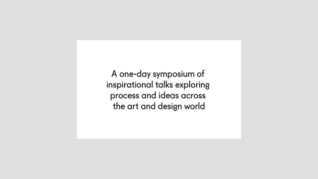
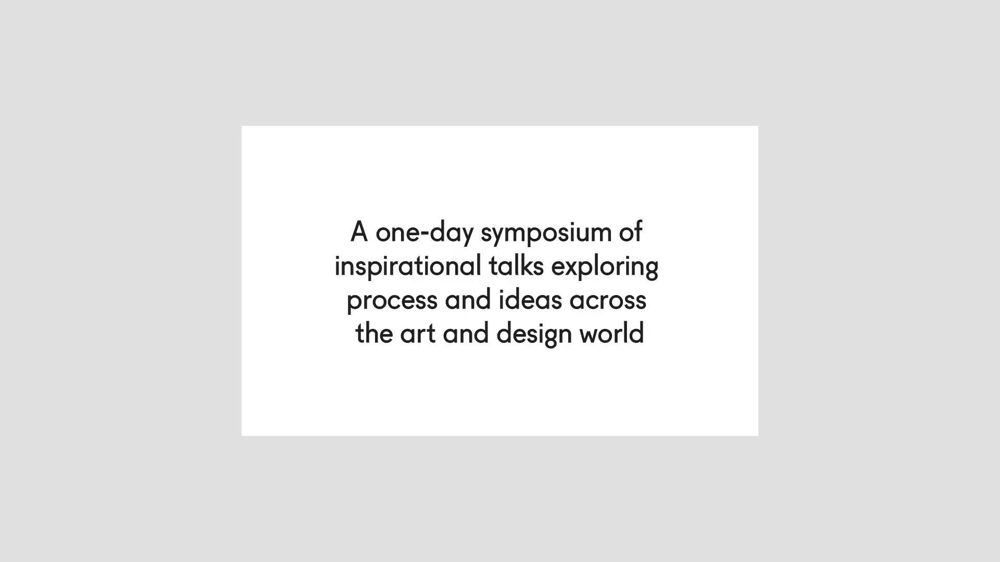
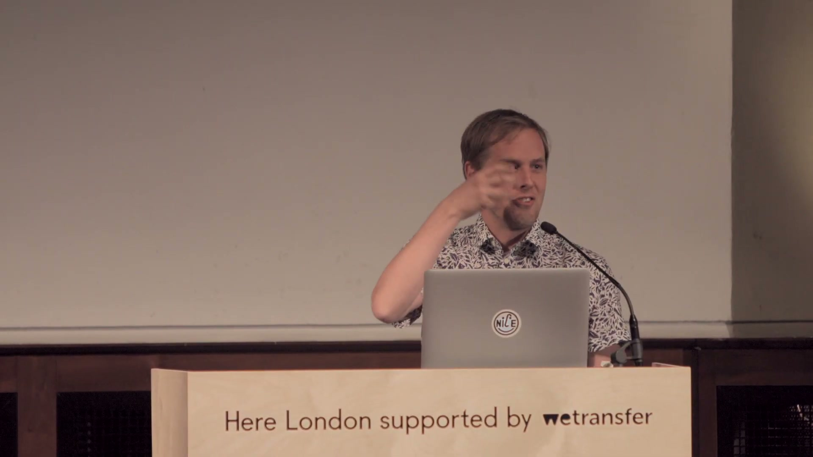
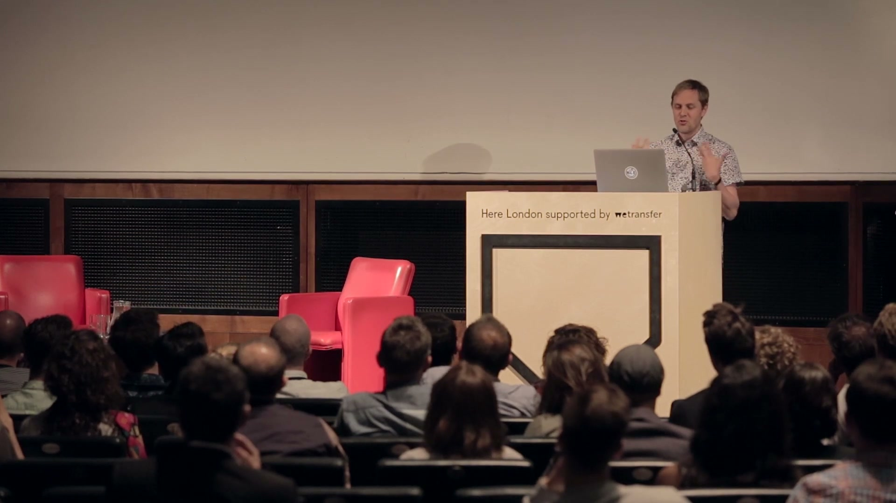
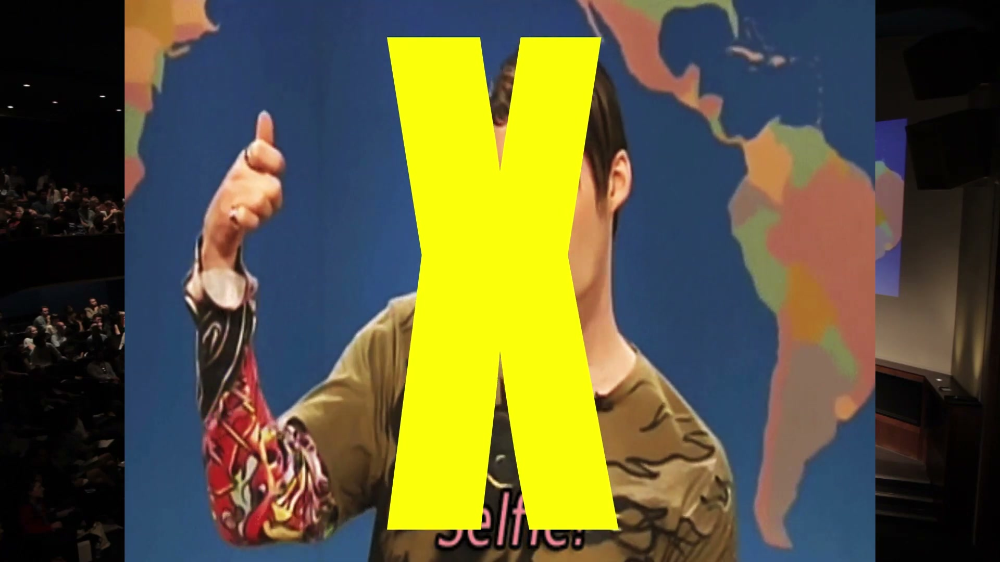
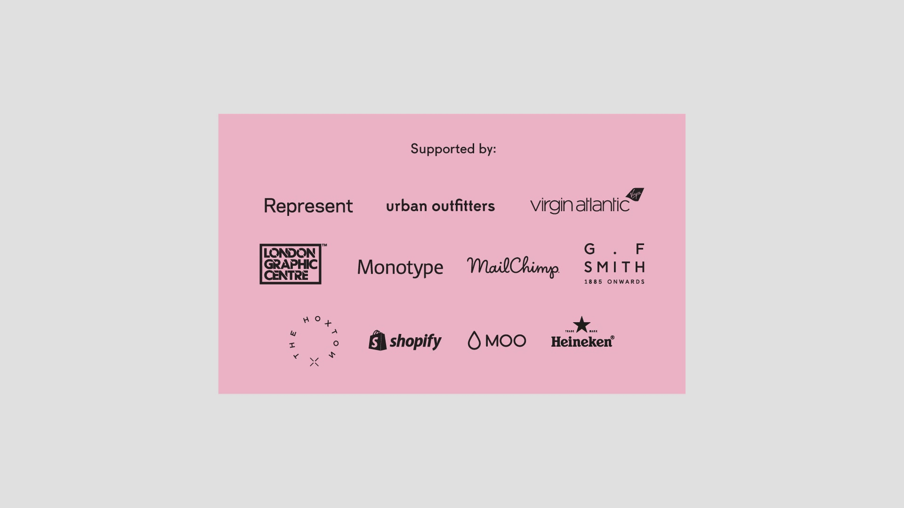

# A Crowd of Terrible Content

**Event:** Here London (It's Nice That)
**Year:** 2015
**Speaker:** Iain Tait
**Affiliation:** [Wieden+Kennedy London](../../agencies/wieden_and_kennedy_london.md)

## Synopsis

A heavily quoted keynote at It's Nice That's "Here London" event where Iain pushed back against the industry's hype-overload regarding new platforms (like Periscope and Meerkat). He argued that to digital natives, the internet is no longer a novelty, urging brands to stop fetishising tech formats and return to authentic storytelling.

He famously opened by claiming his career was "mostly one of cheating and blagging" — a characteristic self-deprecation that set up the serious argument: that the industry's obsessive platform-chasing was producing a flood of mediocre content, and that craft and ideas still mattered more than novelty.

## Context

Delivered during Iain's tenure as ECD at W+K London, this talk captures the tension between his deep roots in digital culture and his growing frustration with how "digital" was being used as a shorthand for thoughtless platform adoption. It's a companion piece to the PSFK "10 Reasons" talk — where that earlier talk argued digital was *better*, this one argued that digital had *lost its way*.

## References & Media

### Assets

### Video

- [YouTube: Here London 2015 — Iain Tait](https://www.youtube.com/watch?v=-9H5tZffhyc)
- **Local archive:** [raw/media/2015_here_london_crowd_of_terrible_content.mp4](../../raw/media/2015_here_london_crowd_of_terrible_content.mp4)
