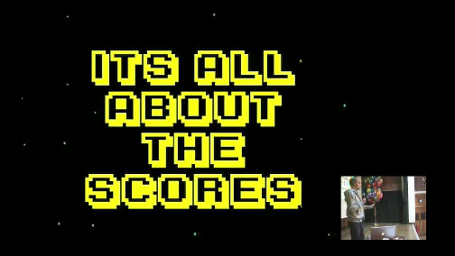
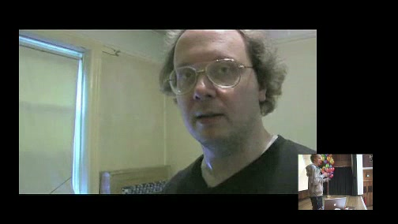
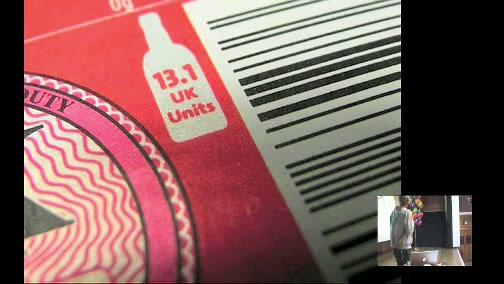
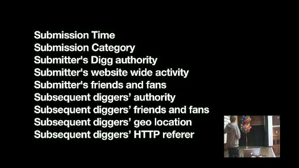
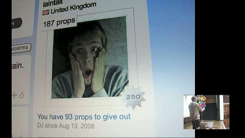
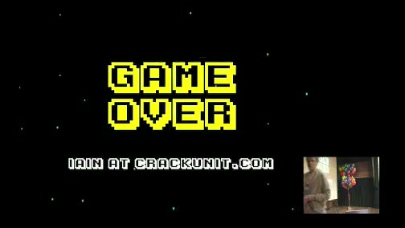

# High Scores

**Event:** Playful London
**Year:** ~2008
**Speaker:** Iain Tait
**Affiliation:** [POKE London](../../agencies/poke_london.md)

## Synopsis

Talk at the Playful conference in London, an event dedicated to exploring play, games, and interactive experiences. Playful was a key gathering for the creative technology community in London during this period, attracting designers, developers, and artists working at the intersection of technology and play.

## References & Media

### Assets

### Video

- [Vimeo: "High Scores" at Playful London](https://vimeo.com/2602586)
- **Local archive:** [raw/media/2008_playful_london_high_scores.mp4](../../raw/media/2008_playful_london_high_scores.mp4)
