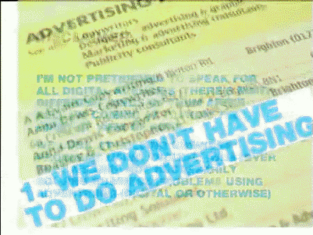
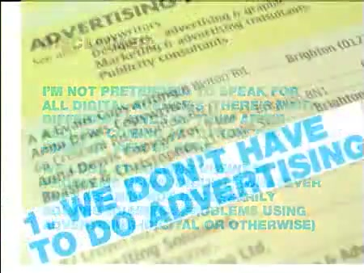

# 10 Reasons Why Digital is Better than Advertising

**Event:** PSFK Conference
**Year:** ~2007
**Speaker:** Iain Tait
**Affiliation:** [POKE London](../../agencies/poke_london.md)

## Synopsis

A landmark provocation that argued digital practice was fundamentally superior to traditional advertising — not just a new channel, but a better way of thinking about creativity. Delivered at the PSFK conference during a period when "digital" was still widely treated as a subordinate discipline within the advertising industry.

This talk is widely cited as a defining moment in Iain's career trajectory — the presentation that "put him on this journey" from digital specialist to creative leadership across the broader industry. It crystallised the argument that digital's advantages (measurability, interactivity, iterability, direct audience relationships) weren't just tactical benefits but represented a philosophical shift in how creative work should be conceived and evaluated.

## Context & Legacy

The talk arrived at a moment when digital agencies like POKE were fighting for creative credibility against traditional agencies with vastly larger budgets and cultural prestige. By framing the argument as "better than" rather than "as good as," Iain shifted the terms of debate — forcing the industry to reckon with digital on its own merits rather than as an add-on to TV campaigns.

Confirmed in a Boards magazine interview as the presentation that catalysed his move from POKE into the broader advertising world, ultimately leading to Wieden+Kennedy Portland.

## References & Media

### Assets

### Video

- [Vimeo: "10 Reasons Why Digital is Better than Advertising" (remix)](https://vimeo.com/863125)
- **Local archive:** [raw/media/2007_psfk_10_reasons_digital_better_than_advertising.mp4](../../raw/media/2007_psfk_10_reasons_digital_better_than_advertising.mp4)

### Citations

- Boards magazine interview (wklondon.com) — references this talk as pivotal career moment
