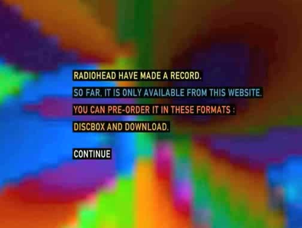
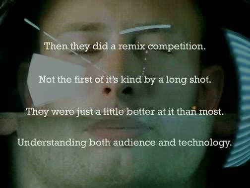
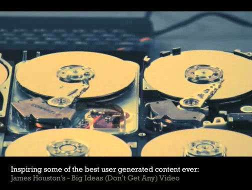
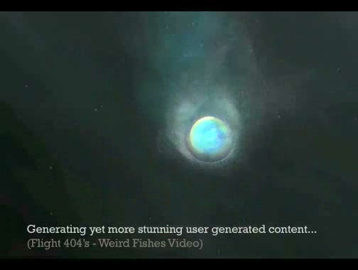

# Radiohead Marketing Presentation

**Event:** Unknown
**Year:** ~2008
**Speaker:** Iain Tait
**Affiliation:** [POKE London](../../agencies/poke_london.md)

## Synopsis

Presentation discussing Radiohead's marketing approach — likely centred on the *In Rainbows* pay-what-you-want release model (October 2007), which was one of the most disruptive experiments in digital distribution at the time. The album was released as a digital download with no minimum price, challenging every assumption about how music (and by extension, creative products) could be distributed and monetised.

This was a natural subject for Iain during the POKE era — a real-world case study of digital-first thinking applied to a beloved cultural product, proving that the internet wasn't just a marketing channel but could fundamentally reshape the relationship between creators and audiences.

## References & Media

### Assets

### Video

- [Vimeo: Radiohead Marketing Presentation](https://vimeo.com/1356001)
- **Local archive:** [raw/media/2008_radiohead_marketing.mp4](../../raw/media/2008_radiohead_marketing.mp4)
