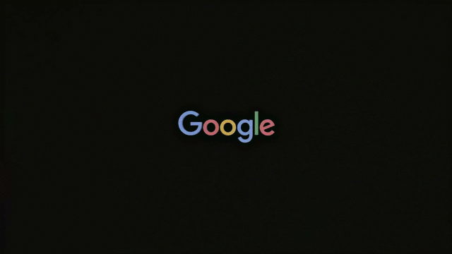

# Google AI Consultancy

## Overview

A creative and strategic consultancy for Google exploring how AI technologies could be embedded into mainstream culture.

## Collaborators

- **[Iain Tait](../../collaborators/iain_tait.md)** — Strategic / Creative Partner, FOOD
- **[Ben Malbon](../../collaborators/ben_malbon.md)** — Client / Google stakeholder *(evidence: user testimony 2026-04-08)*

## References & Media

### Assets

