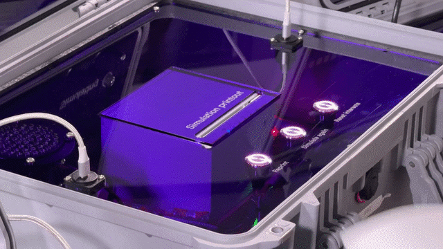

# AI Dating Coach

## Overview

An R&D sprint to conceptualize a transformative, AI-powered coach aimed at improving dating outcomes for users.

## Project Summary

Instead of simply using AI to optimize match algorithms, FOOD collaborated with Hinge to explore how conversational AI could act as a personal dating coach. The strategic focus was on actionable mindset shifts, skill development for users (e.g., navigating conversations, handling rejection, building confidence), and generating product concepts that aligned with Hinge's core brand promise of being "designed to be deleted."

## Collaborators

- **[Iain Tait](../../collaborators/iain_tait.md)** — Creative / Strategic Partner, FOOD

## References & Media

### Assets

