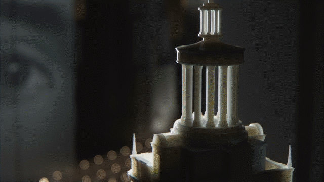
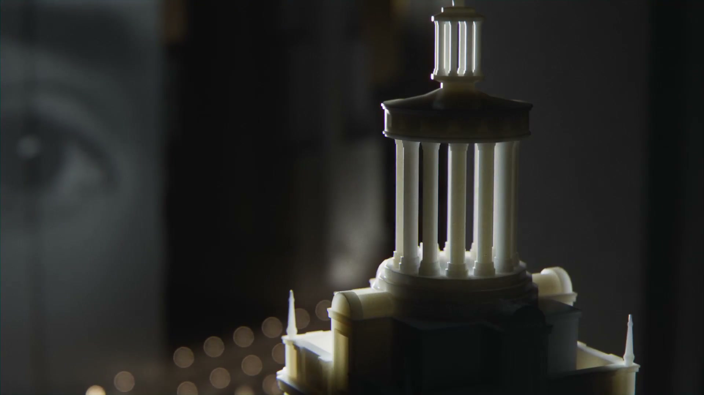
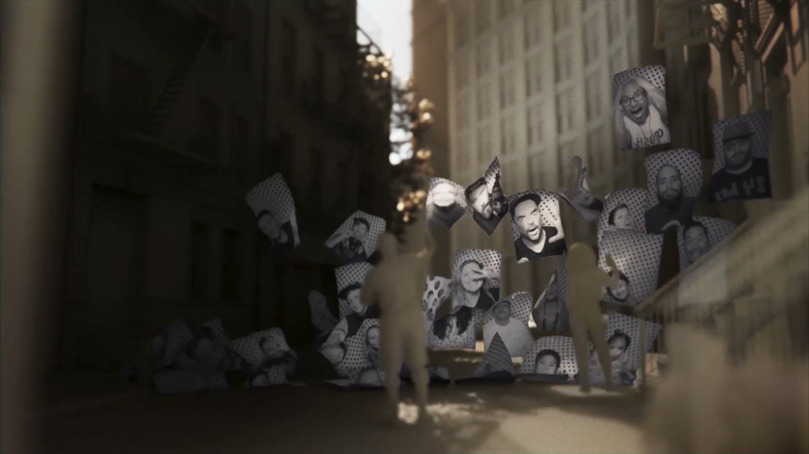
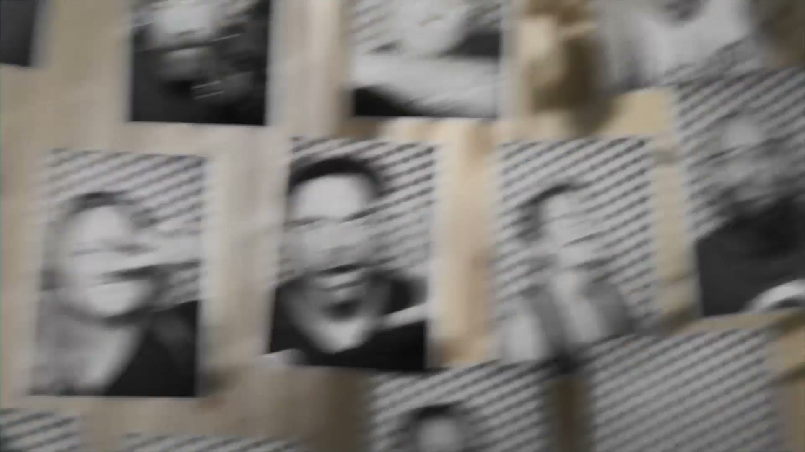
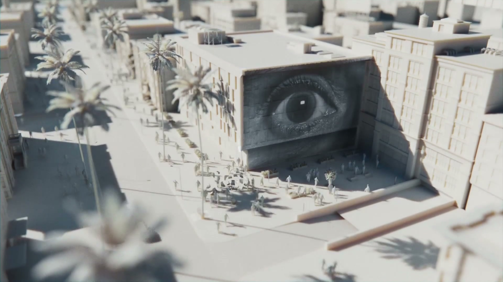
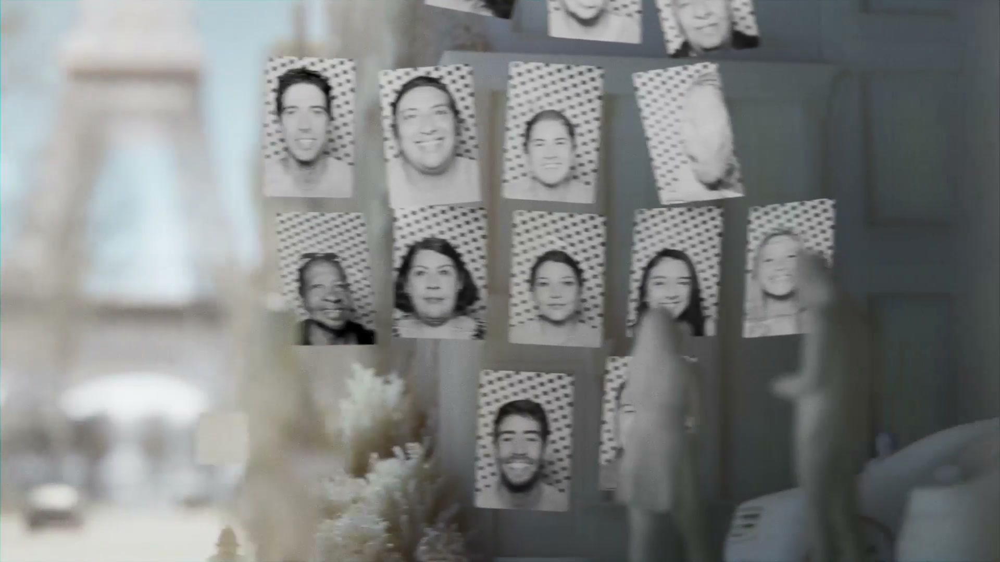
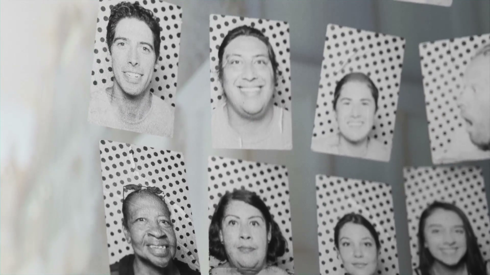

# JR Reality

## The Project

A global AR art experience built as a native mobile app (iOS and Android), commissioned by **Superblue** and created in collaboration with French street artist **JR**, whose life's work is placing giant photographic portraits of ordinary people in unexpected public spaces around the world.

JR Reality democratised that act — giving anyone with a phone the ability to permanently anchor a black-and-white portrait and a voice message to a physical location in the real world, contributing to a living, layered, communal mural that grows over time.

## The Technology

Built on Niantic's **Lightship Visual Positioning System (VPS)** using **Niantic AR Developer Kit 2.0** — making JR Reality the **first app to use Niantic's ARdk 2.0**. The VPS precisely geo-anchors content to physical locations so that multiple users visiting the same spot see the same accumulated portraits in exactly the same positions.

**The mechanic:**
1. User visits a geo-mapped location
2. Takes a black-and-white portrait selfie in JR's signature photographic style
3. Records a short voice message
4. The portrait appears as a floating AR element permanently anchored to that spot
5. Future visitors see the full accumulated "living mural" and can tap portraits to hear each person's voice
6. Remote viewing (without being physically present) was also possible

## Launch

**Beta:** 2022

**Public launch:** 15–16 May 2023, **New York City** (Elizabeth Street Garden, Soho). JR was present at the launch location.

**Miami:** 1 June 2023

**Soft public launch post:** JR's Instagram, 15 May 2023 — *"My new app JR Reality is live!"* ([@jr](https://www.instagram.com/p/CsR9B5rxkrr/)) — tagging @superblue.art, @nianticlabs, @nexusstories, @insideoutproject. 3,100+ likes, 45 comments.

The launch was deliberately understated — a "soft" announcement through JR's own channels rather than a paid media campaign.

## Collaborators

- **[Iain Tait](../collaborators/iain_tait.md)** — Creative Director / Co-founder, FOOD
- **JR / JR Studio** — Artist and creative originator
- **Superblue** — Lead commissioning partner (Mollie Dent-Brocklehurst, Co-Founder & CEO)
- **[Niantic](../collaborators/niantic.md)** — AR technology platform (Lightship VPS / ARdk 2.0); Dan Morris, Director of Developer Relations
- **[Nexus Studios](../collaborators/nexus_studios.md)** — Experience design and technical build (both beta and public launch versions)
- **Art Practice** — Production / finishing (linked to Time Based Arts)

*FOOD's role confirmed on food.xyz: "JR Reality. Global AR Art Project with JR Studio / Niantic / Nexus / Art Practice."*

## References & Media

### Assets

### Primary
- [JR Instagram: soft launch post (15 May 2023)](https://www.instagram.com/p/CsR9B5rxkrr/) — "My new app JR Reality is live!"
- [Nexus Studios: JR Reality launch case study](https://nexusstudios.com/work/jr-reality/)
- [Nexus Studios: JR Reality beta case study](https://nexusstudios.com/work/jr-reality-2-2/)
- [FOOD: food.xyz project listing](https://www.food.xyz)

### Raw Research
- [Raw research file](../raw/research/food_jr_reality_2026-04-07.md)
