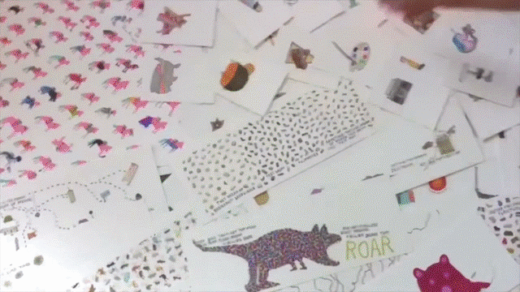
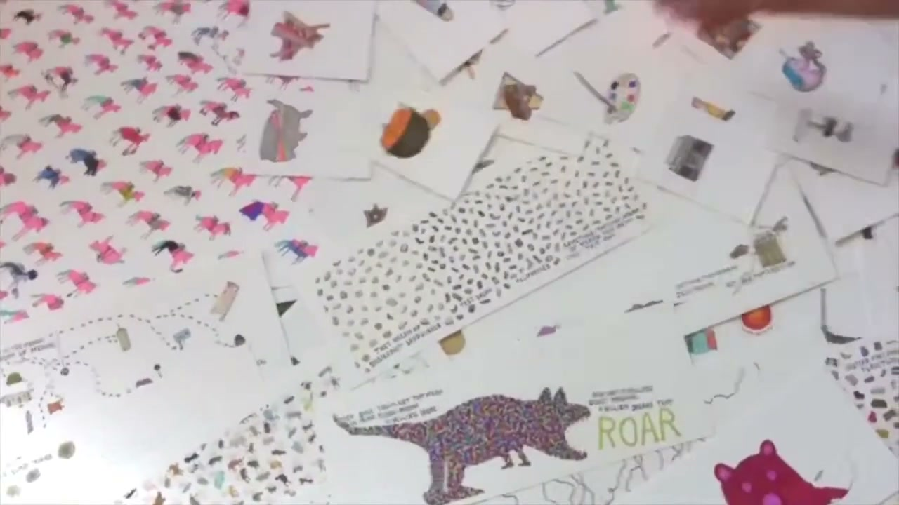
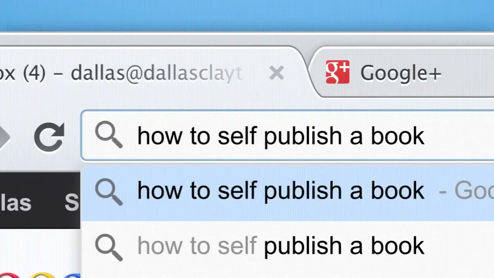
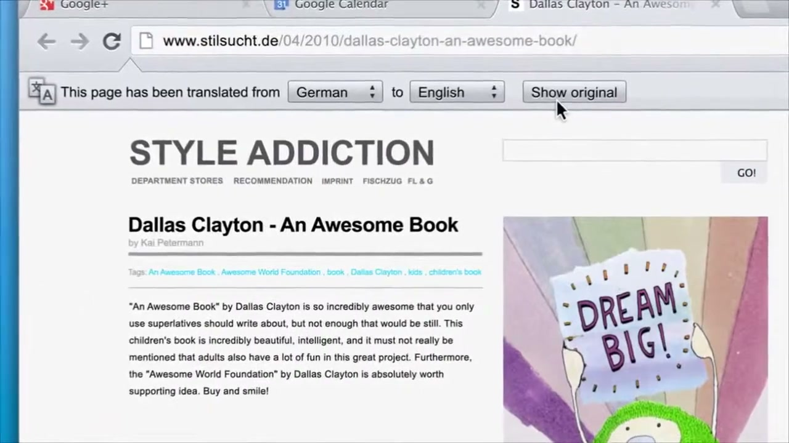
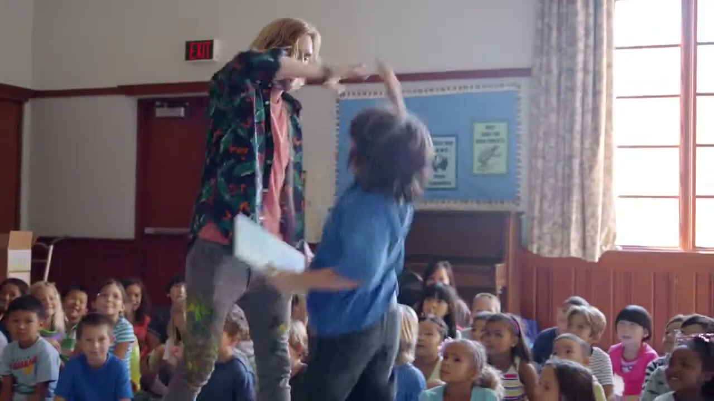
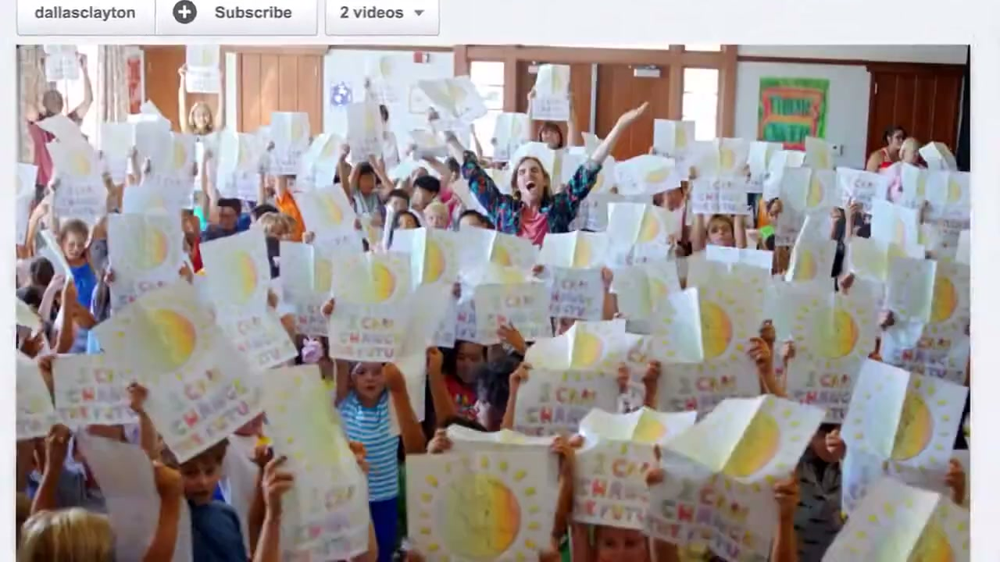
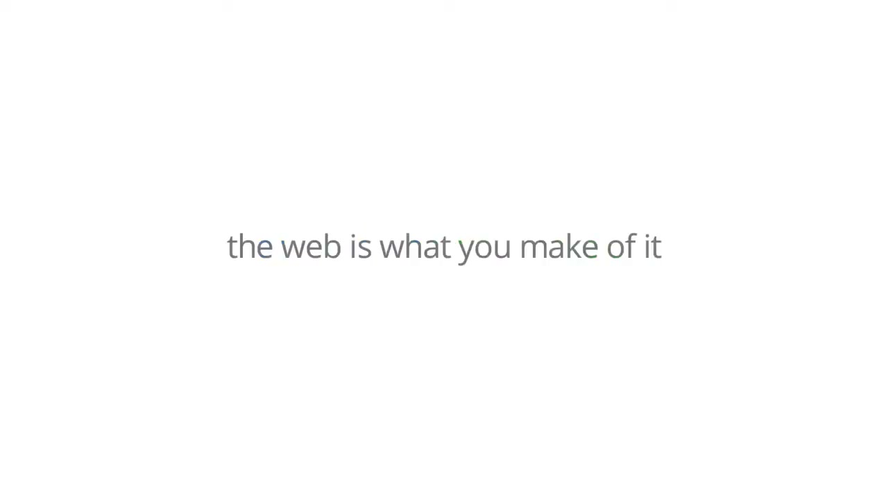

# An Awesome Book (Chrome)

## The Project

Google Creative Lab partnered with author and illustrator **Dallas Clayton** to adapt his self-published children's book *An Awesome Book!* into a campaign for Chrome — comprising both an interactive Chrome Web Store app (in 17 languages) and a **film**.

The Chrome Blog launch post was titled **"It's an awesome world"** (October 8, 2012).

## The Film

A short film titled **"Google Chrome: An Awesome World"** was produced as the campaign's centrepiece. Uploaded to YouTube on **October 7, 2012** (one day before the Chrome Blog post), it ran on YouTube, Hulu, and TV. Stats one week after launch: 68,784 views, 1,454 likes, 169 comments. The original Google upload (`youtube.com/watch?v=oZmtwUAD1ds`) has since been removed but has **1,090 Wayback Machine captures** spanning October 2012 – August 2025. A surviving copy exists at `youtube.com/watch?v=C3Aufan71D0`.

**Director:** **David Gelb**, through production company **Independent Media Inc** (independentmediainc.com/directors/david-gelb). Gelb had just released *Jiro Dreams of Sushi* on Netflix in August 2012 — two months before this film — and would go on to create *Chef's Table* (Netflix, 2015). This was a significant early commission from a director at the beginning of an extraordinary run. Confirmed by Iain Tait; Google is listed in Gelb's current director bio at Independent Media.

Dallas Clayton confirmed the film on Tumblr (archived October 11, 2012): *"Google made an ad about me and my book."*

The film's companion site `veryawesomeworld.com` described it as: *"Written by Dallas Clayton and made with some friends at Google."*

**Note on Iain's children:** Iain Tait's children appear multiple times in the original launch Chromebook film.

## The Chrome Web Store App

- Available in 17 languages
- Dallas Clayton originally wrote the book for his son; it had already built a grassroots following before the Google collaboration
- The app added digital interactivity to Clayton's illustrated story about dreaming big

## Collaborators

- **[Iain Tait](../collaborators/iain_tait.md)** — Executive Creative Director, Google Creative Lab
- **[Dallas Clayton](../collaborators/dallas_clayton.md)** — Author / Illustrator
- **David Gelb** — Director (Independent Media Inc) — confirmed by Iain Tait; see independentmediainc.com/directors/david-gelb

## References & Media

### Assets

### Video
- [YouTube: "Google Chrome: An Awesome World" — surviving copy](https://www.youtube.com/watch?v=C3Aufan71D0)
- [YouTube: original Google upload (removed, 1,090 Wayback captures)](https://www.youtube.com/watch?v=oZmtwUAD1ds) — archived: `https://web.archive.org/web/2012*/https://www.youtube.com/watch?v=oZmtwUAD1ds`

### Credits & Press
- [Chrome Blog: "It's an awesome world" (Oct 8, 2012)](https://chrome.googleblog.com/2012/10/its-awesome-world.html)
- [Chrome Web Store: An Awesome Book (app listing)](https://chromewebstore.google.com/detail/an-awesome-book/jcafjdhiidcpdgpdbpnllmpheogojkfl)
- [Ad Age Creativity: "Awesome World" (Oct 10, 2012)](https://adage.com/creativity/work/awesome-world/29468/) — credits section paywalled
- [David Gelb — Independent Media Inc director page](https://www.independentmediainc.com/directors/david-gelb)

### Raw Research
- [Raw research file](../raw/research/google_an_awesome_book_film_2026-04-06.md)
- [Raw research — Gelb deep dig](../raw/research/google_an_awesome_book_gelb_2026-04-07.md)
