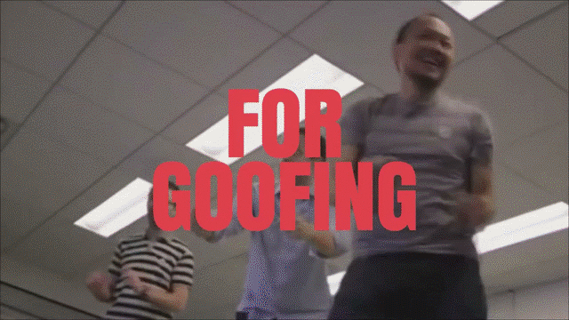
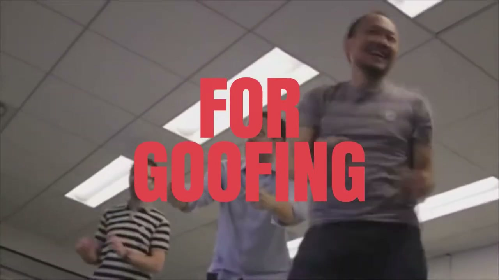
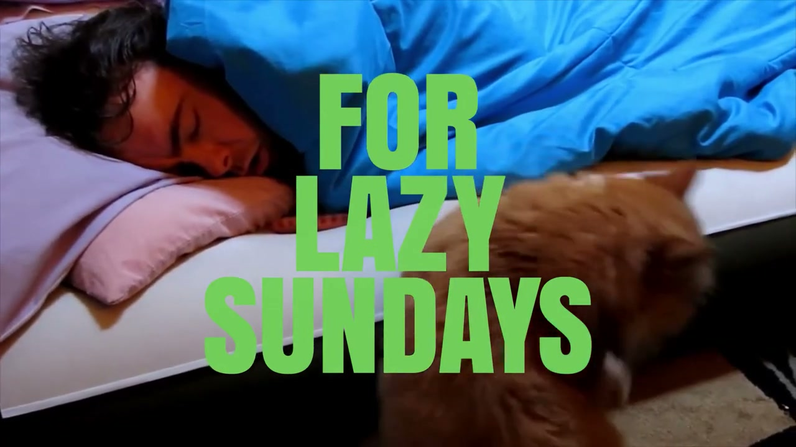
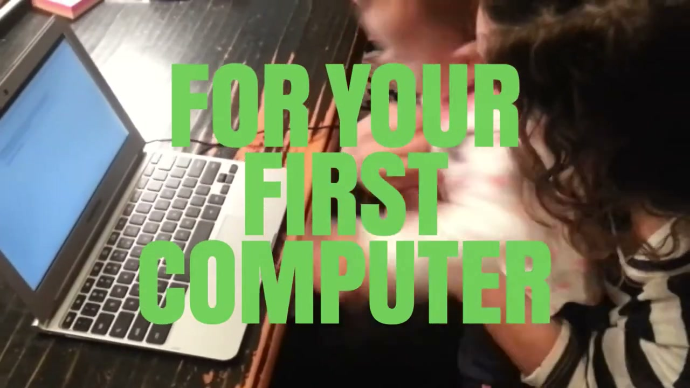
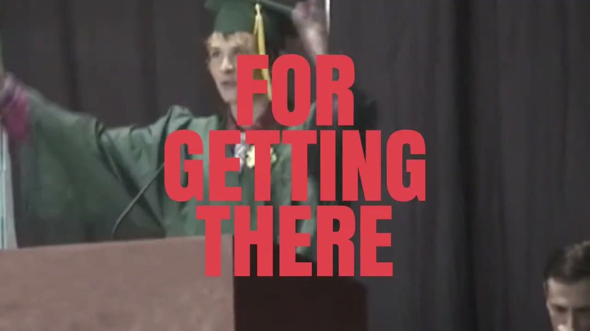
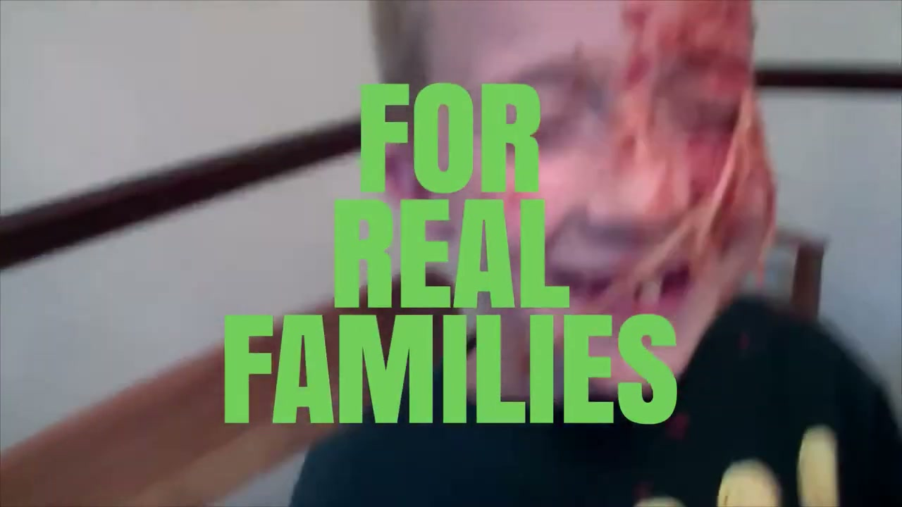
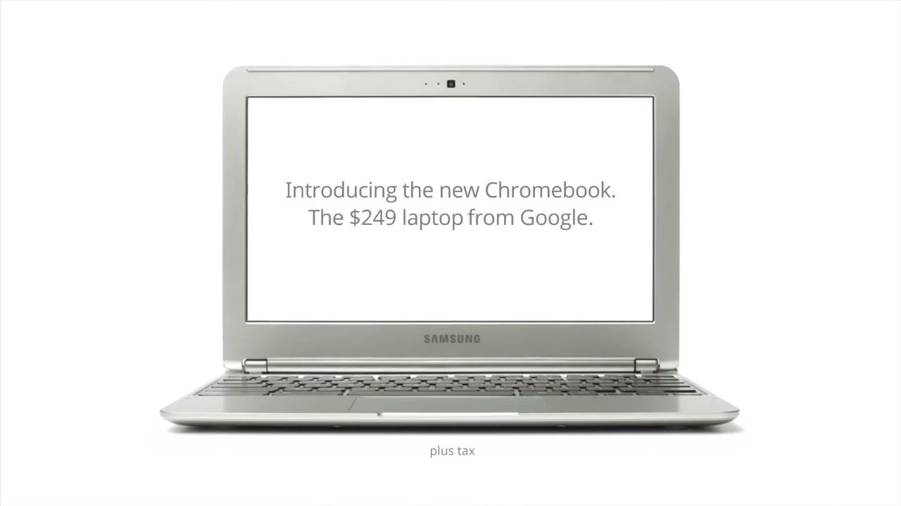

# Chromebook: For Everyone

## The Campaign

Launched October 18, 2012 — the same day as the Samsung Chromebook product announcement — "For Everyone" was the platform that broke Chromebook out of the tech enthusiast niche and positioned it as an accessible, frictionless computing device for ordinary people.

The primary launch device was the **Samsung Chromebook** (Exynos 5 ARM chip, 11.6", $249 Wi-Fi), with an LG model at $349 launching simultaneously. Google SVP Sundar Pichai used "For Everyone" as the official campaign name at the launch event. TV spots aired that evening during the MLB baseball playoffs.

Key campaign messages: extreme simplicity, instant boot, zero viruses, cloud persistence. Rather than explaining Chrome OS, the campaign demonstrated what made the device feel different — particularly for people who'd been burned by slow, malware-ridden laptops.

## Key Executions

**TV Spots:**
- *"For Everyone"* — launch spot, featuring The Death Set's music. Directed and edited by Jessica Brillhart. **Iain Tait's children appear multiple times in this film.**
- *"Goodbye to All That"* — second spot in the campaign.

**Times Square Takeover (November 2012 — Thanksgiving weekend):**
- Gretel designed the visual and animation system for a takeover of **9 screens** in Times Square.
- The system accommodated both Chromebook messaging and user-submitted content across 9 different screen sizes and ratios.
- Website traffic spiked over 50% during the activation.
- The Chromebook sold out in less than 24 hours.

**Platform continuation (2013):**
- 72andSunny were brought in February 2013 to execute further work under the "For Everyone" platform (initially for Google Chrome browser, later Chromebook executions including ASUS Chromebook Flip). Google Creative Lab originated the platform; 72andSunny scaled it.

## Metrics

| Metric | Figure |
|---|---|
| Launch sell-out | Less than 24 hours |
| Chromebooks sold, year one | 5 million |
| Best Buy expansion | 100 → 500 stores at launch |
| Times Square web traffic spike | +50% during activation |

## Collaborators

- **[Iain Tait](../collaborators/iain_tait.md)** — Executive Creative Director, Google Creative Lab
- **[Jeff Baxter](../collaborators/jeff_baxter.md)** — Creative, Google Creative Lab
- **Tristan Smith** — Creative, Google Creative Lab
- **Charles Hodges** — Creative, Google Creative Lab
- **Todd Lamb** — Creative, Google Creative Lab
- **Natalie Dennis** — Creative, Google Creative Lab
- **Jake Dubs** — Copywriter (freelance at Google Creative Lab, 2012)
- **[Jessica Brillhart](../collaborators/jessica_brillhart.md)** — Director / Editor
- **The Death Set** — Music (launch TV spot)
- **[Gretel](../collaborators/gretel.md)** — Visual / animation system design, Times Square takeover (9 screens)
- **[72andSunny](../collaborators/72andsunny.md)** — Platform continuation executions (from February 2013)

## References & Media

### Assets

### Video
- [YouTube: "Chromebook: For Everyone" — launch TV spot ✓](https://www.youtube.com/watch?v=Ba2Tfm0dyNY)
- [YouTube: "Goodbye to All That" — second campaign spot](https://www.youtube.com/watch?v=PRTI_Z9POyo)

### Credits
- [Jake Dubs portfolio: Google Chromebook — names full Google Creative Lab team](https://jakedubs.com/Google-Chromebook)
- [Gretel NY: Google Times Square case study — confirms 9-screen animation system](https://gretelny.com/google-times-square)

### Press
- [TechCrunch: "$249 Samsung Chromebook launch" (Oct 18, 2012)](https://techcrunch.com/2012/10/18/google-launches-the-249-samsung-chromebook/)
- [Engadget: Times Square Chromebook activation (Nov 25, 2012)](https://www.engadget.com)
- [Ad Age / MediaPost: 72andSunny joins Google Chrome account (Feb 2013)](https://adage.com)

### Raw Research
- [Raw research file](../raw/research/google_chromebook_for_everyone_2026-04-06.md)
