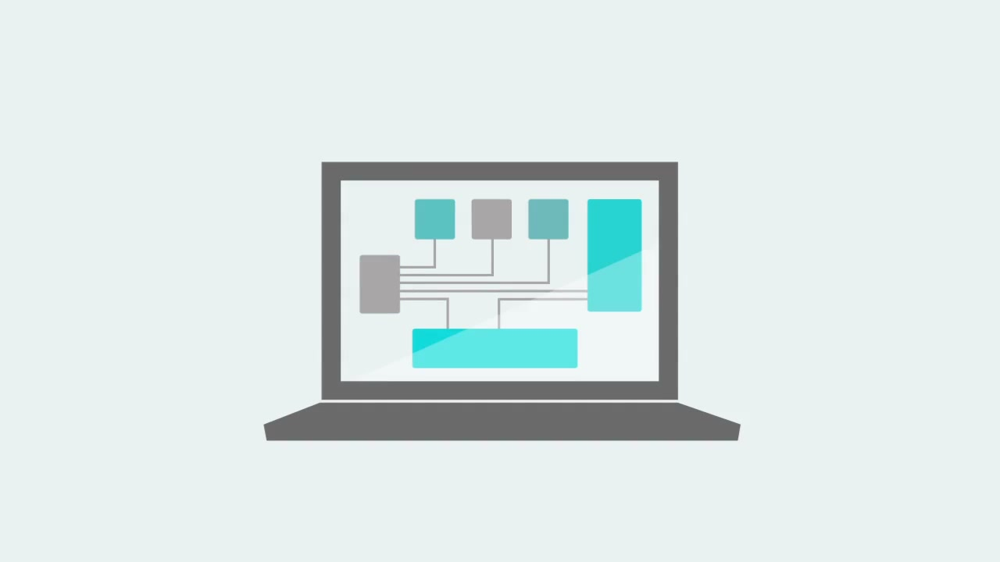
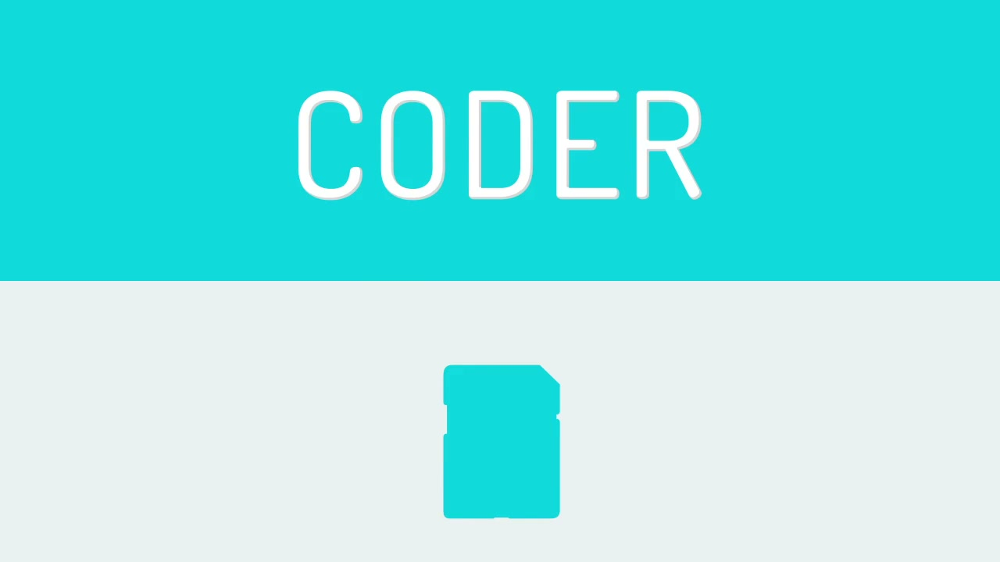
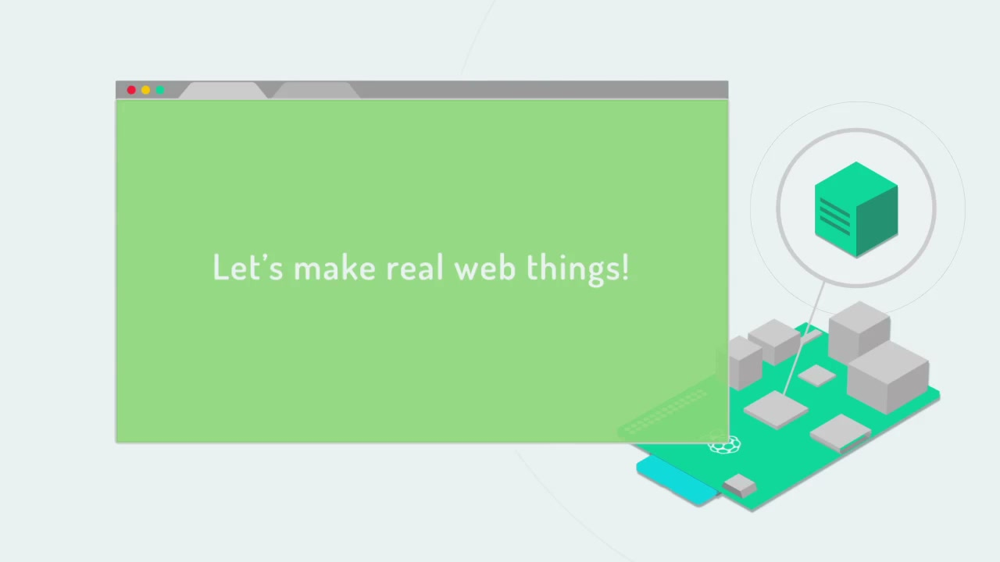
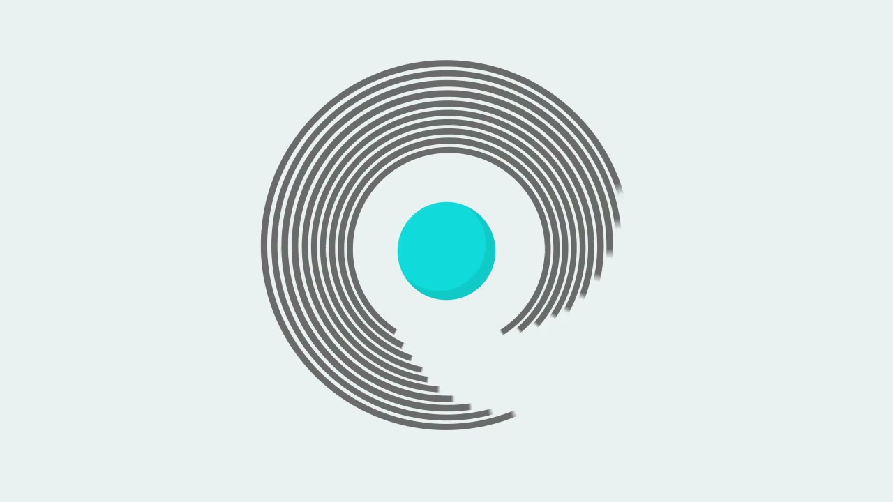
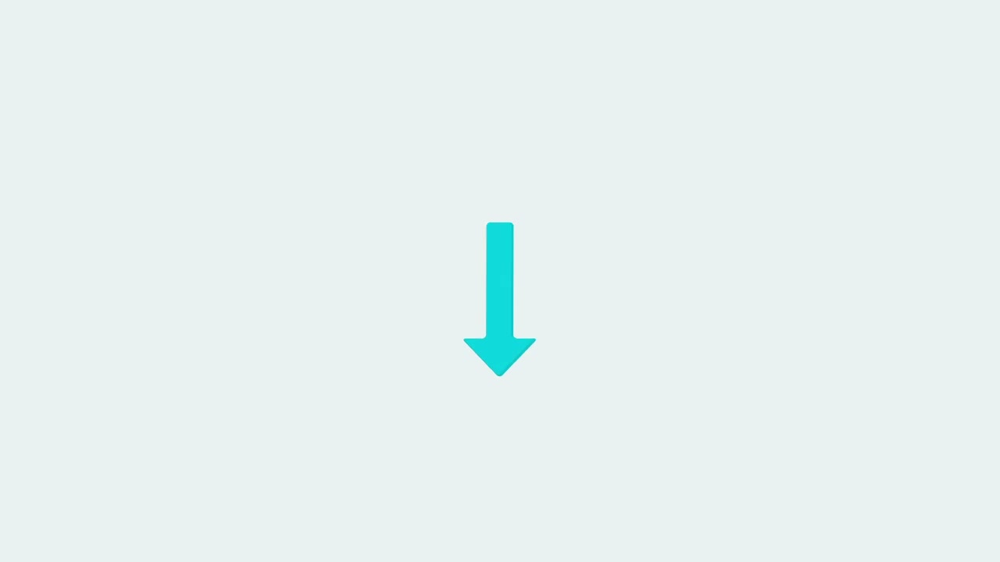

# Google Coder

**Primary creator:** Jason Striegel (Creative Technologist)

> "A simple way to make web stuff on Raspberry Pi."

An open-source project by Google Creative Lab that turned a Raspberry Pi into a simple personal web server and browser-based development environment for HTML, CSS, and JavaScript. Aimed at educators, parents, and beginners. Built primarily by Jason Striegel and Jeff Baxter. Archived on GitHub in August 2025 after a 12-year lifespan with 2,400 stars and 269 forks.

---

## The Concept

Coder removed the most significant barrier to learning web development on a Raspberry Pi — the command line. Instead of requiring terminal expertise to configure a Pi as a web server, Coder made setup a 10-minute process (hardware cost under $50), after which students accessed a full browser-based code editor with HTML, CSS, JavaScript, and Node.js file tabs, a live preview panel, and media upload management.

It ran entirely in Chrome — no installation, no app — meeting learners exactly where they already were. A companion curriculum site, [Coder Projects](https://googlecreativelab.github.io/coder-projects/), provided "simple, fun, and sneakily educational" things to build.

The project aligned with the peak of the Raspberry Pi cultural moment (2012–2015) — the Pi had sold millions of units but web-based creative coding on it remained technically demanding. Coder democratised that entry point.

---

From TechCrunch (launch day): *"The tool, which was developed by Googler Jason Striegel, designer Jeff Baxter and a small team in New York, is meant to be an environment for educators and parents to teach kids 'the basics of building for the web.'"*

---

## GitHub Stats

| Metric | Value |
|---|---|
| Stars | 2,400 |
| Forks | 269 |
| Watchers | 194 |
| Commits | 83 |
| License | Apache-2.0 |
| Languages | JavaScript (66.7%), CSS (12.2%), HTML (10.8%), Shell (5.3%), Python (5.0%) |
| Archive date | August 18, 2025 (read-only, preserved — not deleted) |
| Pi image size | 1.33GB (v0.9) |

**Archive notice:** *"This project is no longer actively maintained by the Google Creative Lab but remains here in a read-only Archive mode so that it can continue to assist developers that may find the examples helpful... We welcome users to fork this repository should there be more useful, community-driven efforts that can help continue what this project began."*

---

## Awards

None found. The project was never entered into traditional advertising/creative award circuits — its open-source educational identity made that inappropriate. Its impact was measured in GitHub stars, forks, and press reach, not trophies.

---

## Cultural Legacy

- Landed at peak Raspberry Pi/maker-movement moment. Positioned alongside Codecademy and Khan Academy as a learning resource
- Zero-command-line setup was a genuine differentiator — previous Pi web server configurations required terminal expertise
- The `findcoder-appengine` component suggests Google Creative Lab was already thinking about multi-device classroom deployment at classroom scale
- Google simultaneously gifted 15,000 Raspberry Pi units to UK schools — Coder was well-placed to serve that initiative
- 269 community forks indicate sustained developer interest beyond the original team
- Archived in 2025 after 12 years — not deleted, preserved

---

## Collaborators

- **[Jason Striegel](../collaborators/jason_striegel.md)** — Creative Technologist; primary developer and creative force behind Coder
- **[Jeff Baxter](../collaborators/jeff_baxter.md)** — Designer; responsible for interface and visual design
- **[Iain Tait](../collaborators/)** — ECD, Google Creative Lab NYC; champion and creative director
- **[Claire Stapleton](../collaborators/claire_stapleton.md)** — Editorial and creative (role on Coder not yet press-confirmed)
- **[Minji Hong](../collaborators/minji_hong.md)** — Designer (role on Coder not yet press-confirmed)

---

## References & Media

### Assets

### Primary
- [GitHub: googlecreativelab/coder — 2,400 stars, archived Aug 2025](https://github.com/googlecreativelab/coder)
- [Official docs site: Coder for Raspberry Pi](https://googlecreativelab.github.io/coder/)
- [Coder Projects companion curriculum](https://googlecreativelab.github.io/coder-projects/)

### Press
- [TechCrunch: "Google Creative Labs launches Coder to turn Raspberry Pi into a basic web development platform" (Frederic Lardinois, Sep 12, 2013)](https://techcrunch.com/2013/09/12/google-creative-labs-launches-coder-to-turn-raspberry-pi-into-a-basic-web-development-platform/) — names Striegel and Baxter explicitly
- [The Verge: "Google Coder project turns Raspberry Pi into a mini app server" (Sep 14, 2013)](https://www.theverge.com/2013/9/14/4729050/google-coder-project-turns-raspbery-pi-into-a-mini-app-server)
- [Engadget: "Google Coder lets you build Raspberry Pi web apps in your browser" (Sep 12, 2013)](https://www.engadget.com/2013-09-12-google-coder.html)
- [Fast Company: "Google's Coder tool turns a Raspberry Pi into a web server for coding" (Sep 13, 2013)](https://www.fastcompany.com/3017390/googles-coder-tool-turns-a-raspberry-pi-into-a-web-server-forcoding)
- [Google Canada Blog (official): "Coder: a simple way to make web stuff on Raspberry Pi" (Sep 12, 2013)](https://canada.googleblog.com/2013/09/coder-simple-way-to-make-web-stuff-on.html)

### Video
- [YouTube: Official Google Developers launch video (Sep 2013)](https://www.youtube.com/watch?v=wH24YwdayFg)
