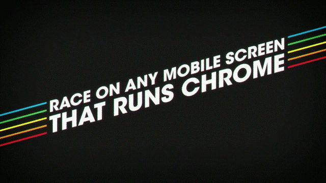
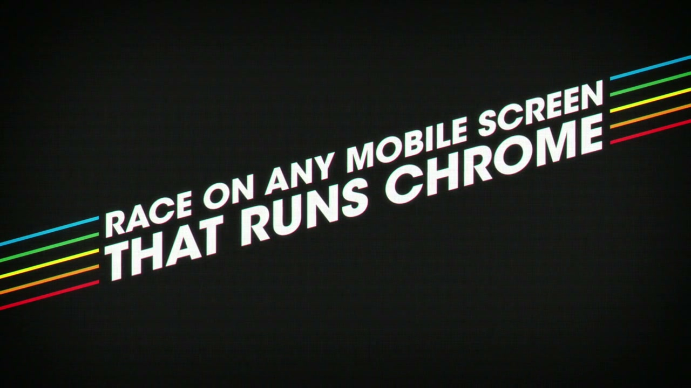
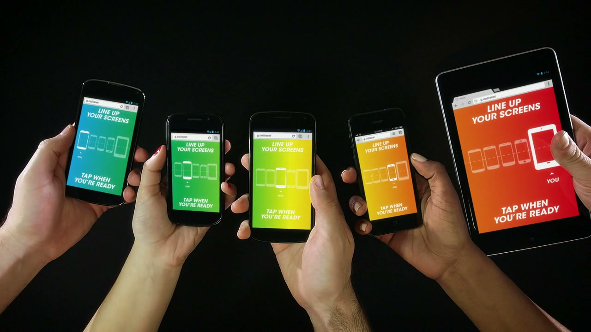
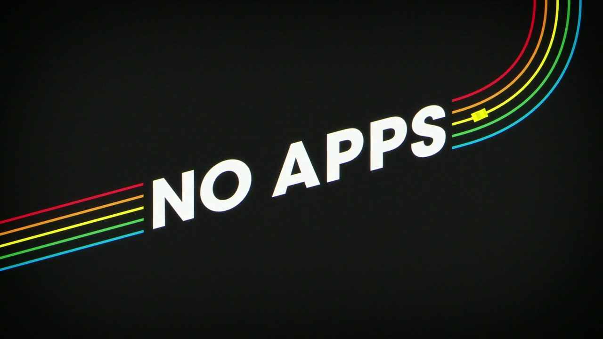
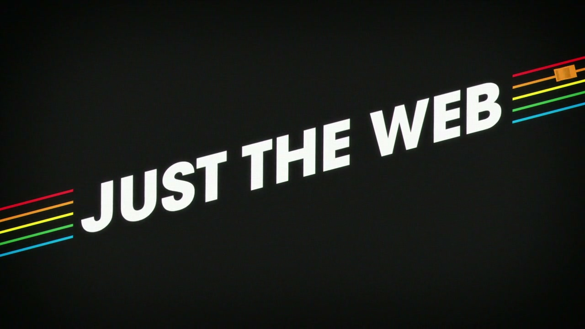
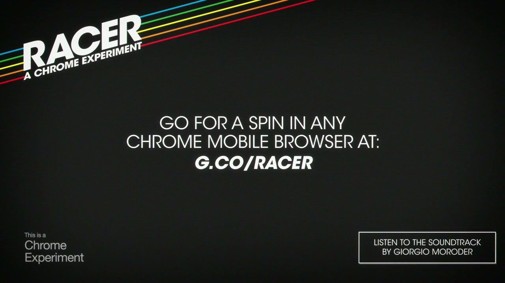
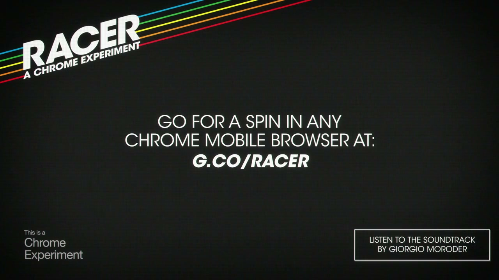

# Google Racer — A Chrome Experiment

> Unveiled live at Google I/O 2013, Racer was a multi-player, multi-device slot-car racing game that ran across up to five phones and tablets simultaneously — no apps, no downloads, just Chrome and the web.

---

## The Concept

Up to five players physically line up their phones and tablets edge-to-edge. A race track is dynamically generated that visually spans all connected screens. As a car drives off the right edge of one player's phone, it instantaneously appears on the left edge of the next device. Players touch their screens to accelerate. The Giorgio Moroder-composed soundtrack plays in real-time as distributed audio stems across all connected phone speakers simultaneously.

**Short URL:** `http://g.co/racer` → `chrome.com/racer`

---

## Technical Execution

- **Track rendering:** Paper.js (HTML5 Canvas vector graphics)
- **Sync:** WebSockets with sub-10ms latency compensation (server time offset calculated as median of multiple round trips)
- **Audio:** Web Audio API — Moroder's stems distributed dynamically across all connected speakers
- **No installation required** — runs entirely in the mobile browser
- **Development:** Google Creative Lab built the concept, design, and prototype; Active Theory developed the full game over 8 weeks prior to Google I/O

From Active Theory's case study: *"Armed with the concept, design and prototype from Google Creative Lab and sound from Plan8 we iterated on builds for 8 weeks leading up to the launch at I/O 2013."*

---

## Giorgio Moroder

The soundtrack for Racer was composed by **Giorgio Moroder** — the Italian electronic music pioneer who defined the sound of the 1970s–80s disco and film score era (*Midnight Express*, *Scarface*, *Top Gun*).

The connection came from a producer on the project who had proactively reached out to Moroder. When Iain heard he was interested, the team's response was immediate: *"Hell yeah."*

**2013 was Moroder's extraordinary comeback year.** In the same year as Racer:
- He collaborated with Daft Punk on *"Giorgio by Moroder"* from *Random Access Memories* — which won the Grammy for Album of the Year (his 4th Grammy)
- He began his live DJ touring career (Vivid Fest, Moogfest, Wireless Festival)

Racer was released alongside — and in the cultural wake of — the Daft Punk collaboration. The music press covered it accordingly.

**Soundtrack details:**
- Title: "Racer" by Giorgio Moroder
- Label: Giorgio Moroder Enterprises
- Release date: May 15, 2013 (same day as Google I/O launch)
- Free download was available via Google Play Store
- Official page: https://www.giorgiomoroder.com/music/giorgio-moroder-google-chrome-racer/
- Listed in Moroder's official discography and soundtracks at giorgiomoroder.com/credits/

**Live performance:** On his SoundCloud mix recorded live from Deep (Brooklyn, 2013), at 19:15, Moroder says *"I would love to play a new song which I made for Google, it's called the Racer experience and it goes like this..."* — [listen here](https://soundcloud.com/giorgiomoroder/giorgio-moroder-live-at-deep)

---

## Awards

| Award | Category | Year | Status |
|---|---|---|---|
| Cannes Lions | **Gold Mobile Lion** — Category A04: Innovative technology for mobile | 2014 | **WIN** — confirmed |
| Cannes Lions | **Bronze Mobile Lion** — Category A04: Innovative technology for mobile | 2014 | **WIN** — confirmed |
| FWA | Site of the Day (Installation) | 2013 | **WIN** — confirmed |
| Tomorrow Awards | Nomination (Installation) | 2013 | Nominated |
| Webby Awards | Referenced in SoDA Report 2014 | 2014 | Referenced, not individually confirmed |
| CLIO Awards | Referenced in SoDA Report 2014 | 2014 | Referenced, not individually confirmed |

**Cannes context:** Gold + Bronze Mobile Lions, both Category A04 (64th Festival, June 2014). Entry #1828. Agency credited as Google Creative Lab / Active Theory. Racer was one of only nine Gold Mobile Lions awarded that year. Source: mobiforge.com full Cannes Mobile Lions winners list (June 20, 2014).

---

## Patent

**US10195523B2** — "Multi-screen gaming using a portable computing device as a controller"
- **Inventors:** Iain Tait, Stewart Smith, Jeffrey Paul Baxter
- **Filed:** May 10, 2013 (priority date — same day as Google I/O 2013 launch)
- **Granted:** February 5, 2019
- **Assignee:** Google LLC
- https://patents.google.com/patent/US20160339338A1/en

---

## Metrics

| Metric | Figure | Source |
|---|---|---|
| Website visitors | 3.2 million | Cannes Lions 2014 submission |
| Mobile/tablet share | 70% | Cannes Lions 2014 submission |
| Press coverage | "Universally positive" | Cannes submission |
| Development time | 8 weeks (Active Theory) | web.dev case study |

---

## Cultural Legacy

- **Racer S** — a follow-on WebGL experiment by HelloEnjoy (December 2013) — inspired directly by Racer
- Independent developers reverse-engineered the server after Google shut down hosting:
  - https://github.com/Technohacker/recar
  - https://github.com/allancoding/racer (live at racer.allancoding.dev)
- Featured as a case study in the SoDA Report 2014 (Society of Digital Agencies)

---

## Collaborators

- **[Iain Tait](../collaborators/)** — ECD, Google Creative Lab NYC; concept originator; patent co-inventor
- **[Stewart Smith](../collaborators/stewart_smith.md)** — Creative technologist / software engineer, Google Creative Lab; patent co-inventor
- **[Jeff Baxter](../collaborators/jeff_baxter.md)** — Designer, Google Creative Lab; patent co-inventor
- **[Active Theory](../collaborators/active_theory.md)** — Development studio; built the full game over 8 weeks from Creative Lab's concept and prototype
- **[Plan8](../collaborators/plan8.md)** — Sound design
- **Giorgio Moroder** — Original soundtrack composer
- **HUSH** — Designed and produced the physical Racer Installation at Google I/O (separate from the digital experiment; won FWA for the installation)

---

## References & Media

### Assets

### Work Online
- [Experiments with Google: Racer (listing live, interactive now defunct)](https://experiments.withgoogle.com/racer)
- [Google Chrome Blog: "Roll across platforms and race across screens" (May 28, 2013)](https://chrome.googleblog.com/2013/05/roll-across-platforms-and-race-across.html)
- [Active Theory portfolio: Racer](https://activetheory.net/work/racer)

### Technical
- [Active Theory case study on web.dev (Google Developers) — full technical breakdown](https://web.dev/case-studies/racer)
- [Patent: US10195523B2 — Iain Tait, Stewart Smith, Jeff Baxter](https://patents.google.com/patent/US20160339338A1/en)

### Awards
- [Cannes Lions 2014 Mobile Lions winners — confirms Gold + Bronze (mobiforge.com)](https://mobiforge.com/news-comment/the-cannes-mobile-lions-winners-2014-award-winning-mobile-campaigns-with-case-studies-and-videos)

### Press
- [The Verge: "Google Chrome Racer experiment connects Android and iOS devices" (Carl Franzen, May 15, 2013)](https://www.theverge.com/2013/5/15/4333920/google-chrome-racer-experiment)
- [Consequence of Sound: "Listen to Giorgio Moroder's New Theme Song for Google Chrome Game"](http://consequenceofsound.net/2013/05/listen-to-giorgio-moroders-new-theme-song-for-google-chrome-game/)
- [Le Poisson Rouge bio (2018): confirms Moroder/Racer connection and 2013 context](https://lpr.com/lpr_events/lpr-x-giorgio-moroder-june-24th-2018/)

### Giorgio Moroder
- [Official Moroder music page for Racer (with download link)](https://www.giorgiomoroder.com/music/giorgio-moroder-google-chrome-racer/)
- [Giorgio Moroder official credits/discography — lists "2013: Racer (Google Chrome)"](https://www.giorgiomoroder.com/credits/)
- [SoundCloud: Giorgio Moroder live at Deep (Brooklyn) — plays Racer theme at 19:15](https://soundcloud.com/giorgiomoroder/giorgio-moroder-live-at-deep)

### Video
- [Vimeo: "Google Racer: A Chrome Experiment" (Mixtape Club, May 15, 2013)](https://vimeo.com/66268518)
- [YouTube: "Racer: A Chrome Experiment" — official experiment video](https://www.youtube.com/watch?v=KOCM9_qGccY)
- [YouTube: "Interactive Gold Winner: Racer: A Chrome Experiment" — Cannes case study reel](https://www.youtube.com/watch?v=GOv8taIntgU)
