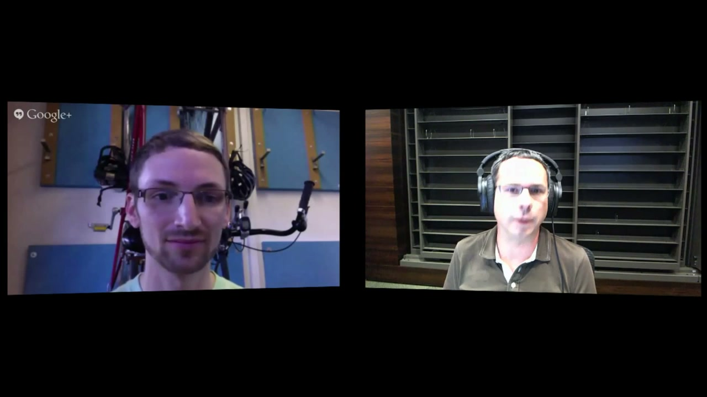
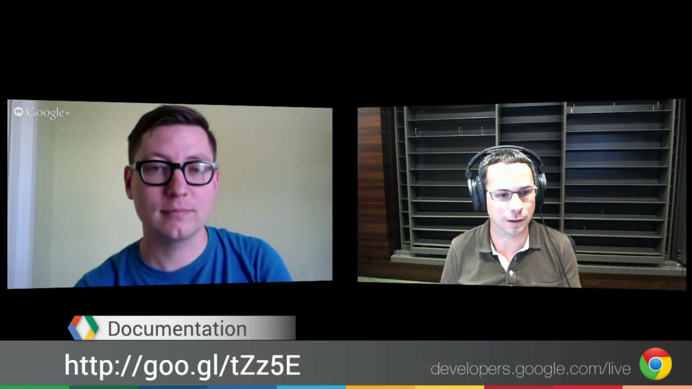

# Google Roll It — A Chrome Experiment

**CD:** James Cooper

A web-based Skee-Ball game demonstrating seamless cross-device synchronisation via the mobile browser. Launched in May 2013 alongside Chrome Racer as a paired Chrome Experiment — both making the same argument that Chrome could deliver multi-device interactive experiences without any app install.

---

## The Concept

Players sync their smartphone to their desktop browser via WebSockets. The phone becomes a motion-sensitive controller: using the device's built-in accelerometer, the player physically flicks their wrist to roll the ball. The desktop renders a full 3D Skee-Ball arcade alley via WebGL/Three.js with Physijs physics simulation. Rolling mechanics are translated from the phone's physical motion into the 3D scene in real time.

**Short URL:** `http://g.co/rollit`

---

## Technical Execution

- **3D rendering:** THREE.js (WebGL) + Physijs (physics engine)
- **3D pipeline:** Cinema 4D → Blender → THREE.js JSON export
- **Communication:** WebSockets (custom JSON protocol, ~15 messages/sec)
- **Accelerometer:** `window.deviceorientation` event with 10-sample rolling delta detection
- **Backend:** Google Compute Engine + App Engine, written in Go
- **Frontend:** CoffeeScript (transpiled to JS), SASS

Credit structure: Google Creative Lab (concept, prototypes, direction) → Legwork Studio Denver (UX, art direction, design, 3D, animation) → Mode Set Denver (primary development partner, brought in when Legwork's developers were at capacity).

From Justin Gitlin (Mode Set): *"Roll It was a Google Chrome Experiment, commissioned by the Google Creative Lab and designed by Legwork Studio. Legwork's developers were super busy at the time, so they asked me and Mode Set to build it."*

---

## Awards

| Award | Category | Year | Status |
|---|---|---|---|
| FWA | Mobile Site of the Day | 2 July 2013 | **WIN** — confirmed |
| FWA | Site of the Month | July 2013 | **WIN** — confirmed |
| FWA | Cutting Edge Award | July 2013 | **WIN** — confirmed |
| Awwwards | Site of the Day | 20 June 2013 | **WIN** — confirmed (score 7.67/10; Creativity 8.88/10) |
| Webby Awards | Integrated Mobile Experience — Apps & Software / All Devices (18th Annual) | 2014 | Nominated — win status unconfirmed |
| Adobe Cutting Edge Award | — | 2013 | Listed by Legwork; not independently verified |

**Note:** No D&AD or Cannes Lions found for Roll It specifically (Racer received the Cannes recognition for the paired Chrome Experiments launch).

---

## Collaborators

- **[Iain Tait](../collaborators/)** — ECD, Google Creative Lab NYC
- **[James Cooper](../collaborators/james_cooper.md)** — Creative Director, Google Creative Lab
- **[Stewart Smith](../collaborators/stewart_smith.md)** — Creative technologist / software engineer, Google Creative Lab (internal)
- **[Legwork Studio](../collaborators/legwork_studio.md)** — UX, art direction, design, 3D modeling, animation (Denver)
- **Mode Set (Justin Gitlin / Cacheflowe)** — Primary development partner (Denver); author of the HTML5 Rocks case study
- **[Tim Healy](../collaborators/tim_healy.md)** — Original music (London)
- **Suzanne Chambers** — Listed on Awwwards entry alongside Legwork Studio

*Note: PA Consulting, listed in an earlier version of this file, has been confirmed absent from all credible sources — removed.*

---

## References & Media

### Assets

### Work Online
- [Experiments with Google: Roll It (listing live; interactive now defunct)](https://experiments.withgoogle.com/roll-it)
- [Google Chrome Blog: "Roll across platforms and race across screens" (May 28, 2013)](http://chrome.blogspot.com/2013/05/roll-across-platforms-and-race-across.html)

### Technical
- [HTML5 Rocks / web.dev case study: "Creating Roll It" by Justin Gitlin (June 4, 2013)](https://web.dev/case-studies/roll-it)

### Awards
- [FWA: Roll It (Mobile SOTD, Site of the Month, Cutting Edge — July 2013)](https://thefwa.com/cases/roll-it)
- [Awwwards: Roll It — Site of the Day (20 June 2013)](https://www.awwwards.com/sites/roll-it)
- [Webby Awards: Nomination — Integrated Mobile Experience (2014)](https://winners.webbyawards.com/2014/apps-and-software/all-devices/integrated-mobile-experience/145778/roll-it)

### Press
- [Engadget: "Google's Roll It Chrome Experiment brings skee ball to your phone and browser" (May 28, 2013)](http://www.engadget.com/2013/05/28/google-roll-it/)
- [Mashable: "Google Brings Skeeball to Your Browser" (May 28, 2013)](http://mashable.com/2013/05/28/google-roll-it-skeeball/)
- [Slate: "Google's 'Roll It' experiment will turn your phone into a glorious time-waster" (May 29, 2013)](http://www.slate.com/blogs/trending/2013/05/29/google_roll_it_latest_chrome_mobile_experiment.html)
- [Adweek: "Google's new Chrome games are a dream come true" (covered Roll It + Racer together)](http://www.adweek.com/adfreak/googles-new-chrome-games-are-dream-come-true-good-thing)
- [SiliconAngle: "Google Chrome's Roll It" (May 23, 2013)](https://siliconangle.com/2013/05/23/googles-chrome-roll-it/)

### Video
- [YouTube: "Chrome Roll It" — official Google Developers demo (June 7, 2013)](https://youtube.com/watch?v=5XdzRoYo0wM)

### Partner Portfolios
- [Legwork Studio: Roll It case study](https://legworkstudio.com/interactive/google-roll-it/details)
- [Stewart Smith portfolio: Roll It (comprehensive awards and press list)](https://stewartsmith.io/work/roll-it)
