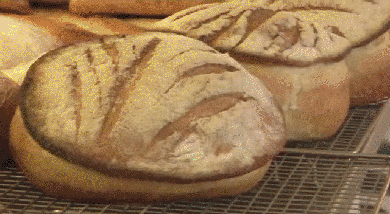
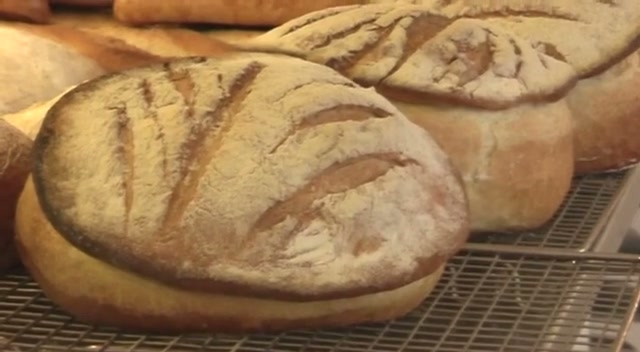
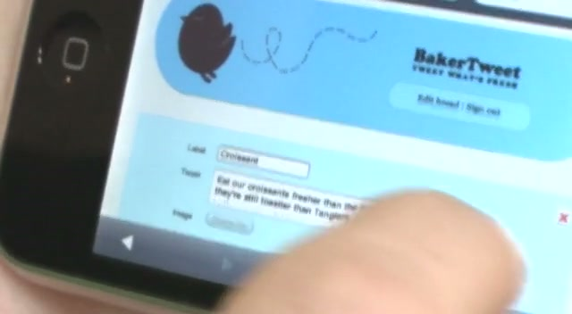
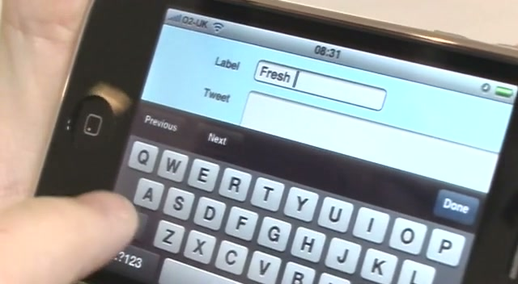
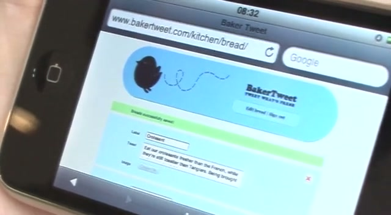
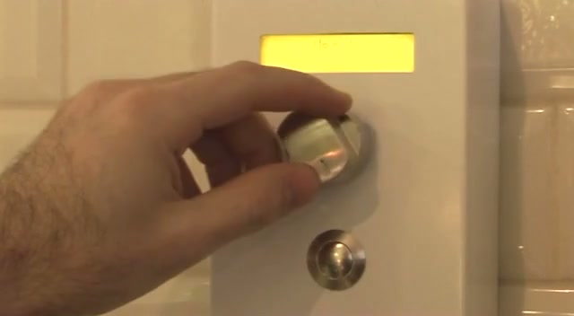

# Baker Tweet

## The Objective

To create a seamless, frictionless bridge between the physical reality of a busy commercial bakery and the digital world of Twitter, allowing bakers at the Albion Cafe in Shoreditch to alert local customers when fresh goods were out of the oven.

## The Work

Before the concept of the "Internet of Things" became thoroughly commercialised, POKE engineered a charming physical-digital interface out of necessity: the agency was located right across the street from the Albion Cafe and wanted first dibs on fresh pastries.

The concept was the **brainchild of [Nik Roope](../collaborators/nik_roope.md)**, POKE's co-founder and co-creative director, and a former colleague of Iain Tait's from the aptly named Oven Digital. It was brought to life by developer **[Andrew Zolty](../collaborators/andrew_zolty.md)**, who built the hardware and software in just **two weeks from concept to completion**. The charming visual identity and iconic character illustration that gave the product its soul was crafted by POKE illustrator **[Simon Cook (Cookie)](../collaborators/cookie.md)**.

The result was the **BakerTweet**: a ruggedised, wall-mounted steel box specifically built to withstand the heat, flour, and chaos of a commercial kitchen. Bakers could turn a physical dial to select the baked good that had just finished (e.g., Croissants, Sourdough) and press a large button to instantly dispatch a pre-formatted tweet to the Albion's followers. The device was donated to the bakery across the road from POKE HQ.

As Andrew Zolty told the Evening Standard: *"Our office is opposite the bakery, and the idea started as an office joke — we thought it would be great to get food as soon as it comes out of the oven."*

### Technical Deep Dive

- **Hardware Architecture:** Powered by a combination of the open-source Arduino Duemilanove micro-controller and an official Arduino Ethernet Shield to handle internet connectivity.
- **Environmental Design:** The form factor was entirely defined by the hostile environment of a bustling bakery. Standard keyboards or touchscreens would instantly fail due to flour ingress and sticky hands; the physical potentiometer dial and industrial push-button bypassed this entirely.
- **Network Protocol:** The box bypassed complex authentication protocols by pinging a dedicated intermediary server built by POKE, which then authenticated with Twitter's API layer to broadcast the message, ensuring the physical box's logic remained as lightweight as possible.
- **Dimensions:** 25 x 10 x 10 cm (per MoMA catalogue entry).

## Collaborators

- **[Nik Roope](../collaborators/nik_roope.md)** — POKE co-founder & co-creative director. Concept originator.
- **[Andrew Zolty](../collaborators/andrew_zolty.md)** — Developer. Built the hardware and software.
- **[Simon Cook (Cookie)](../collaborators/cookie.md)** — Illustrator. Created the BakerTweet visual identity and character.
- **Peter Prescott** — Owner, Albion Cafe.

## Reception and Legacy

### Awards

- **Cannes Lions:** Silver Lion
- **Art Directors Club (ADC):** Merit, Interactive category (89th Annual Awards, 2010)
- **Webby Awards:** Nominated, 2010

### Press Coverage

BakerTweet generated global press coverage far beyond its hyper-local origins. As Iain noted in a Creative Bloq interview: *"the story made it into papers and magazines around the world, including the Guardian, Wired and even The Hindustan Times."*

Key coverage included The Guardian, Wired, Engadget, TechCrunch, Campaign, London Evening Standard, Adafruit, and TrendHunter.

### MoMA "Talk to Me" Exhibition (2011)

BakerTweet was selected for inclusion in MoMA's **"Talk to Me: Design and the Communication between People and Objects"** exhibition (July 24 – November 7, 2011) at the Museum of Modern Art, New York. For the duration of the exhibition, MoMA's Cafe 2 broadcast the arrival of baked goods via its own BakerTweet installation.

### Cultural Impact

- **Hardware as Brand Utility:** Long before branded hardware gadgets became a widespread advertising trope, BakerTweet proved that a brand could create utility that solved a very explicit (and somewhat selfish) hyper-local problem while generating enormous global PR.
- **IoT Pioneer:** Repeatedly cited as an early example of the "Internet of Things" before the term entered mainstream usage. Coverage in Adafruit and the Arduino community positioned it as a maker-culture crossover into commercial design.
- **Industry Influence:** Featured in *The Idea Writers* by Teressa Iezzi (AdAge editor, Palgrave Macmillan, 2010) as an exemplar of new-era creative work. Campaign cited it as a key example of "how to drive digital marketing forward in 2010."
- **Spin-off Interest:** A zoo inquired about creating "KeeperTweet" to alert visitors when animals were being fed. Nik Roope explored productisation but concluded the investment required a fundamentally different business model.

### Impact Metrics

- Peter Prescott (Albion Cafe owner): *"We tested it by telling people we had fresh scones, and five minutes later we had sold out"*
- *"It has made a big difference to sales"* — Prescott, Evening Standard
- 300+ followers on @AlbionsOven at time of Evening Standard coverage

## References & Media

### Assets

### Verified URLs

- [MoMA "Talk to Me" Exhibition Entry](https://www.moma.org/interactives/exhibitions/2011/talktome/objects/146207/)
- [The Guardian: "BakerTweet gives geeks fresh oven updates in 140 chars" (2009-04-03)](https://www.theguardian.com/media/pda/2009/apr/03/twitter-marketingandpr)
- [Wired: "Baker Tweet Gives You the Scoop on Fresh Bread" (2009-04-09)](https://www.wired.com/2009/04/baker-tweet-giv/)
- [Engadget: "BakerTweet, the Arduino-based pastry early warning system" (2009-04-03)](https://www.engadget.com/2009-04-03-bakertweet-the-arduino-based-pastry-early-warning-system.html)
- [TechCrunch: "Google Creative Lab Gets 'Old Spice' Creative Director Iain Tait" (2012-04-16)](https://techcrunch.com/2012/04/16/iait-tait-google-creative-lab-wieden-kennedy/)
- [The Drum: "Hotshot Brit Iain Tait quits W&K to start baking for Google" (2012-04-17)](https://www.thedrum.com/news/hotshot-brit-iain-tait-quits-wk-start-pulling-cookies-out-googles-oven)
- [Campaign: "BBDO New York triumphs at Art Directors Club awards" — confirms ADC Merit for Baker Tweet (2010-04-27)](https://www.campaignlive.co.uk/article/bbdo-new-york-triumphs-art-directors-club-awards/999438)
- [Campaign: "Close-Up: How to drive digital marketing forward in 2010"](https://www.campaignlive.co.uk/article/close-up-drive-digital-marketing-forward-2010/984994)
- [London Evening Standard: "Bakery tries to attract customers using Twitter" (2012-04-13)](https://www.standard.co.uk/hp/front/bakery-tries-to-attract-customers-using-twitter-6918373.html)
- [Creative Bloq: "Iain Tait" — extended interview covering BakerTweet (2009-07-17)](https://www.creativebloq.com/3d/iain-tait-7099043)
- [LBB Online: "5 Minutes with Nicolas Roope" — discusses BakerTweet productisation (2012-07-11)](https://lbbonline.com/news/5-minutes-with-nicolas-roope)
- [TrendHunter: "Baker Tweeting" (2009-06-06)](https://www.trendhunter.com/trends/baker-tweet-poker-london)
- [Adafruit: "Baker Tweet — bakers using open source hardware to tweet what's tasty" (2009-04-02)](https://blog.adafruit.com/2009/04/02/baker-tweet-bakers-using-open-source-hardware-to-tweet-whats-tasty/)

### Video Assets

- [Vimeo: "Bakertweet (2009)" by Poke](https://vimeo.com/33021879) — **Local archive:** [raw/media/2009_baker_tweet_case_study.mp4](../raw/media/2009_baker_tweet_case_study.mp4)
- [Vimeo: BakerTweet demo (early embed)](https://vimeo.com/3972081) — **DEAD LINK (404)**, not archived

### Books

- Iezzi, T. (2010). *The Idea Writers: Copywriting in a New Media and Marketing Era*. Palgrave Macmillan. [Springer Link](https://link.springer.com/book/10.1007/978-1-137-51044-0)

### Raw Context

- [Raw research file](../raw/research/baker_tweet_2026-04-06.md)
- [Raw ingest source](../raw/poke_baker_tweet.md)
