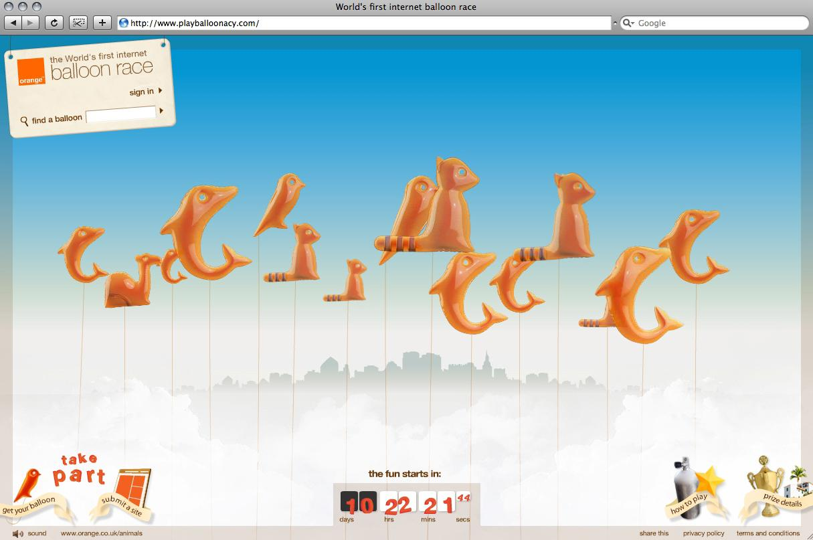
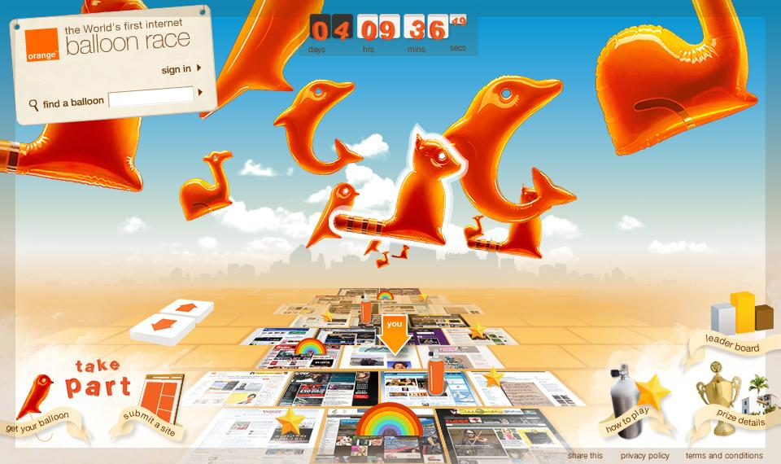
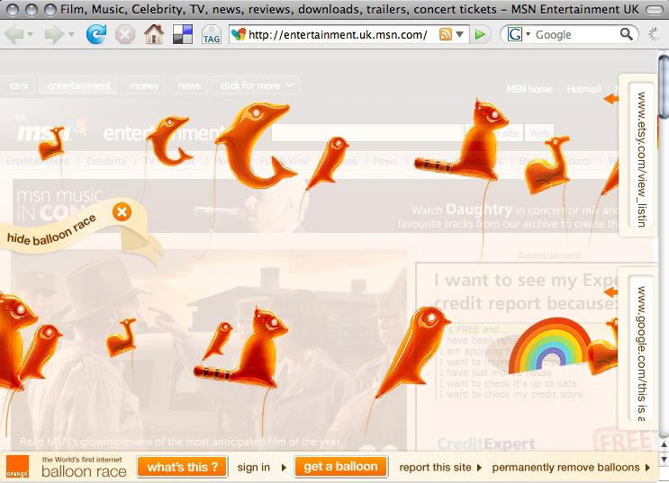
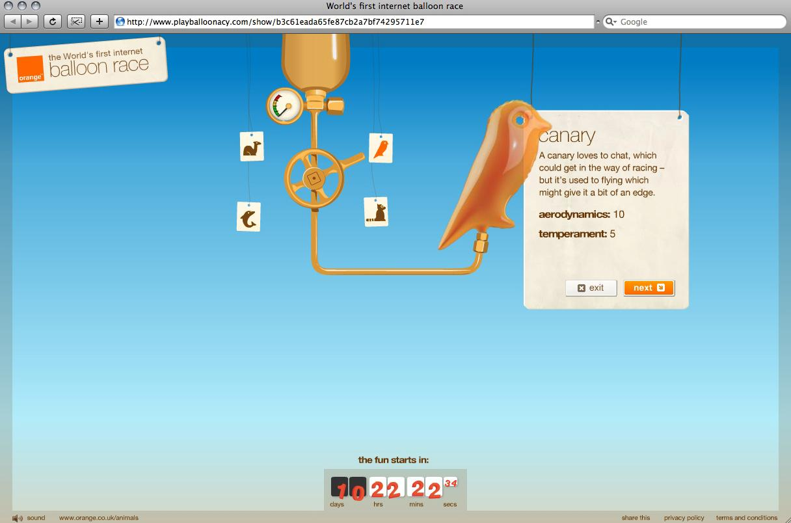
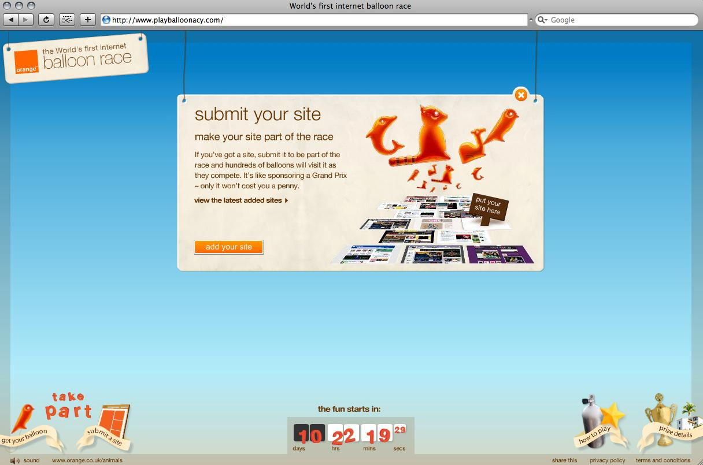
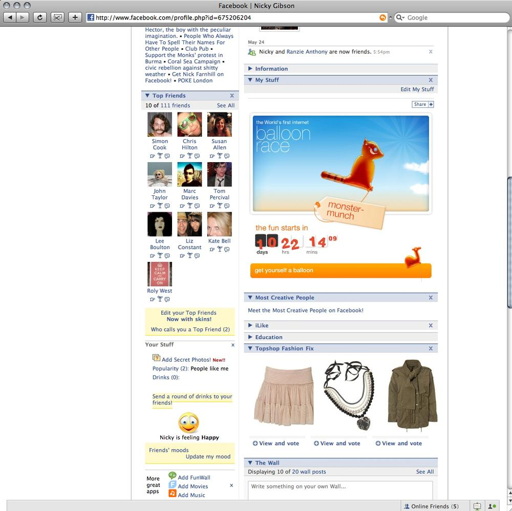

# Orange Balloonacy

> "The world's first internet balloon race."

Balloonacy was a pioneering digital campaign created entirely in-house by POKE London for Orange UK, promoting the "Orange Animals Pay As You Go" offering. Iain Tait originated the concept and led it as CD/ECD. Built using Gigya for widget distribution and Papervision for the 3D map.

---

## The Experience

The campaign allowed users to create and fly personalised virtual balloons across the internet. Rather than existing on a single microsite, the balloons traversed across 1,500–2,000 participating websites — including major portals — via an embeddable widget. The widget appeared on-site and allowed balloons to "float" across content as users visited, creating a persistent shared multiplayer experience across the open web.

A 3D race map built in Papervision tracked progress in real time. The race ran for 7 days following a 3-week sign-up period (announced 2 June 2008, launched 24 June 2008).

**Prize:** £20,000 VIP trip to Ibiza for the winner and 7 friends.

On launch day, Iain wrote on his blog: *"After lots of late nights and hard work by lots of valiant people at Poke the Orange Balloon Race is finally live and running. The servers are getting hammered with about 14 Trillion Terrabytes a second."* One commenter: *"Singlehandedly the best piece of advertising ever seen on the web."*

---

## Metrics

| Metric | Figure | Source |
|---|---|---|
| Pilots (balloons entered) | 40,000–42,000 | Orange 2010 press release; awards.playballoonacy.com Wayback |
| Race host sites | 1,500–2,000 | Orange press release; Wayback awards page |
| Total distance raced | 63 million online miles | Orange 2010 press release |
| Winning balloon | "Reginald Ringtail the Raccoon" — 5,033 internet miles | Existing record (unverified in research pass) |
| Total awards won | 9 | Orange's own 2010 press release |
| Global ranking | "Top 10 most awarded interactive projects of 2009" | Orange's own 2010 press release |

---

## Awards

| Award | Category | Year | Status |
|---|---|---|---|
| MediaGuardian Innovation Award (Megas) | Digital Creative | 2009 | **WIN** — confirmed (The Guardian, 25–30 Mar 2009) |
| Webby Awards | Websites — Telecommunications | 2009 (13th Annual) | **WIN** — confirmed (winners.webbyawards.com) |
| Clio Awards | Interactive | 2009 | Entry confirmed (credits found); shortlist/win level unverified |
| Cannes Lions | Digital/Interactive | 2009 | "Recognised" per existing record; exact category/level unverified |
| Campaign Grand Prix | — | — | Claimed in earlier records; not confirmed from open sources |
| BIMA | — | — | Claimed in earlier records; no confirming source found |

**Note:** Orange's own press release states 9 awards total from the 2008 campaign. The two confirmed wins above (Megas Digital Creative; Webby Telecommunications) are the floor. The remaining 7 are distributed across Cannes, Clio, Campaign, and BIMA — likely real but paywalled.

---

## Technical Build

- **Widget platform:** Gigya (cross-blog distribution across WordPress, Blogger, TypePad)
- **3D map:** Papervision 3D (open-source Flash 3D engine, state of the art 2007–2010)
- **Build:** Entirely in-house at POKE London — no external production company or director
- **Media partner:** i-level

---

## Collaborators

- **[Iain Tait](../collaborators/)** — Creative Director / ECD, concept originator
- **[Igor Clark](../collaborators/igor_clark.md)** — Technical lead / Management, POKE London *(evidence: directnewideas.com credit "Igor Clark, Mike Pearson - Management")*
- **[Nilesh Ashra](../collaborators/nilesh_ashra.md)** — Lead Developer, POKE London
- **[Andrew Zolty](../collaborators/andrew_zolty.md)** — Creative team (Clio 2009 credits)
- **Nicky Gibson** — Creative team (Clio 2009 credits)
- **Marc Davies** — Creative team (Clio 2009 credits)
- **Dickon Langdon** — Creative team (Clio 2009 credits)
- **i-level** — Media partner

*Note: Andrew Zolty is the only Clio-credited team member with an existing collaborator profile. Nicky Gibson, Marc Davies, and Dickon Langdon's specific roles (developer, designer, producer) are not yet confirmed from open sources.*

---

## References & Media

### Assets

### Primary — Iain Tait's Blog (crackunit.com) — all LIVE
- [Crackunit: Announcement post — "The Orange Balloon Race" (2 June 2008)](https://www.crackunit.com/2008/06/02/the-orange-balloon-race-playballoonacycom/)
- [Crackunit: Pre-launch update — "More Balloonacy" (6 June 2008)](https://www.crackunit.com/2008/06/06/more-balloonacy/)
- [Crackunit: Launch day — "Balloonacy is go! Hooray!" (24 June 2008)](https://www.crackunit.com/2008/06/24/balloonacy-is-go-hooray/)

### Awards
- [Webby Awards 2009 — Websites / Telecommunications — WIN](https://winners.webbyawards.com/2009/websites/general-websites/telecommunications/152435/orange-balloonacy)
- [The Guardian: MediaGuardian Innovation Awards 2009 winners list](https://www.theguardian.com/media/2009/mar/25/megas-winners-2009)
- [The Guardian: Megas ceremony report — "Poke agency and Orange for the Orange Balloonacy internet balloon race"](https://www.theguardian.com/media/2009/mar/30/mediaguardian-innovation-awards)

### Press
- [Campaign Live: "Brands harness the power of online games" (Nov 2009) — calls Balloonacy "one of the more successful recent online games"](https://www.campaignlive.co.uk/article/brands-harness-power-online-games-engage-consumers/967817)
- [24-7 Press Release: 2010 re-launch (key source for 2008 metrics and award count)](https://www.24-7pressrelease.com/press-release/179858/internet-balloon-race-from-orange-is-bigger-and-better-than-ever)
