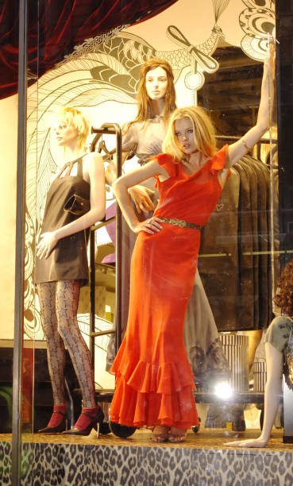
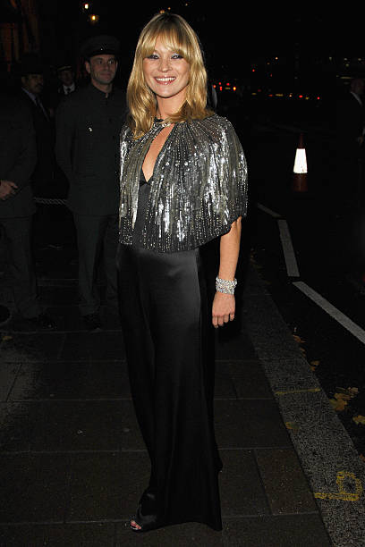
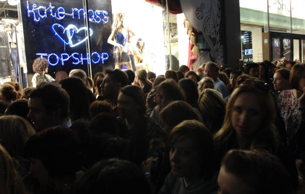
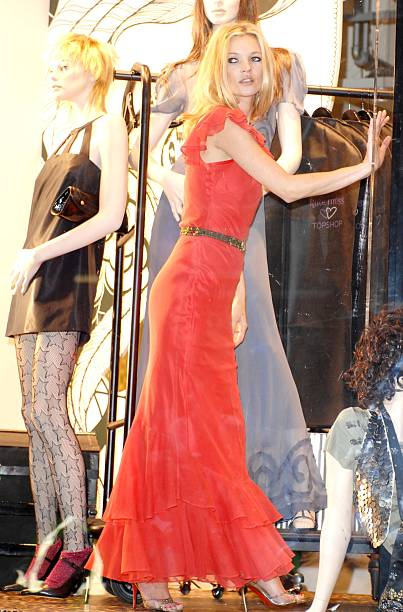
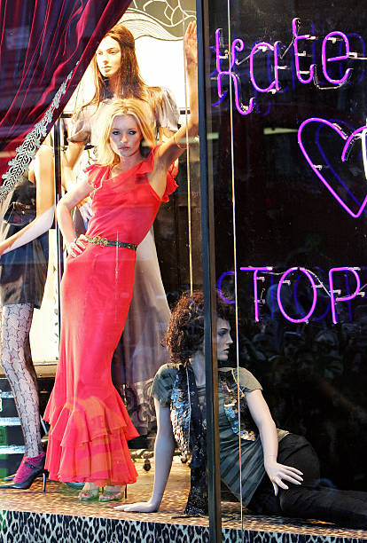
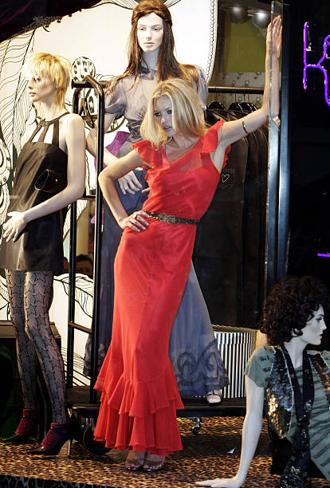
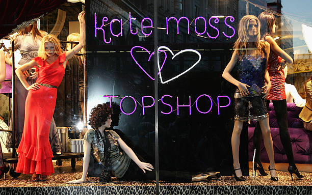
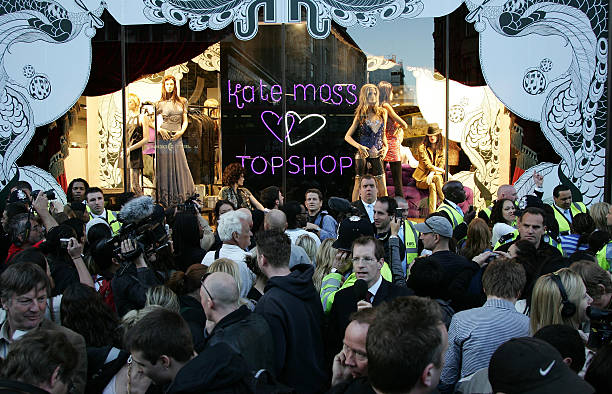
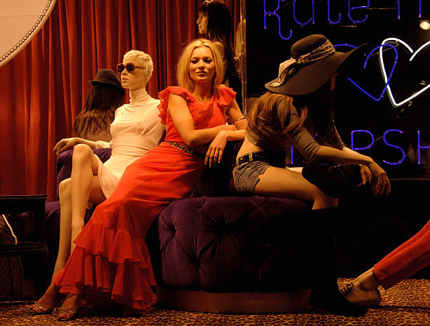
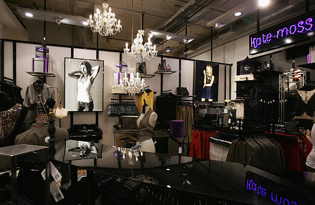

# Kate Moss for Topshop

## The Project

POKE London built the digital experience around the first Kate Moss × Topshop collection launch — one of the most culturally significant moments in British high-street fashion history.

The collection was previewed on the night of 30 April 2007, with the official on-sale date of 1 May. Fans queued overnight on Oxford Street; Topshop issued colour-coded wristbands and enforced 20-minute timed entry slots with a five-item purchase limit to manage the crowds. The 50-piece collection ranged from a £12 vest top to a £150 leather jacket. At Barneys New York, the collection sold out in four hours.

POKE's scope covered two deliverables:

1. **Kate Moss Topshop microsite** — a branded online experience featuring video podcasts documenting Moss designing the range, a blog, and stills of the collection. The site served as the digital connective tissue between the celebrity collaboration and the consumer launch.

2. **Topshop Fashion Fix Facebook application** — launched December 2007. A branded Facebook app developed by POKE sitting alongside Topshop's existing e-commerce portal, allowing users to engage with the fashion range socially.

The Kate Moss × Topshop collaboration ran annually until 2010, with a final collection in 2014.

## Awards

**Webby Award (2007) — Status: UNCONFIRMED.** The existing project notes claimed a 2007 Webby for Best Fashion site. This has not been verified: Simon Waterfall's own CV (the most authoritative POKE awards source) lists Webby wins for 2009, 2008, 2006, 2005, and 2004, but has **no 2007 entry at all**. The 2007 Webby Awards gallery requires registration and returned a 404 on the fashion category URL. The claim may be a confusion with POKE's confirmed 2005 Webby for Alexander McQueen (Best Fashion site). *Do not assert this award until a primary source is found.*

No evidence of BIMA, Cannes, or One Show entries for this specific project.

## Collaborators

- **[Iain Tait](../collaborators/iain_tait.md)** — Executive Creative Director, POKE London
- **[Nik Roope](../collaborators/nik_roope.md)** — Co-founder / ECD, POKE London
- **[Simon Waterfall](../collaborators/simon_waterfall.md)** — Creative Director / Co-Founder, POKE London
- **[Nicky Gibson](../collaborators/nicky_gibson.md)** — Senior Art Director / Designer, POKE London. Both "Kate Moss" and "Topshop" are listed as separate POKE-era clients on her portfolio (nickygibson.com).

## References & Media

### Assets

- [Campaign Live — "Topshop launches Facebook application" (3 Dec 2007)](https://www.campaignlive.co.uk/article/topshop-launches-facebook-application/770872) — confirms POKE built Topshop digital work; explicitly names POKE for the Kate Moss microsite and Fashion Fix app
- [Campaign Live — "Dare scoops Digital Agency of the Year"](https://www.campaignlive.co.uk/article/dare-scoops-digital-agency-year/773098) — paywalled; snippet confirms Kate Moss topshop.com site and Simon Waterfall reference
- [The Guardian — "Queue for preview sale of Moss Topshop collection" (1 May 2007)](https://www.theguardian.com/uk/2007/may/01/fashion.retail) — contemporaneous launch coverage
- [TIME Magazine — "How Topshop Changed Fashion" (24 May 2007)](https://time.com/archive/6681138/how-topshop-changed-fashion/) — cultural impact; Barneys NYC sell-out
- [CNN — "Kate Moss wannabes mob London store" (1 May 2007)](https://www.cnn.com/2007/SHOWBIZ/05/01/moss.clothing/index.html) — Oxford Street crowd coverage
- [CBS News — "Kate Moss' Designs Unveiled In London" (1 May 2007)](https://www.cbsnews.com/news/kate-moss-designs-unveiled-in-london/) — AP wire; wristbands, 20-min slots, 50-piece collection
- [Wayback Machine — Topshop Kate Moss URL (2007)](https://web.archive.org/web/2007*/http://www.topshop.com/en/tsuk/category/kate-moss) — no confirmed captures yet; needs manual verification
- [Raw research file](../raw/research/kate_moss_topshop_2026-04-06.md)
