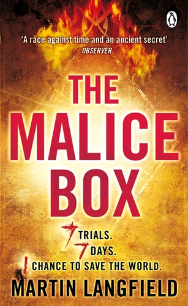
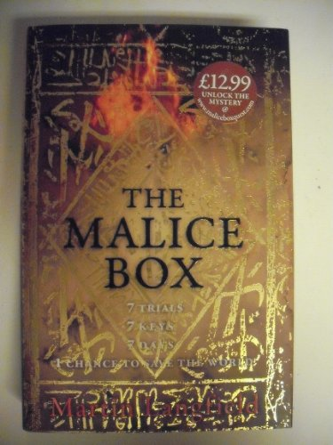
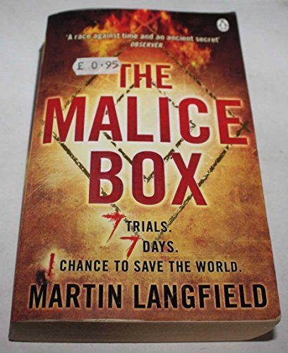
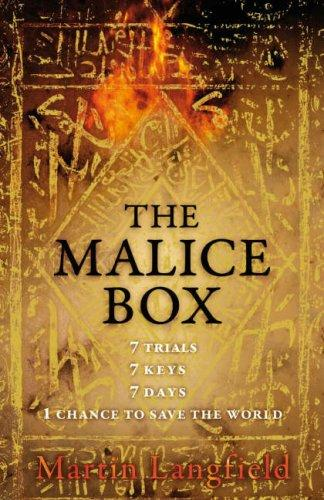

# The Malice Box Quest

An Alternate Reality Game (ARG) created by POKE London for Penguin Books to promote Martin Langfield's debut thriller novel *The Malice Box* — published by Michael Joseph (Penguin) on 28 February 2007. The game launched in early January 2007, approximately six weeks before publication, and ran for ~5 weeks. The publisher printed `www.maliceboxquest.com` directly in the book's first edition, signalling the ARG was integral to the publishing strategy from the outset.

---

## The Experience

The game invited readers to solve an escalating series of real and virtual puzzles across London:

1. **The Gridcracker** — An intricate spatial/logic puzzle online
2. **The Labyrinths** — Five increasingly difficult puzzles designed to eliminate casual players. One required converting visual patterns to braille to extract a phone number, which directed players to dial 10 digits as musical notes. Another referenced the Archimedes Principle as a puzzle element.
3. **The Real-World Climax** — The final seven contestants (the "Seven Ascendants") competed in a physical finale across London, culminating at the London Eye.

Navigation throughout used **Google Earth** (launched 2005, still genuinely novel in early 2007 — confirmed by SFF Chronicles community thread from Jan 10, 2007). A leaderboard with scoring tracked competitive play across an international community.

**Ultimate prize:** Aston Martin V8 Vantage + £10,000 cash.

Iain Tait's stated design goal: *"start off online with an immersive experience similar to an online game that becomes more and more real."*

---

## Reception

An active player community formed on the SFF Chronicles forum (confirmed thread: sffchronicles.com/threads/35047/, started Jan 10, 2007, running through Feb 13, 2007), with international participants from at least the UK and USA. Players from as far away as the US registered despite the UK-centric real-world puzzles. The ARG community likely also congregated on Unfiction forums (not yet retrieved from archives).

The novel was published in **13+ languages** (UK, US, German, Dutch, Italian, Spanish, Romanian, Indonesian, Turkish, Estonian, Polish, Portuguese editions confirmed), signalling high publisher confidence in the title — the ARG was part of a significant commercial launch push.

---

## Awards

No awards confirmed from research. Iain's recollection is "possibly some minor wins, nothing confirmed." No Cannes Lions, D&AD, Webby, Revolution, or NMA results found in open sources.

---

## Cultural Legacy

The Malice Box Quest is an early and sophisticated example of a commercial ARG in UK advertising — predating most publisher ARG campaigns by several years. Its combination of Google Earth navigation, braille puzzles, online community competition, and a physical London Eye finale placed it at the frontier of what the ARG community was calling "transmedia" storytelling. The novel's protagonist "blogs online" within the fiction, with the game site extending this into reality — an unusually deep cross-media integration for 2007.

---

## Collaborators

- **[Iain Tait](../collaborators/)** — Creative Director / ECD at POKE London (not the puzzle designer)
- **[Nik Roope](../collaborators/nik_roope.md)** — Co-Creative Director, POKE London
- **[Tim Wright](../collaborators/tim_wright.md)** — Scriptwriter (per crackunit.com blog archive)
- **[Simon Cook (Cookie)](../collaborators/cookie.md)** — POKE team contributor (per crackunit.com blog archive)
- **Martin Langfield** — Author of *The Malice Box* (Reuters East Coast Bureau Chief; first novel)
- **Penguin Books / Michael Joseph** — Client / Publisher
- *Puzzle designer: unconfirmed — role may overlap with Tim Wright, requires verification*
- *Producer, developer: not yet identified from open sources*

**POKE London team context (crackunit.com, Feb 2007):**
Yacco Vijn was announced as a new third Creative Director at POKE on 1 Feb 2007. Tom Hostler was MD ("Boss Hoss"). Asi Sharabi was in planning/strategy. It is not confirmed which of them worked on this specific project.

---

## References & Media

### Assets

### The Book
- [Open Library: *The Malice Box* — Michael Joseph/Penguin first edition (2007), includes "Visit www.maliceboxquest.com"](https://openlibrary.org/books/OL39491501M/The_malice_box)
- [Penguin.co.uk product page (ebook/paperback edition)](https://www.penguin.co.uk/books/55641/the-malice-box-by-martin-langfield/9780141909400)

### Community Coverage
- [SFF Chronicles forum thread: "Malice Box Quest" (started Jan 10, 2007 — active through Feb 13, 2007)](https://www.sffchronicles.com/threads/35047/) — Confirms Google Earth navigation, international players, leaderboard, Trial 5 timing, physical finale

### Campaign URL (Defunct)
- `maliceboxquest.com` — dead (domain no longer resolves)
- *Wayback Machine archives exist but individual snapshots not yet retrieved*

### Research Gaps
- Crackunit.com posts about this project not yet located (likely on page 2+ of January 2007 archive — Wayback has 592 captures of crackunit.com from this period)
- Unfiction forum thread not retrieved
- Trade press (Campaign, NMA, Revolution) coverage likely paywalled
- No video record found
