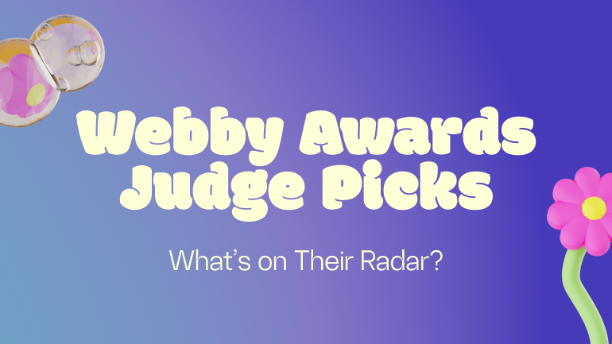

# Netted by the Webbys

POKE London provided the naming and brand/design identity for **Netted** — a free daily email newsletter launched by The Webby Awards on 4 November 2009, dedicated to "better living through the internet." Each edition recommended one website, app, or service. The newsletter grew to 50,000+ subscribers and remains live at netted.net in 2026.

---

## POKE's Role

**David-Michel Davies**, Executive Director of The Webby Awards (MarketingSherpa, September 2011):

> *"I took our branding/design assignment to **Nicolas Roope and Iain Tait at Poke London** (Iain's now at Wieden+Kennedy) because I knew that when I asked them to make something both beautiful and Internet-y with a great name, they'd understand what that meant for our organization."*

This is the primary source confirming POKE's scope: **naming + branding/design**. The name "Netted by the Webbys" was itself the creative resolution — a name that connected the new property to the Webby Awards brand without causing confusion with the awards themselves.

**Note:** Iain had moved to W+K by the time Davies gave this quote (September 2011). The work was done while Iain was still at POKE (launched November 2009), at which point he was ECD.

---

## What Netted Was

A free daily email newsletter from The Webby Awards:
- One recommendation per issue — a website, app, or service
- Tagline: "Better living through the internet"
- Launched: 4 November 2009
- Grew to: 50,000+ subscribers
- Still live at `netted.net` in 2026 (now publishing periodic articles rather than daily emails)

**POKE–Webby relationship context:** Claire Graves, who later became Executive Director of The Webby Awards, had previously been a Client Lead at POKE London managing accounts including The Guardian, BBC, and Skype. The project reflects a deep, ongoing relationship between the two organisations.

---

## Collaborators

- **[Iain Tait](../collaborators/)** — Naming and branding lead, POKE London (explicitly named by client)
- **[Nik Roope](../collaborators/nik_roope.md)** — Naming and branding lead, POKE London (explicitly named by client)
- **The Webby Awards / IADAS** — Client (David-Michel Davies, Executive Director)

---

## References & Media

### Assets

- [Webby Awards press release, 4 November 2009 — Netted launch announcement](https://www.webbyawards.com/press/press-releases/the-webby-awards-launch-daily-newsletter-uncovering-internets-most-brilliantly-useful-things/)
- [MarketingSherpa, September 2011 — David-Michel Davies names Iain Tait and Nik Roope as POKE contacts (primary attribution source)](https://sherpablog.marketingsherpa.com/marketing/naming-branding-companies/)
- [netted.net](https://netted.net) — live site
