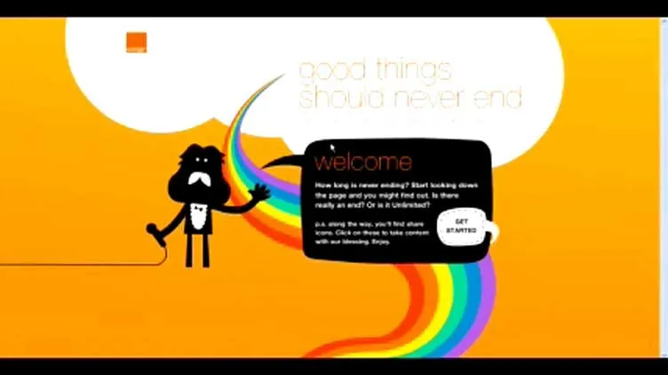
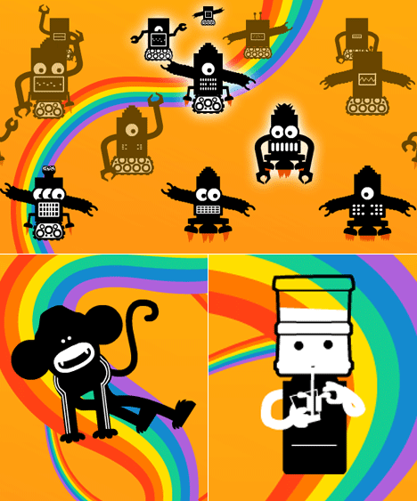
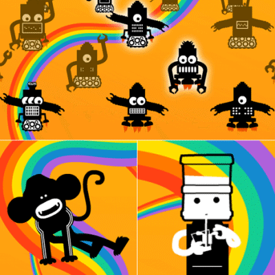

# Orange Unlimited — The Never-Ending Webpage

**Official title:** *Unlimited — Good Things Should Never End*

A Flash-based infinite-scrolling webpage created by POKE London for Orange UK, launched in November 2007 as part of a £6m campaign to promote Orange's unlimited calls and texts packages. The concept was elegantly literal: a webpage that never ended — illustrating "unlimited" through the experience of scrolling forever, through animated characters, generative art, and reactive sound design.

Named in **Campaign Annual 2007 Top 10 Digital Ads (#8)** and **Advertising Age's best non-TV digital efforts of 2007**. Won a **Webby Award 2008 (Design Aesthetic)**, **Cannes Cyber Lions Silver**, **ADC New York Gold Cube**, **BIMA Overall Winner**, and the **Revolution Awards Grand Prix**.

**Attribution note:** Iain Tait contributed to the original concept as co-founder and co-creative director of POKE. Nik Roope led the craft, execution, and public presentation of the work. The Campaign Annual 2007 credits list Nik Roope first. Neither should be sole-credited — this was a shared origination.

---

## The Experience

**URL:** `http://unlimited.orange.co.uk` (also accessible as `http://www.goodthingsshouldneverend.co.uk`) — both now offline.

A Flash website designed to be genuinely endless. Users scrolled down — and down — encountering a continuous landscape of animated characters, illustrated vignettes, generative visual elements coded by Marius Watz, and a reactive audio layer by Nick Ryan. The page would not end because Orange's service did not end.

**Nik Roope (Dezeen, 2007):** *"Orange asked us to talk about their unlimited offers so we made them a never ending web page. Easy concept to sell but pretty scary when we had to work out what to put on it. We worked with an animator called Rex and an art coder guy called Mariuz Watz."*

**Campaign Annual 2007 description:** *"A website building on Orange's unlimited text package that runs for as long as you can be bothered to scroll down it. It's not really neverending, but is full of lovely illustrations and widgets."*

**Advertising Age (Dec 2007):** *"In a freedom-to-talk push, Poke, London created a never-ending webpage. Really, it doesn't stop."*

---

## Awards

| Award | Category | Result |
|---|---|---|
| Webby Awards 2008 | Design Aesthetic | **Winner** |
| Cannes Cyber Lions 2008 | Telecomms and Microsites | **Silver Lion** |
| Cannes Cyber Lions 2008 | Innovations | **Bronze Lion** |
| ADC New York | Innovation | **Gold Cube** |
| ADC New York | Best Microsite | **Silver Cube** |
| One Show Interactive | Consumer Microsites | **Silver Pencil** |
| One Show Interactive | Multimedia | **Bronze Pencil** |
| BIMA 2008 | Overall Winner — BTC Web | **Winner** |
| Revolution Awards | Grand Prix | **Winner** |
| Revolution Awards | Best Online Advertising | **Winner** |
| LIA 2008 | Best Use of Animation/Motion Graphics | Finalist |
| IAB | Campaign of the Year | **Winner** |
| Clio Awards | Best Microsite | **Bronze** |

*Note: Awards confirmed via Nicky Gibson's portfolio (nickygibson.com/exhibitions-awards). The Campaign Annual creatives list and Designboom/Cannes shortlist confirm the project's award trajectory. Individual award-level disambiguation against the full Poke credits list is noted.*

**Industry recognition:**
- **Campaign Annual 2007 Top 10 Digital Ads — #8** (same list as Spot the Bull at #1)
- **Advertising Age best non-TV digital 2007** — listed alongside Halo 3 and Discovery Channel Shark Runners

---

## Museum / Permanent Collection

Team member **Nicky Gibson** describes herself as "MoMA and Design Museum exhibited" on her personal website, with Orange Unlimited explicitly listed in her client work. She has a confirmed MoMA artist page at `moma.org/artists/39782` and exhibition credits at MoMA (New York), the Design Museum (London), and ICA (London).

Whether **Orange Unlimited specifically** is in MoMA's or the Design Museum's permanent collection or was exhibited as part of a digital design show requires manual verification:
- `https://www.moma.org/artists/39782` (Nicky Gibson MoMA page)
- `https://collection.designmuseum.org` (search "Poke" or "Orange Unlimited")

**Separate fact:** Nik Roope's **Plumen 001** lightbulb (his Hulger product, separate from POKE work) is confirmed in MoMA's and the V&A's permanent collections. This is not related to Orange Unlimited.

---

## Cultural Legacy

Orange Unlimited is one of three works cited as defining Iain Tait's POKE era in *Boards Magazine* (2010) — alongside Room 10101 and Oasis Rubberduckzilla. In the 2009 Creative Bloq profile of Iain Tait it is described simply as "the much-loved 'never-ending webpage' for Orange Unlimited" — no explanation required, indicating it had achieved genuine cultural recognition.

Nik Roope presented the work at **Belgrade Design Week 2009** and at the **Kyoorius Design Yatra seminar** (India, 2008) as an example of POKE's philosophy of ideas that exist as genuine experiences rather than advertisements.

Adage citations also note that Skittles' "Experience the Rainbow" campaign (2010) drew inspiration from this project.

---

## Collaborators

- **[Iain Tait](../collaborators/)** — Concept originator / Co-founder, POKE London (executive creative; not in Campaign credits)
- **[Nik Roope](../collaborators/nik_roope.md)** — Creative Lead / Co-founder, POKE London (listed first in Campaign credits; public face of the project)
- **[Nicky Gibson](../collaborators/nicky_gibson.md)** — Designer / Art Director (Campaign credits; MoMA + Design Museum exhibition credits)
- **[Derek McKenna](../collaborators/derek_mckenna.md)** — Lead Flash Developer (Campaign credits; also on Balloonacy)
- **[Rex Crowle](../collaborators/rex_crowle.md)** — Animator (named by Roope in Dezeen; rexbox.co.uk)
- **[Marius Watz](../collaborators/marius_watz.md)** — Art Coder / Generative (named by Roope in Dezeen; unlekker.net)
- **[Nick Ryan](../collaborators/nick_ryan.md)** — Sound / Audio (Campaign credits)
- **Julie Barnes** — Creative (Campaign credits)
- **Orange UK** — Client

---

## References & Media

### Assets

### Press
- [Dezeen, 3 November 2007 — "The never-ending web page by Poke" (Marcus Fairs; launch coverage; Roope quotes)](https://www.dezeen.com/2007/11/03/the-never-ending-web-page-by-poke/)
- [Core77, 3 November 2007 — "The never ending web page"](https://www.core77.com/posts/7988/The-never-ending-web-page)
- [Campaign Live, 1 November 2007 — "Orange launches colourful 'never-ending' campaign" (£6m campaign context)](https://www.campaignlive.co.uk/article/orange-launches-colourful-never-ending-campaign/764110)
- [Campaign Annual 2007, Top 10 Digital Ads (#8) — with authoritative creatives credit list](https://www.campaignlive.co.uk/article/campaign-annual-2007-top-10-digital-ads/773787)
- [Campaign India, 15 September 2008 — Roope at Kyoorius Design Yatra](https://www.campaignindia.in/article/the-real-world-is-driven-by-web-roope/43jc7rgfr1aa17avcsd159yax7)
- [Advertising Age, 17 December 2007 — named in best non-TV digital of 2007 (paywalled)](https://www.proquest.com/docview/208407336)
- [Designboom, 1 June 2009 — Roope at Belgrade Design Week; confirms Webby 2008](https://www.designboom.com/marketing/poke-london-nicolas-roope-at-belgrade-design-week/)
- [Creative Bloq, 17 July 2009 — Iain Tait profile ("much-loved 'never-ending webpage'")](https://www.creativebloq.com/3d/iain-tait-7099043)

### Awards and collaborator pages
- [Nicky Gibson exhibitions & awards (includes full awards list)](https://www.nickygibson.com/exhibitions-awards)
- [LIA 2008 Digital Media Finalists — POKE London / Orange Unlimited listed](https://2008.liaentries.com/winners/?id_medium=2&view=list&range=f)

### Archive
- Wayback Machine capture, 10 April 2008: `https://web.archive.org/web/20080410173222/http://unlimited.orange.co.uk/flash/go`
- Original URL (dead): `http://unlimited.orange.co.uk`
- Alternate URL (dead): `http://www.goodthingsshouldneverend.co.uk`
- Core77 GIF screenshot (possibly still live): `https://s3files.core77.com/blog/images/endless_orange.gif`
- Dezeen static screenshot: `https://static.dezeen.com/uploads/2007/11/42.jpg`
