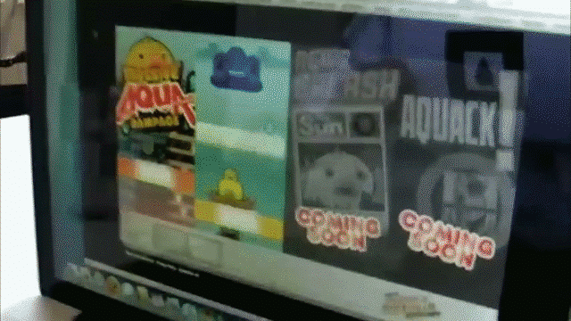
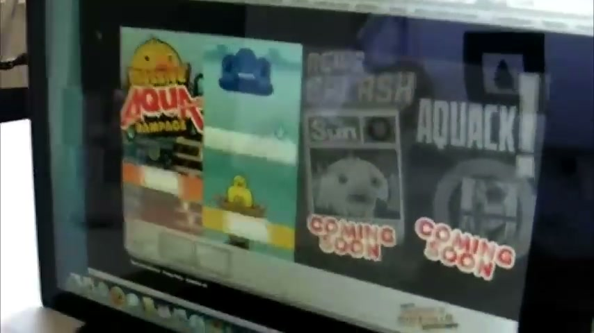
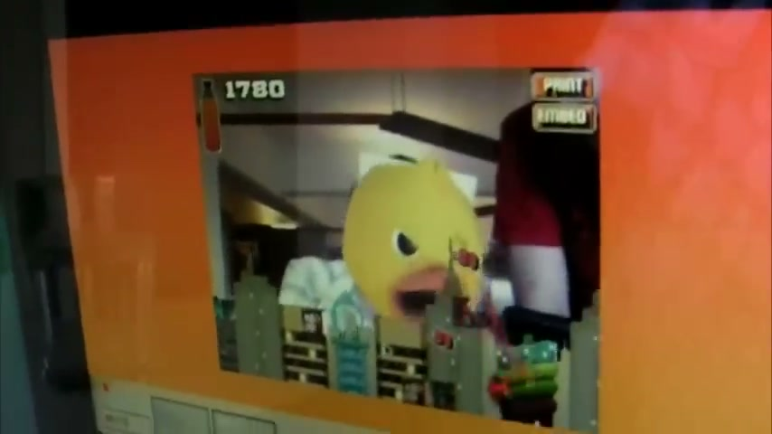
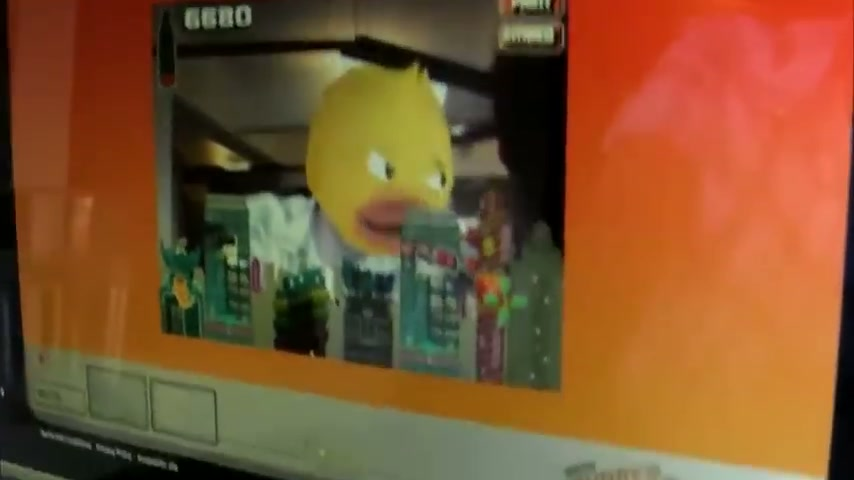
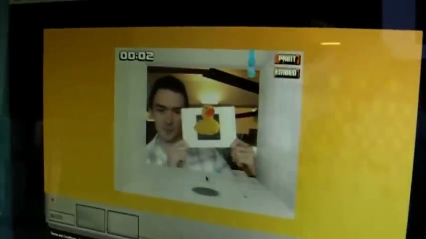
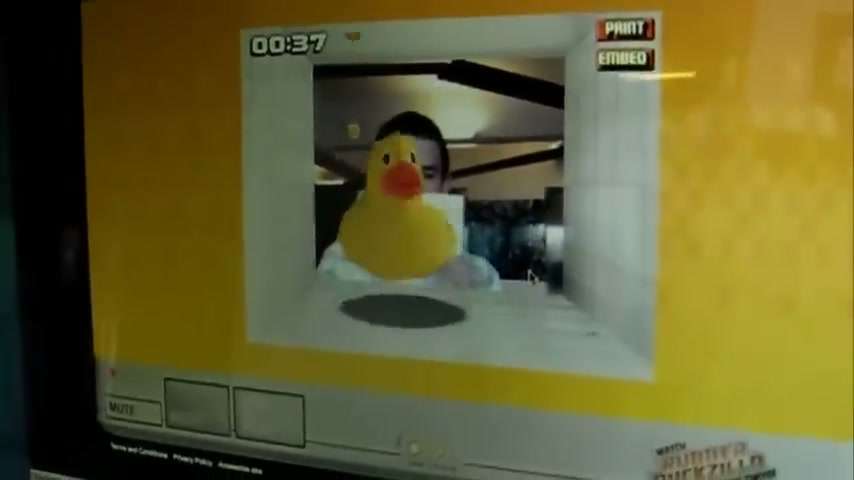
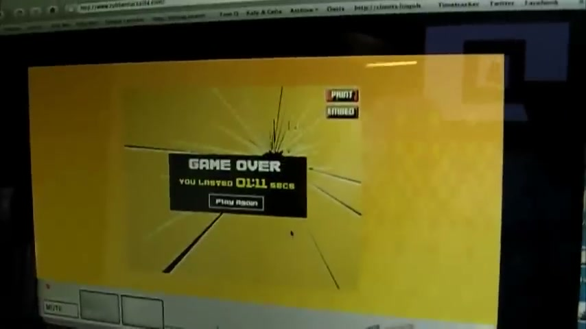

# Oasis Rubberduckzilla — AR Campaign

POKE London's digital and augmented reality work in support of the Oasis "Rubberduckzilla" campaign — a giant, water-hating rubber duck stomping through a Japanese city in the style of Godzilla. **The TV ad, print, and outdoor were made by Mother London (not POKE).** POKE created the AR games, the interactive website, and the innovative Sun newspaper media takeover.

One of the earliest examples of augmented reality used in mainstream UK brand advertising — deployed in 2009, using FLARToolKit when AR was still genuinely novel.

**Iain (crackunit.com, June 2009):** *"The Oasis stuff feels like a slightly silly way of delivering what is essentially a slightly silly message. It's not trying to do anything more. Which is cool in my book."*

---

## What POKE Built

### AR Games — rubberduckzilla.com

A Flash-based AR games website using **FLARToolKit** (open-source AR library). At launch two of four planned sections were active:

1. **Become Rubberduckzilla** — users held an AR marker up to their webcam to become RDZ and fire lasers from their eyes
2. **Head Takeover** — putting the AR marker on your head turned your head into the duck's head

Interaction was playful and low-stakes — matching the brand's tone exactly. 8-bit Japanese-style graphics and music.

### The Sun Newspaper Takeover

The standout component. POKE created a special "episode" in partnership with The Sun: **the physical front cover of The Sun newspaper became an AR marker**. Holding a copy of The Sun up to a webcam replaced the cover with animated destruction content.

Iain, crackunit.com: *"Personally I like this bit of the campaign as it puts the 'marker' in peoples' hands and doesn't rely on printers and stuff."*

This was genuinely innovative — solving the primary friction of consumer AR (the need to print markers) by turning a mass-circulation newspaper into the input device. At the time, The Sun sold approximately 3 million copies daily.

---

## Agency Split

| Work | Agency |
|---|---|
| TV ad (directed by Joseph Kahn) | Mother London + HSI Productions |
| Digital / AR / interactive | **POKE London** |

The TV campaign launched 18 May 2009 (first aired during Hollyoaks). POKE's AR site launched approximately June 2009. The two agencies worked in parallel — POKE and Mother had a long-standing partnership (Mother held many brand accounts, with POKE as their digital arm).

---

## Technology

- **FLARToolKit** — Flash-based open-source AR library (community-built from ARToolKit)
- **Webcam + printed AR markers** — standard 2009 AR stack
- **The Sun as AR marker** — the campaign's key innovation; eliminated printer dependency

**Context:** In 2009, AR was barely emerging in consumer applications. The iPhone 3GS (the first with a compass, enabling location AR) had just launched. Markerless AR was years away. FLARToolKit marker-based AR was the cutting edge. Flo Heiss (then at Dare) said at the time: *"Augmented Reality is the Quicktime VR of 2009"* — positioning it as a hyped-but-embryonic technology.

---

## Awards

No confirmed award wins or nominations found for POKE's digital component. Research gap: BIMA or Cannes Cyber Lions records from 2009–2010 may yield results.

---

## Collaborators

- **[Iain Tait](../collaborators/)** — ECD, POKE London
- **[Gavin Fox](../collaborators/gavin_fox.md)** — Creative Director, POKE London
- **[Katie Marcus](../collaborators/katie_marcus.md)** — Creative, POKE London
- **[Jason Fox](../collaborators/jason_fox.md)** — Creative, POKE London
- **Mother London** — TV, print, and outdoor (NOT POKE's work)
- **Joseph Kahn** — TV director (Mother / HSI)
- **Oasis / Coca-Cola UK** — Client (client contact: Cathryn Sleight)

---

## References & Media

### Assets

### Primary source
- [crackunit.com — Iain Tait's own blog post, 12 June 2009 (primary source)](https://www.crackunit.com/2009/06/12/aaaaaaargh-rubberduckzillacom/)

### Press
- [Marketing Week, 7 May 2009 — "Oasis unveils Rubberduckzilla TV ad" — confirms "digital element created by Poke"](https://www.marketingweek.com/oasis-unveils-rubberduckzilla-tv-ad/)
- [Adverblog, 8 June 2009 — "smart guys from Poke London"](https://www.adverblog.com/archives/003900/)
- [BannerBlog, 14 June 2009 — "35 Awesome AR Examples" — credits "Agency: Poke London [UK]"](https://www.bannerblog.com.au/news/2009/06/35_awesome_augmented_reality_examples.php)
- [Campaign Live — Oasis / Rubberduckzilla (Mother campaign; 403 blocked)](https://www.campaignlive.co.uk/article/oasis-rubberduckzilla-mother-london/902589)

### Video
- [POKE AR Demo — YouTube (Poke's Chris demos the cityscape destruction game)](https://www.youtube.com/watch?v=5lbIBfN6dkI)
- [TV spot — Vimeo (Mother / Joseph Kahn; not POKE's work)](https://vimeo.com/320150715)
- [TV spot — YouTube](https://www.youtube.com/watch?v=hnNAPZ9lJ9g)

### Archived site
- rubberduckzilla.com — now offline
