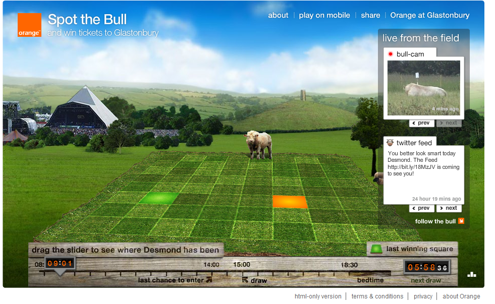
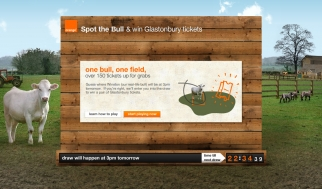

# Orange Spot the Bull

**Years:** 2007, 2008, 2009 (three consecutive annual campaigns)

A three-year annual digital campaign for Orange UK, tied to Orange's long-running Glastonbury Festival sponsorship. A real bull was fitted with a GPS tracker and placed in a real field at a secret UK location (not at Glastonbury). Users visited a dedicated microsite, viewed the bull's live position via GPS data, and picked the grid square where they predicted the bull would be standing at 3pm that day. Correct guessers entered a daily prize draw to win a pair of Glastonbury Festival tickets.

Named **#1 in Campaign Annual 2007's Top 10 Digital Ads**. Won **two LIA Gold awards in 2008**. Named one of the "10 Best Ever Promotions" in the UK by Mando Agency in 2025, and cited as the direct inspiration for Walkers' "When it Rains" promotional campaign.

---

## The Experience

**The bull:** A real animal fitted with a GPS tracker, placed in a secret field at an undisclosed UK location. Not at Glastonbury — the Glastonbury connection was entirely the prize.

**The mechanic:**
1. Users visited `spotthebull.co.uk` (also `spotthebull.orange.co.uk`)
2. The bull's live position was displayed on a grid map of the field
3. Users picked the grid square they predicted the bull would occupy at 3pm that day
4. Correct predictions entered a daily prize draw for a pair of Glastonbury Festival tickets

**The prize:** Sold-out Glastonbury Festival tickets — effectively priceless to UK music fans, highly contextually relevant to Orange's Glastonbury sponsorship.

### Campaign Evolution by Year

**2007 — Original launch**
Named #1 in Campaign Annual's Top 10 Digital Ads of 2007. TrendHunter covered it in May 2007: *"A brilliantly funny idea that really took off."* The bull in some early coverage is referred to as "Derek."

**2008 — Enhanced relaunch**
Added hoof-step-by-hoof-step tracking. A farmer provided daily tips on the bull's routine. Campaign Live reported the relaunch on 30 May 2008: "Orange revives Spot the Bull." Technology stack expanded to include Papervision3D, Flash AS3, and a live two-way GPS data feed via Flashtalking's 3D banner format. Production partnership with Unit 9 confirmed.

**2009 — Third iteration**
Bull named **Desmond**. Added Twitter account @spotthebull. AdPulp: *"Ride Darling Desmond To The Show"* (27 May 2009). Social media integration formalised.

---

## Awards

- **Campaign Annual 2007: #1 in Top 10 Digital Ads** — "A brilliantly funny idea that really took off. Orange had some Glastonbury tickets to give away, so Poke put a GPS tracker on a bull…"
- **LIA 2008: Gold — Digital Media / Online Games** (POKE London / Orange / "Spot The Bull")
- **LIA 2008: Gold — Digital Media / Best Use of Interactivity** (POKE London / Orange / "Spot The Bull")

---

## Cultural Legacy

In 2025, Mando Agency named Spot the Bull one of **"The 10 Best Ever Promotions"** in UK advertising, explicitly citing it as the direct creative inspiration for Walkers' "When it Rains" campaign:

> *"It was this promotion which inspired Walkers' When it Rains promotion which was a much bigger promotional campaign involving consumers purchasing crisps and picking grid squares across the country to participate — by guessing where it was going to rain."*

Spot the Bull was one of the earliest documented examples of **physical-digital real-time integration in UK advertising** — a real object connected to the internet to drive digital engagement, predating mainstream IoT discourse by nearly a decade. The campaign ran at the exact moment that Flash-based 3D banners (Papervision3D) were pushing browser-based interactivity to its limits.

When POKE celebrated their 10th anniversary in 2011, Spot the Bull was one of the works commemorated with a bespoke cake display — confirming its status as one of the agency's landmark projects.

---

## Technology

- **Papervision3D** (Flash AS3) — 3D rendering in the browser
- **Live two-way GPS data feed** — bull's position relayed in real-time
- **Flashtalking** — 3D interactive banner ad format (showcase at flashtalking.com/showcase/Orange3D/)
- **Twitter** — 2009 iteration, @spotthebull

---

## Collaborators

- **[Iain Tait](../collaborators/)** — Creative Director, POKE London
- **[Nik Roope](../collaborators/nik_roope.md)** — Co-Creative Director, POKE London
- **[Oliver Wright](../collaborators/oliver_wright.md)** — Executive Producer, POKE London
- **[Unit 9](../collaborators/unit9.md)** — Production partner (2008–2009)
- **Mediaedge CIA** — Media planning and buying
- **Flashtalking** — Ad technology platform (3D banner unit)
- **Orange UK** — Client

---

## References & Media

### Assets

### Awards database
- [LIA 2008 winners — Digital Media (Online Games + Best Use of Interactivity)](https://2008.liaentries.com/winners/?id_medium=2&view=icons&range=w)

### Press
- [Campaign Annual 2007: Top 10 Digital Ads (#1)](https://www.campaignlive.co.uk/article/campaign-annual-2007-top-10-digital-ads/773787)
- [Campaign Live, 27 May 2008: "Orange launches Glastonbury ticket giveaway online"](https://www.campaignlive.co.uk/article/orange-launches-glastonbury-ticket-giveaway-online/811722)
- [Campaign Live, 30 May 2008: "Orange revives Spot the Bull"](https://www.campaignlive.co.uk/article/week-advertising-news-orange-revives-spot-bull/812871)
- [Campaign Live, 23 May 2008: "Orange celebrates 10 years at Glasto with 'kinetic' charge"](https://www.campaignlive.co.uk/article/orange-celebrates-10-years-glasto-kinetic-charge/811650)
- [Campaign Live, 25 Nov 2008: "Brand Watch: Case Study — Orange"](https://www.campaignlive.co.uk/article/brand-watch-case-study-orange/864869)
- [TrendHunter, 31 May 2007: "Spot the Bull Ad Campaign"](https://www.trendhunter.com/trends/viral-marketing-spot-the-bull-win-glastonbury-music-festival-tickets)
- [AdPulp, 27 May 2009: "Ride Darling Desmond To The Show"](https://www.adpulp.com/ride_darling_de/)
- [Mando Agency, 9 July 2025: "The 10 Best Ever Promotions" (#4 — Spot the Bull)](https://mando.co.uk/10-best-ever-promotions/)
- [If Only We'd Thought of That blog, 16 June 2009](https://ifonlyblog.wordpress.com/2009/06/16/orange-spot-the-bull-digital-campaign/)
- [Cakeheadloves, December 2011 — POKE 10th birthday (Spot the Bull among landmark works)](https://cakeheadloves.wordpress.com/our-work/poke-10/)

### Archived site
- Microsite: `http://www.spotthebull.co.uk/` (now offline)
- Wayback Machine: `https://web.archive.org/web/2009*/http://www.spotthebull.co.uk/`
