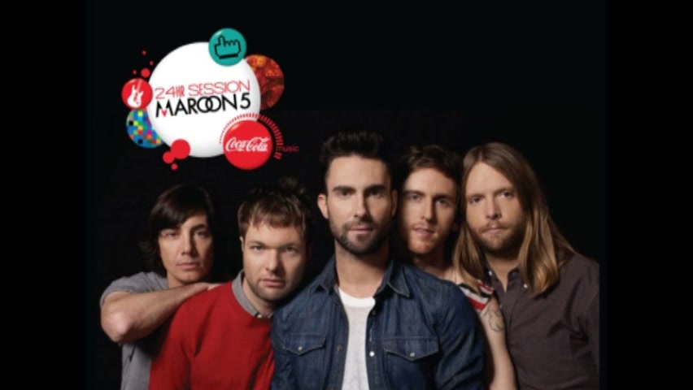

# Coca-Cola / Maroon 5: 24hr Recording Session

## The Event

Part of Coca-Cola's "Coca-Cola Music" initiative for teens. On **22 March 2011 at 17:00 GMT**, Maroon 5 entered a London studio and wrote and recorded an entirely original track from scratch, live in front of a global internet audience, over 24 continuous hours.

## Interactive Execution

A large **projection-mapped interactive sculpture** inside the recording studio displayed fan submissions — lyrics, beats, comments — in real time via Twitter and social media. Band members could interact with the projections via gestures. The system was built by **Hellicar & Lewis** (Pete Hellicar & Joel Lewis) using **openFrameworks**, with a team of creative technologists.

Fans globally could influence the creative process as it happened — their contributions visibly shaping the physical environment the band was working in.

## The Song

**"Is Anybody Out There"** featuring **PJ Morton**. Available as a free download; for the first 100,000 downloads, Coca-Cola donated to the **RAIN** (Rural Action in Nigeria) clean water initiative for Africa.

- [YouTube: "Is Anybody Out There" — Maroon 5 ft. PJ Morton](https://www.youtube.com/watch?v=IJdWn96ldOE)

## Reach

| Metric | Figure |
|---|---|
| Countries reached (live stream) | 139 |
| Coca-Cola Facebook promotion reach | 20+ million |

## Collaborators

- **[Iain Tait](../collaborators/iain_tait.md)** — Global Interactive Creative Director, W+K (authored the Campaign magazine first-person piece about the project; quoted in The Drum)
- **[Dom Felton](../collaborators/dom_felton.md)** — Producer, W+K London
- **[Nexus Studios](../collaborators/nexus_studios.md)** (then Nexus Interactive Arts) — Production / technology company
- **Hellicar & Lewis** (Pete Hellicar + Joel Gethin Lewis) — Directing duo (on Nexus Interactive Arts roster); built gestural openFrameworks system
- **Chris Sugrue, James George, Josh Nimoy, Joshua Noble, Marek Bereza, Todd Vanderlin** — Hellicar & Lewis collaborators
- **PJ Morton** — Featured artist on the track
- **[Jackie Jantos](../collaborators/jackie_jantos.md)** — Client, Coca-Cola (per Iain Tait)
- **Joe Belliotti** — Director of Global Entertainment Marketing, Coca-Cola (named in press)

*No additional individual W+K writer or art director names confirmed in press sources.*

## References & Media

### Assets

### Video
- [YouTube: "Is Anybody Out There" — Maroon 5 ft. PJ Morton (the song)](https://www.youtube.com/watch?v=IJdWn96ldOE)

### Press
- [W+K London blog: "Making Music Together" — Iain Tait first-person piece](https://wklondon.com/2011/03/making-music-together/)
- [The Drum: coverage naming Iain Tait as Global Interactive Creative Director](https://www.thedrum.com)
- [Marketing Week: Coca-Cola / Maroon 5 coverage (2011)](https://www.marketingweek.com)

### Raw Research
- [Raw research file](../raw/research/wk_portland_dodge_cocacola_2026-04-07.md)
