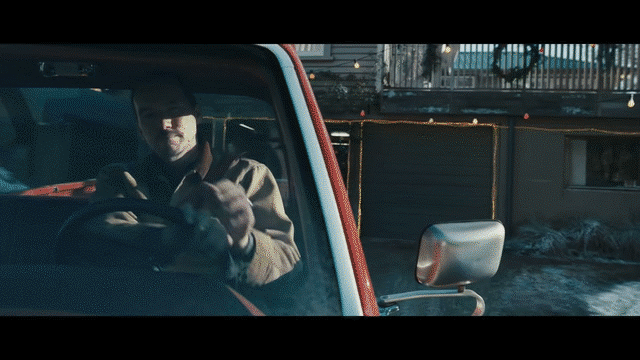
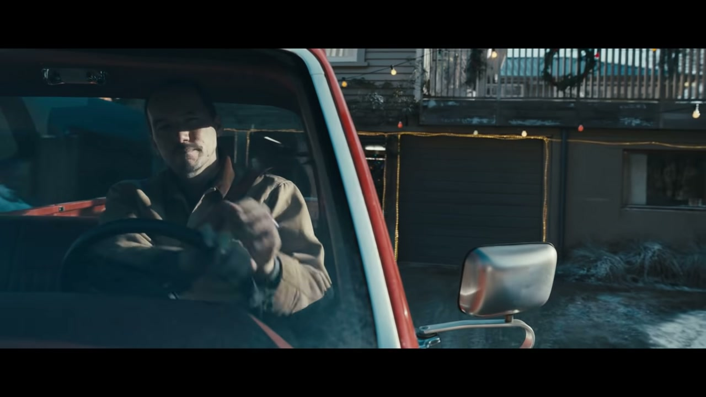
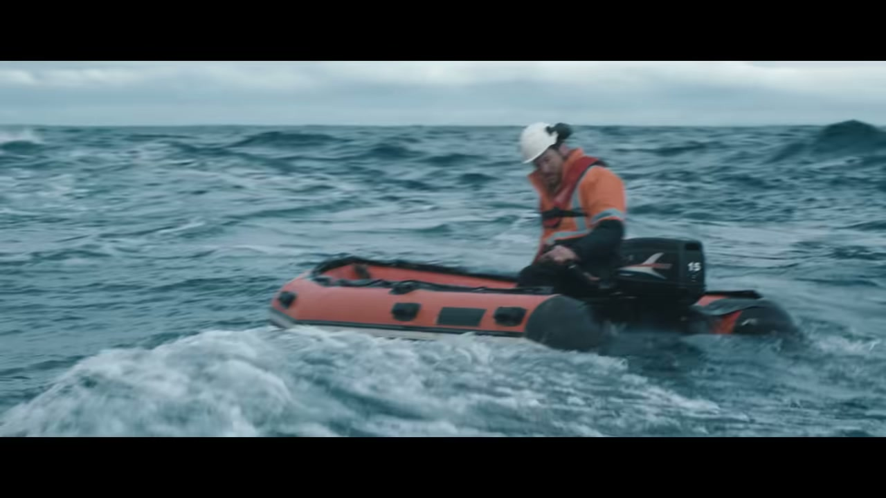
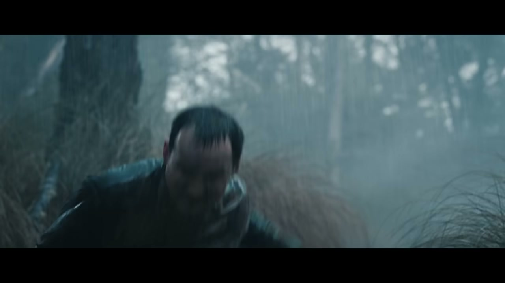
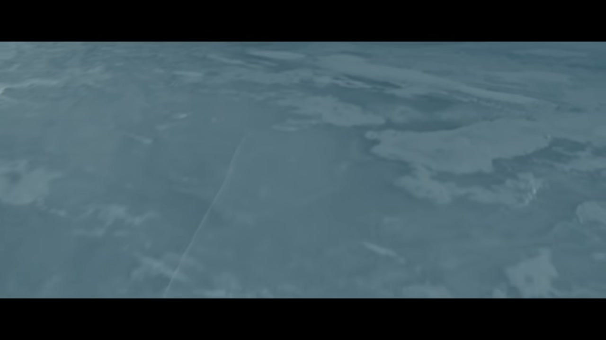
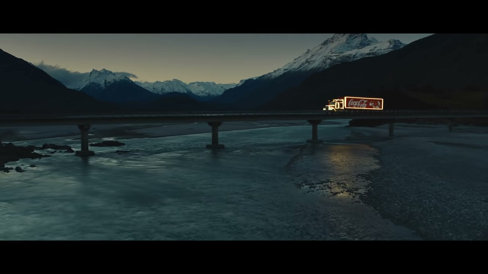
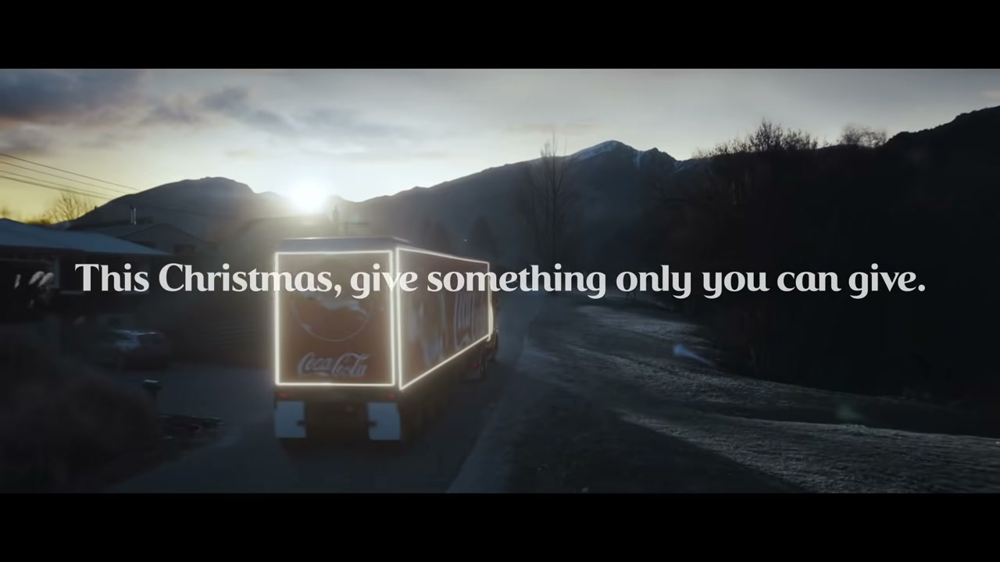

# Coca-Cola: The Letter

## The Campaign

Coca-Cola's global Christmas campaign marking **100 years of Coca-Cola Christmas advertising** — their most expansive festive effort ever, launching in more than **90 markets worldwide**.

The film follows a father who discovers his young daughter's letter to Santa has not been posted. In a desperate bid to make her Christmas wish come true, he embarks on an epic journey — across seas, up cliffs, through jungles — to reach the North Pole before Christmas. The campaign message: *"Give something only you can give."*

Directed by **Taika Waititi** (*Jojo Rabbit*, *Thor: Ragnarok*) — whose home country of New Zealand served as the filming location. Shot over five days in August 2020 during COVID restrictions. In a remarkable logistical achievement, team members in Los Angeles, London, and Madrid reviewed the shoot simultaneously via Zoom. The production staffed entirely with local New Zealand actors and crew.

## Collaborators

**W+K London:**
- **[Iain Tait](../collaborators/iain_tait.md)** — Executive Creative Director
- **[Tony Davidson](../collaborators/tony_davidson.md)** — Executive Creative Director
- **[James Guy](../collaborators/james_guy.md)** — Executive Producer / Head of Integrated Production, W+K London
- **[Joe De Souza](../collaborators/joe_de_souza.md)** — Executive Creative Director
- **[Juan Sevilla](../collaborators/juan_sevilla.md)** — Creative Director
- **Ben Shaffery** — Creative
- **[Tomas Coleman](../collaborators/tomas_coleman.md)** — Creative
- **Michelle Brough** — Agency Producer
- **Gemma Humphries** — Executive Producer

**Production:**
- **Taika Waititi** — Director (Hungry Man)
- **Hungry Man** — Production company
- **Matt Buels** — Executive Producer, Hungry Man
- **Hannah Stone** — Producer, Hungry Man
- **Curious Film** — Production service (New Zealand)
- **Matt Noonan** — Service Producer, Curious Film
- **Leon Woods** — Shoot Supervisor
- **John Toon** — Director of Photography

**Post:**
- **Cabin Editing Company** — Editor
- **James Bamford** — Colourist
- **[The Mill](../collaborators/the_mill.md)** — VFX (London)
- **Barnsley** — VFX Supervisor, The Mill
- **Sid Harrington-Odedra** — VFX Lead Artist, The Mill

**Music & Sound:**
- **Alex Baranowski** — Composer
- **Sean Craigie-Atherton** — Music Producer
- **Siren** — Music (London)
- **Sam Ashwell** — Sound Designer
- **750mph** — Sound (London)

## References & Media

### Assets

- [W+K London case study](https://wklondon.com/work/the-letter/)
- [Campaign UK/US: full credits](https://www.campaignlive.com/article/coca-cola-the-letter-wieden-kennedy-london/1699558)
- [shots Magazine: behind the scenes](https://shots.net/news/view/behind-the-scenes-of-taika-waititis-coca-cola-flavoured-christmas)
- [It's Nice That: Taika Waititi directs Coca-Cola's Christmas advert](https://www.itsnicethat.com/news/taika-waititi-the-letter-coca-cola-christmas-advertising-111120)
- [Adweek: "A Dad Takes a Heroic Journey to the North Pole in Coca-Cola's Epic 2020 Holiday Ad"](https://www.adweek.com/agencies/a-dad-takes-a-heroic-journey-to-the-north-pole-in-coca-colas-epic-2020-holiday-ad/)
- [SHOOTonline: Top Spot of the Week](https://www.shootonline.com/video/top-spot-week-taika-waititi-directs-coca-colas-xmas-ad-letter%C2%A0-wk-london)

### Raw Research
- [Missed projects research file](../raw/research/missed_projects.md)
