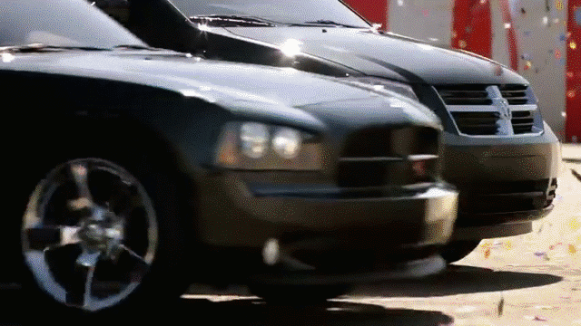
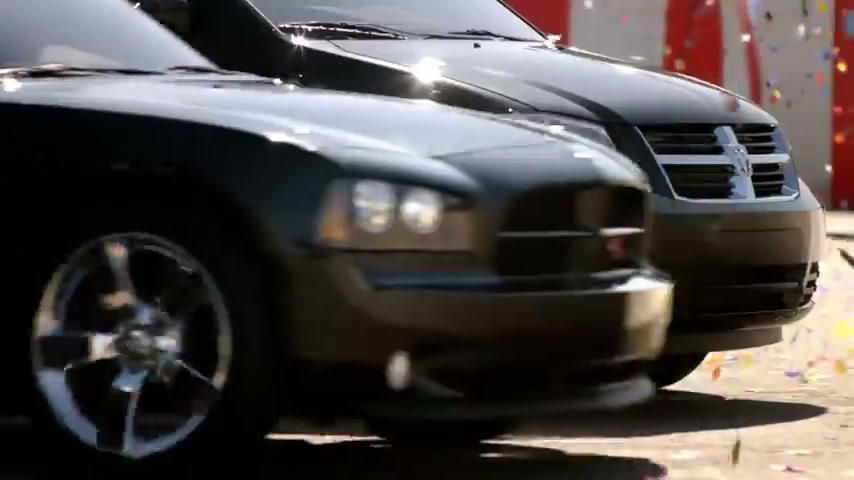
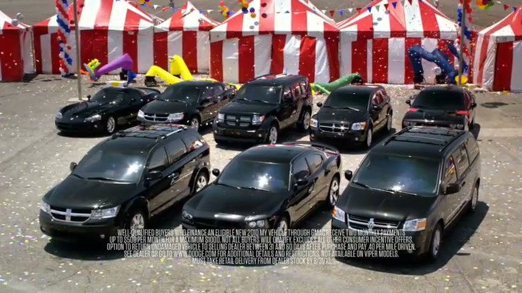
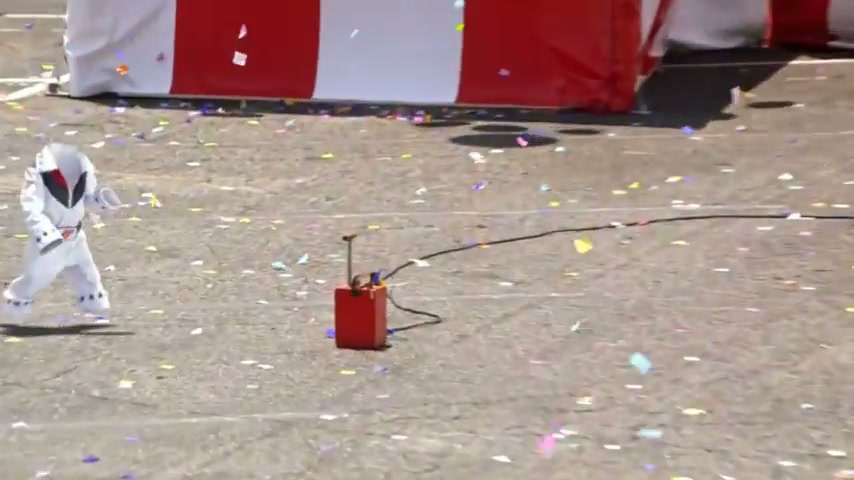
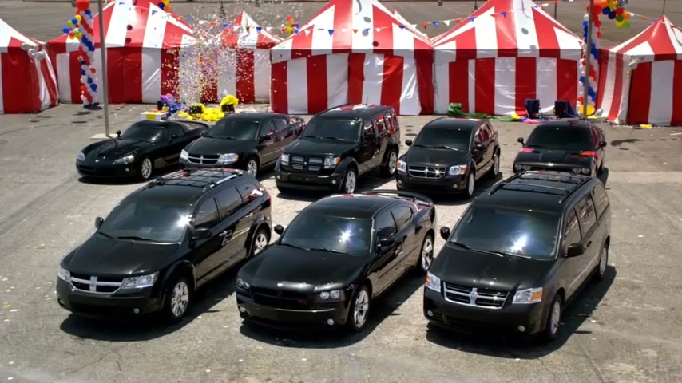
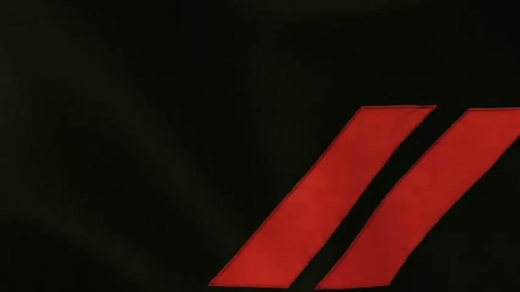
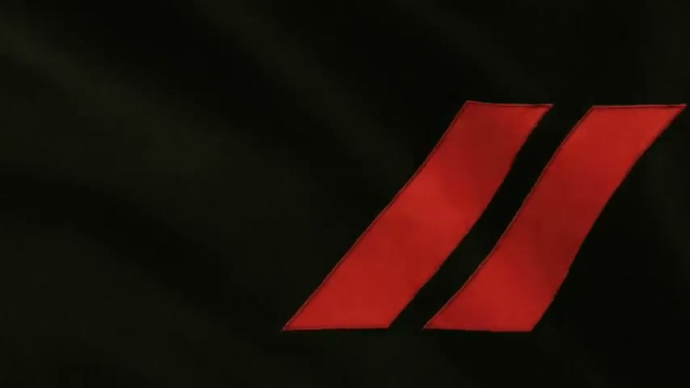

# Dodge Tent Event — Invisible Monkey

## The Campaign

A Dodge "Tent Event" sales promotion offering a free 60-day test-drive. The original TV spot featured a chimpanzee named **Suzy** dressed in an Evel Knievel stuntman outfit, setting off a confetti detonator. Deadpan voiceover by *Dexter* actor **Michael C. Hall**: *"This event could not be more amazing. Oh, wait. There's a monkey. I stand corrected."*

## The Crisis & The Pivot

PETA contacted Dodge in mid-July 2010 to object to the use of a great ape in entertainment. By July 20, Dodge's CEO confirmed the chimp would be removed.

Rather than simply pulling the spot, W+K executed a self-aware pivot: CGI was used to digitally excise Suzy from the footage, leaving an **intentionally obvious empty space** where the chimp had been. Michael C. Hall recorded a new line: *"There's an invisible monkey. Unbelievable."*

The revised "Invisible Monkey" spot aired August 13, 2010 — less than a month after the complaint.

## The Covert Amplification

W+K secretly commissioned **NMA (Next Media Animation World News)** — the Taiwanese internet animation company famous for producing viral news animation segments — to seed the story organically online. NMA produced their animated take-down piece in five hours. The collaboration was kept confidential at the time, making the organic-seeming coverage a designed amplification strategy.

The result: a genuine PR vulnerability became a self-deprecating internet meme, generating far more coverage than the original spot.

## Collaborators

- **[Iain Tait](../collaborators/iain_tait.md)** — Global Interactive Executive Creative Director, W+K Portland
- **Matt Moore** — Creative, W+K Portland (confirmed: uploaded the spot to his personal YouTube channel with first-person framing: *"PETA demanded we take the chimp out of our TV ad — so we did."* Specific role — copywriter or art director — not confirmed in public sources)
- **Michael C. Hall** — Voiceover artist
- **Kristin Starnes** — Brand Communications Director, Dodge (client lead)
- **NMA (Next Media Animation World News)** — Covert amplification (Taiwan)

*Agency co-ECDs at the time: [Mark Fitzloff](../collaborators/mark_fitzloff.md) and [Susan Hoffman](../collaborators/susan_hoffman.md). No further individual W+K creative credits (CD, CW, AD, director, production company) confirmed in available sources.*

## References & Media

### Assets

- [Adweek AdFreak: Tim Nudd — "Under Fire, Dodge Makes Chimp Disappear" (Aug 12, 2010)](https://www.adweek.com/creativity/under-fire-dodge-makes-chimp-disappear-12368/)
- [LA Times: Full PETA correspondence and Dodge CEO response (Jul 23, 2010)](https://www.latimes.com/archives/blogs/la-unleashed/story/2010-07-23/dodge-pulls-chimp-from-its-tent-event-ad)
- [Jalopnik: "Dodge Bests PETA With Invisible Monkey Ad" (Aug 12, 2010)](https://www.jalopnik.com/dodge-bests-peta-with-invisible-monkey-ad-5611061/)
- [YouTube: Matt Moore's personal upload of the spot](https://www.youtube.com/watch?v=m7vEQaw3egU)
- [Dailymotion: spot upload](https://www.dailymotion.com/video/xgocsc)
- [Raw research file (2026-04-07)](../raw/research/wk_portland_dodge_cocacola_2026-04-07.md)
- [Raw research file (2026-04-08)](../raw/research/wk_dodge_tent_event_2026-04-08.md)
