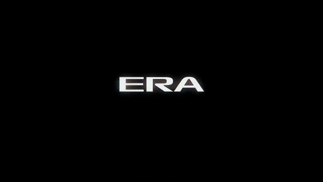
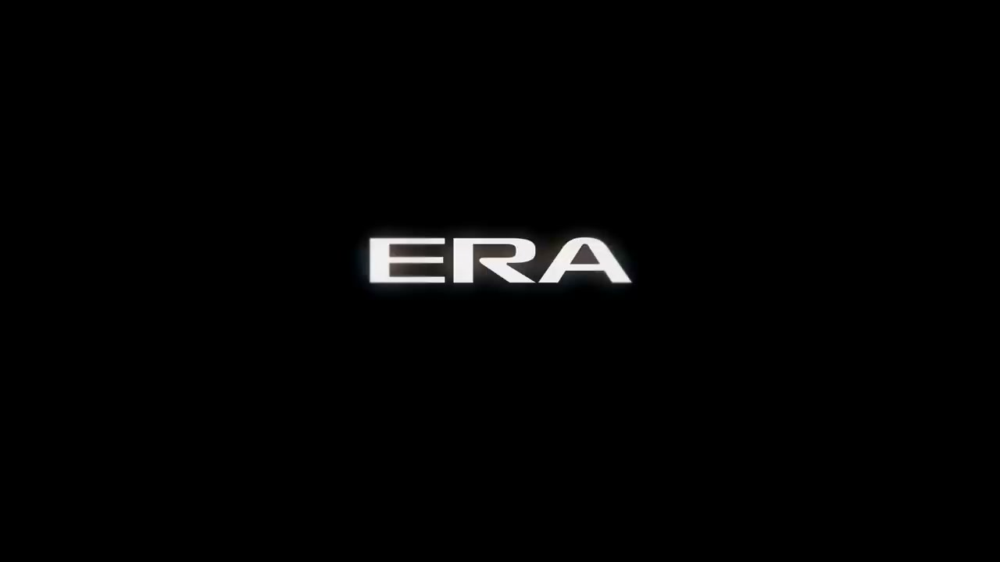
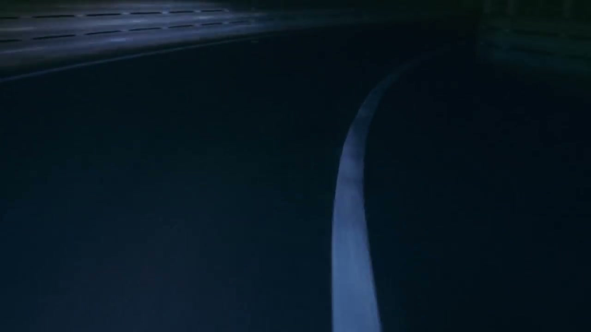
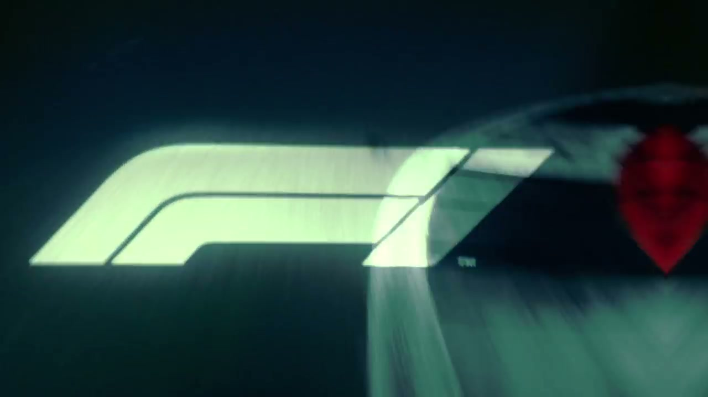
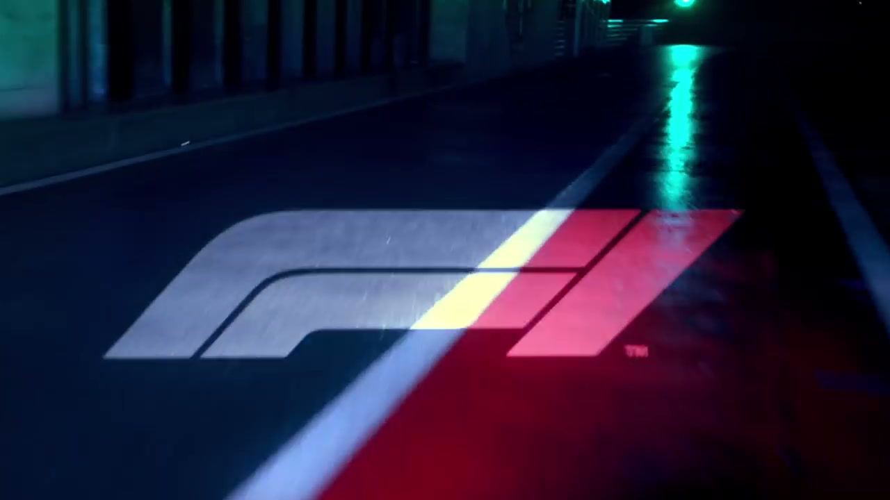
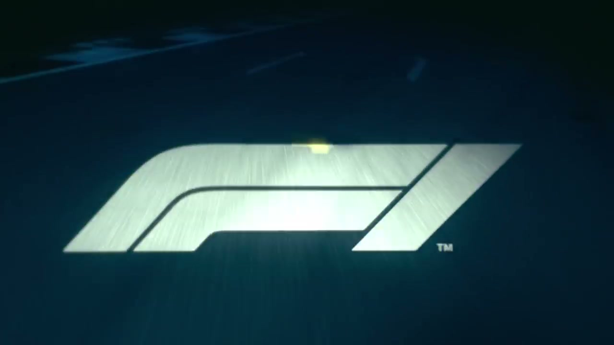
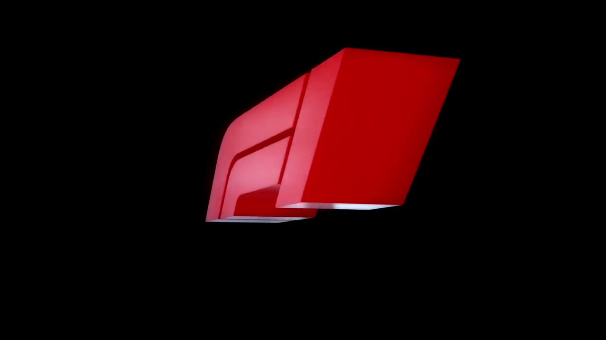

# Formula 1 Global Rebrand — Engineered Insanity

## The Objective

Following Liberty Media's $8 billion acquisition of Formula One in January 2017, the new ownership needed to transform a historically closed, niche motorsport property into an open, global entertainment brand — without alienating its existing fanbase. It was F1's first brand overhaul in 23 years.

W+K London were appointed as **Formula One's first-ever global creative agency** in September 2017 — the first time the sport had ever engaged an external agency at this level.

## The Work

### Identity (November 2017)

Led by Richard Turley — W+K London's ECD of Content & Design, recruited by Iain Tait from *Bloomberg Businessweek* — the agency conducted a fundamental deconstruction and rebuild of the F1 brand.

Flamingo Research conducted a 6-month global brand health study that informed the strategic brief, revealing the sport had lost touch with its visceral emotional core in the eyes of fans. Tone of voice was developed separately by Reed Words.

The result was a controversial, hyper-modern visual identity: a new logo revealed at the Abu Dhabi Grand Prix (November 2017) that replaced the 1994 Carter Wong mark. Three custom typefaces — F1 Regular, F1 Turbo, F1 Torque — were designed by typographer Marc Rouault and are now the global typographic standard for F1 communications.

The logo reveal generated:
- **35,000 tweets** on launch day
- Coverage in **1,500+ media outlets**
- Creative Review's **most-read article of 2017**

### "Engineered Insanity" (March 2018)

The first global marketing campaign, launched ahead of the 2018 season opener. The 60-second hero film used six real superfans as cast, physically exposed to wind-tunnel levels of force — visually replicating the violence and G-forces of an actual F1 cockpit — to communicate the sport's elemental brutality to a new audience.

Sound design for the film was recognised at D&AD 2019 and ProMax 2018.

## Collaborators

- **[Iain Tait](../collaborators/iain_tait.md)** — Executive Creative Director
- **Tony Davidson** — Executive Creative Director
- **[James Guy](../collaborators/james_guy.md)** — Executive Producer / Head of Integrated Production, W+K London
- **Richard Turley** — ECD Content & Design (led identity; recruited by Iain Tait from Bloomberg Businessweek)
- **Marc Rouault** — Typographer (designed F1 Regular, F1 Turbo, F1 Torque typefaces)
- **Flamingo Research** — Brand Strategy Research (6-month global study)
- **Reed Words** — Tone of Voice
- **Ellie Norman** — Director of Marketing, Formula One (client; first-ever marketing director role in F1)
- **Sean Bratches** — Managing Director Commercial Operations, Formula One (client)

## Reception & Legacy

### Awards

- **D&AD 2019:** Sound Design recognition (finalist/shortlist)
- **ProMax 2018:** Bronze — Sound Design, "Engineered Insanity"
- *No Cannes Lions confirmed for this work*

### Metrics (2018 season, first full year under new brand)

| Metric | Figure |
|---|---|
| Unique TV viewers | 490.2 million (+10% YoY) |
| Social media followers | 18.5 million (+53%) |
| Tweets at logo reveal | 35,000 |
| Media outlets at logo reveal | 1,500+ |

F1 was reported as the fastest growing major sports property on social media during this period.

### Cultural Legacy

- The rebrand is widely credited as laying the aesthetic and strategic groundwork for F1's global audience explosion — which accelerated further with Netflix's *Drive to Survive* (2019)
- First time F1 ever worked with a global creative agency — a structural shift as significant as the visual one
- Richard Turley's It's Nice That profile (2019) describes Iain Tait's recruitment of him as foundational to the work: *"Iain called me up... Iain runs the London office"*
- Cited in W+K London's 20-year retrospective as one of its milestone projects

## References & Media

### Assets

### Video

- ["A New Era Awaits" — 2018 F1 logo reveal film (YouTube)](https://www.youtube.com/watch?v=0za98VMTPck)
- [It's Nice That: "Engineered Insanity" coverage](https://www.itsnicethat.com/news/wieden-kennedy-london-formula-one-engineered-insanity-graphic-design-260318)

### Awards & Credits

- [W+K London portfolio](https://wklondon.com/work/formula-1/)
- [Ads of the World — "Engineered Insanity" (full credits)](https://www.adsoftheworld.com/campaigns/engineered-insanity)

### Press

- [Creative Review: F1 rebrand identity reveal — most-read article of 2017](https://www.creativereview.co.uk/formula-1-rebrand/)
- [The Drum: "Formula One appoints Wieden+Kennedy as first ever global creative agency" (Sep 7, 2017)](https://www.thedrum.com/news/2017/09/07/formula-one-appoints-wieden-kennedy-its-first-ever-global-creative-agency)
- [The Drum: Ellie Norman interview — "How Formula One finds its voice" (Mar 14, 2018)](https://www.thedrum.com/news/2018/03/14/f1s-marketing-director-ellie-norman-how-formula-one-finds-its-voice)
- [It's Nice That: Richard Turley profile — confirms Iain Tait's leadership (2019)](https://www.itsnicethat.com/articles/richard-turley-wieden-kennedy-london-graphic-design-050219)

### Raw Research

- [Raw research file](../raw/research/f1_global_rebrand_2026-04-06.md)
