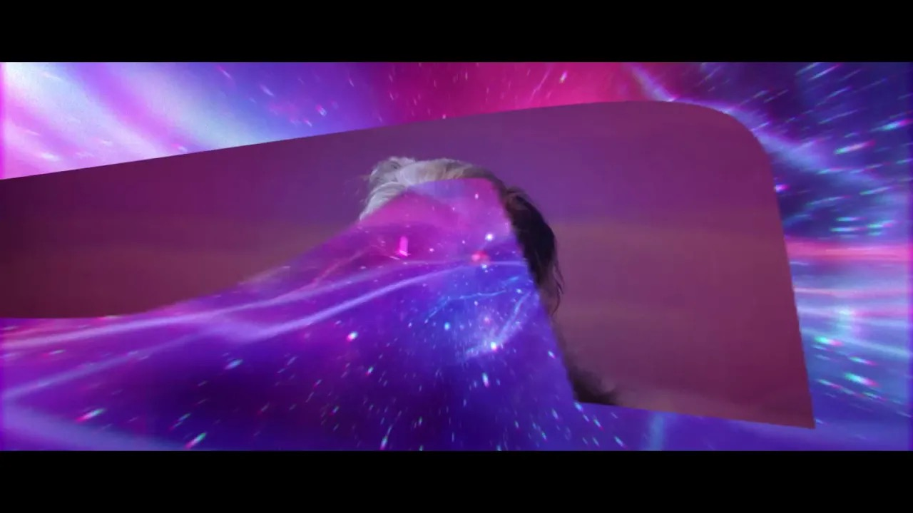
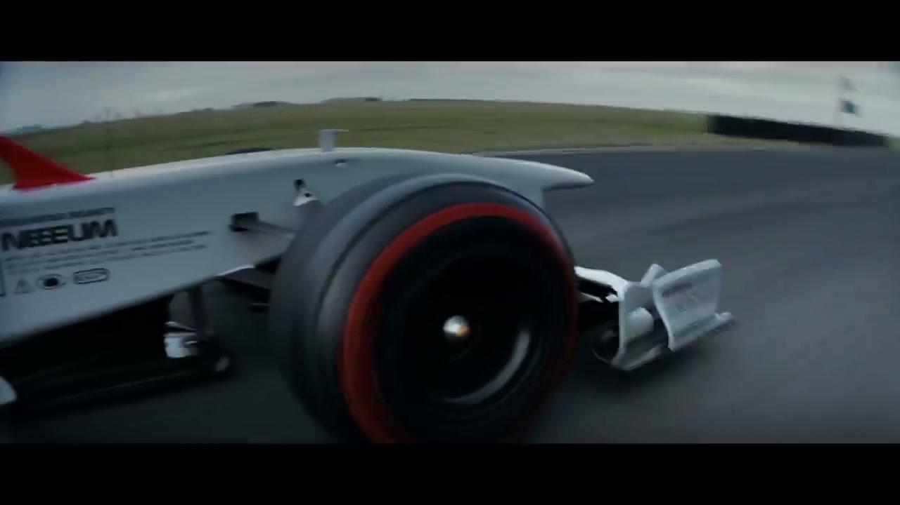
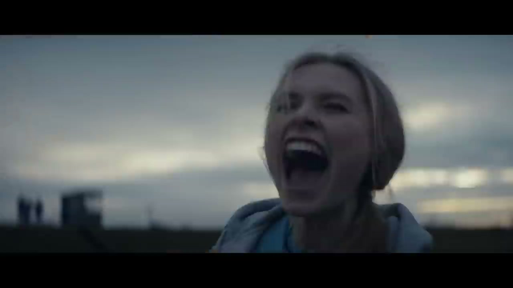
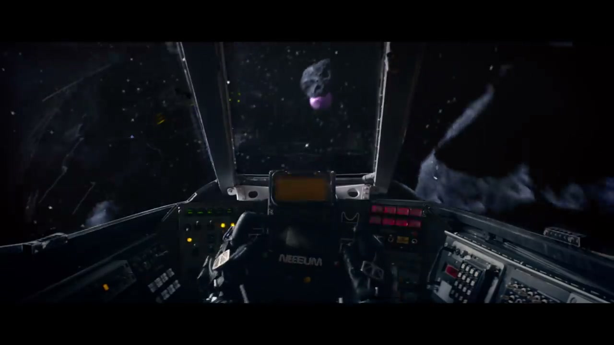

# Formula 1: NEEEUM

## The Campaign

The third major campaign in the W+K London × F1 account, following the 2017 rebrand and 2018's "Engineered Insanity." NEEEUM gave Formula 1 its **global sonic identity** — a three-second audio logo built from an extreme engineering of a Chemical Brothers track.

What began as a licensing conversation became a full collaboration. W+K/F1 approached **Globe** (Universal Music UK's creative consultancy) to license a Chemical Brothers track. Through that process it grew into something else entirely: the band — genuine longstanding F1 fans who had performed at multiple F1 events — agreed to engineer a bespoke remix. They took *"We've Got To Try"* (from their forthcoming album *No Geography*) and accelerated it to **15,000 beats per minute** — matching the 15,000 RPM of a modern F1 car at full speed. The result: the fastest remix ever created. Three seconds of sound.

Globe also co-funded the music video. *No Geography* subsequently reached **No. 2 in the UK charts**, partly on the campaign's reach.

## The Four-Part Campaign

1. **Six-second social films** (launched March 7, 2019) — dog behind a wheel, dog commandeering a rocket
2. **The NEEEUM sonic identity** — "WGTT15000BPM F1 NEEEUM MIX": the 3-second global audio logo
3. **Full music video for "We've Got To Try"** (released March 8, 2019) — directed by Ninian Doff; follows "Girl the Dog" on a mission to complete the impossible
4. **2019 season launch film** (debuted March 11, 2019) — hyping the first Grand Prix in Melbourne using the full Chemical Brothers track

## Metrics

| Metric | Figure |
|---|---|
| Music video organic views (3 weeks) | 1.7 million |
| Global publications covered | 70+ |
| *No Geography* UK chart position | No. 2 |

## The F1 × W+K London Account in Context

NEEEUM was part of a multi-year account transformation commissioned by Liberty Media after they acquired F1 in 2017. CMO **Ellie Norman** tasked W+K London with rebuilding F1 as a global entertainment brand:

| Year | Campaign | Result |
|---|---|---|
| Nov 2017 | "Unleashed" — rebrand | 1,500+ media outlets in 5 days |
| March 2018 | "Engineered Insanity" — first-ever global F1 campaign | +10% unique viewers (490.2M); +53% YoY social to 18.5M followers |
| March 2019 | NEEEUM | 1.7M organic views; 70+ publications; No Geography No. 2 UK |
| Nov 2020 | "Still Rising" — Lewis Hamilton 7th title | — |
| 2021 | "One Begins" — 2022 car livery + launch film | — |

## Collaborators

- **[Iain Tait](../collaborators/iain_tait.md)** — Executive Creative Director, W+K London
- **[Tony Davidson](../collaborators/tony_davidson.md)** — Executive Creative Director, W+K London
- **[James Guy](../collaborators/james_guy.md)** — Executive Producer / Head of Integrated Production, W+K London
- **[Dan Norris](../collaborators/dan_norris.md)** — Creative Director, W+K London
- **[Ray Shaughnessy](../collaborators/ray_shaughnessy.md)** — Creative Director, W+K London
- **Tom Reas** — Creative, W+K London
- **Liam Riddler** — Creative, W+K London
- **Chris Gray** — Creative, W+K London
- **Ninian Doff** — Director, music video (Pulse Films)
- **Pulse Films** — Production company
- **The Chemical Brothers** (Tom Rowlands & Ed Simons) — Music / collaborators
- **Globe / Universal Music UK** — Music partnership (MD: Marc Robinson)
- **Ellie Norman** — Director of Marketing & Communications, Formula 1 (client)

## References & Media

### Assets

### Video
- [YouTube: NEEEUM MIX](https://www.youtube.com/watch?v=DBw5Red0Lr8)
- [YouTube: "We've Got To Try" music video](https://www.youtube.com/watch?v=nBMcSZfV1Co)
- [Spotify: WGTT15000BPM F1 NEEEUM MIX](https://open.spotify.com/track/1n0v2D30zPx5zpseRsEgd0)

### Press
- [W+K London case study](https://wklondon.com/work/neeeum/)
- [Formula 1.com: official announcement](https://www.formula1.com/en/latest/article/chemical-brothers-and-f1-unite-to-create-fastest-remix-of-all-time.4MmqeEKgPGxlcvvFP8V8Jh)
- [LBBonline: "The Chemical Brothers and Formula 1 Release Fastest Remix of All Time" (7 Mar 2019)](https://lbbonline.com/news/the-chemical-brothers-and-formula-1-release-fastest-remix-of-all-time)
- [Adweek (12 Mar 2019)](https://www.adweek.com/creativity/f1s-new-3-second-sonic-branding-is-actually-a-chemical-brothers-song-sped-to-15000-bpm/)
- [Ad Age (7 Mar 2019)](https://adage.com/creativity/work/formula-1-fastest-remix-all-time/1029646/)
- [Billboard](https://www.billboard.com/articles/news/dance/8501615/chemical-brothers-fastest-remix-f1-weves-got-to-try)
- [NME](https://www.nme.com/news/music/watch-surreal-new-video-chemical-brothers-new-single-weve-got-try-2459250)
- [Rolling Stone](https://www.rollingstone.com/music/music-news/the-chemical-brothers-new-video-weve-got-to-try-806140/)
- [Hypebeast](https://hypebeast.com/2019/3/the-chemical-brothers-weves-got-to-try-music-video)
- [The Drum: Globe backstory (16 Apr 2019)](https://www.thedrum.com/news/inside-brand-hunting-globe-universal-music-s-spin-creative-consultancy)

### Raw Research
- [Deep research file](../raw/research/f1_neeeum_2026-04-07.md)
- [Missed projects research file](../raw/research/missed_projects.md)
