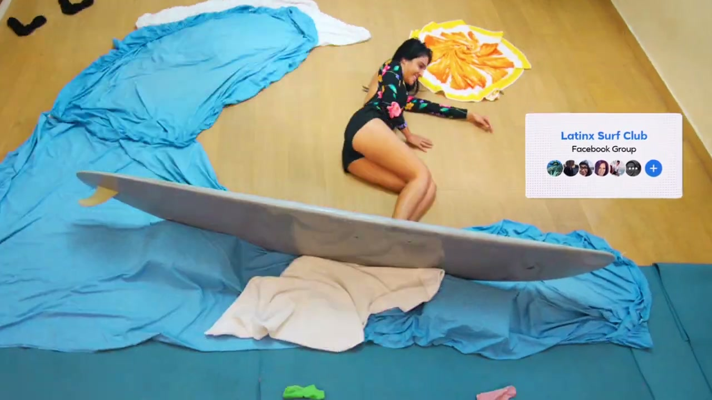
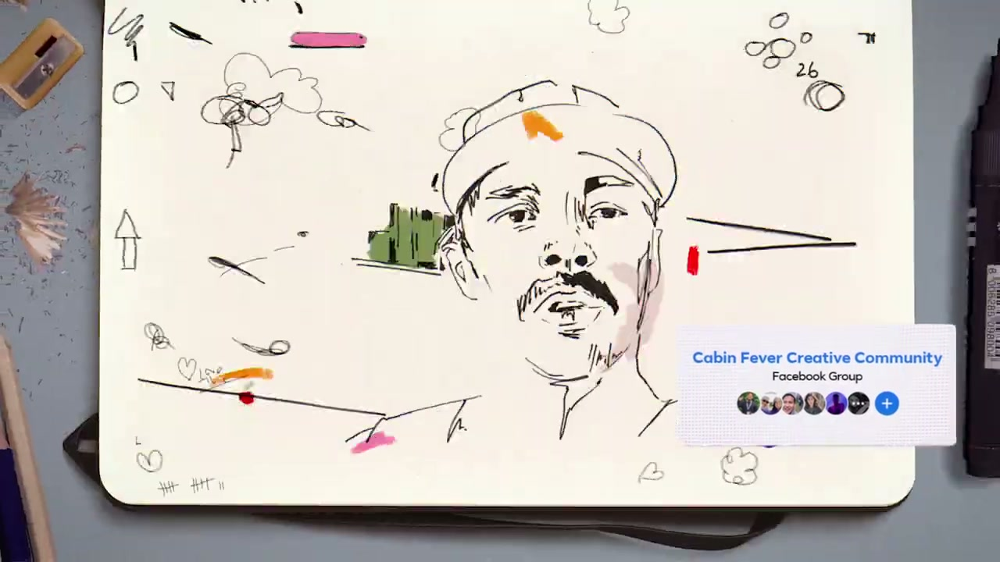
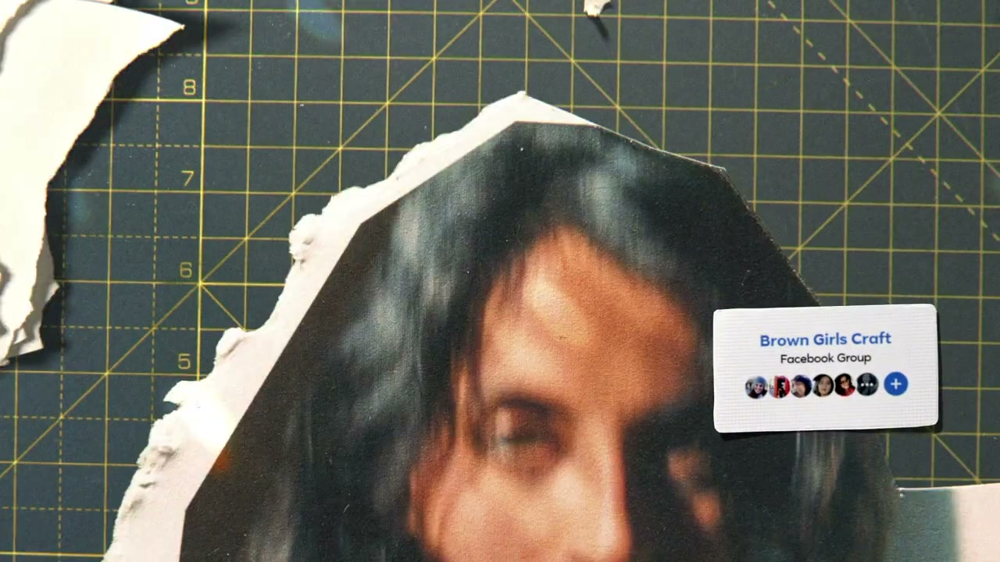
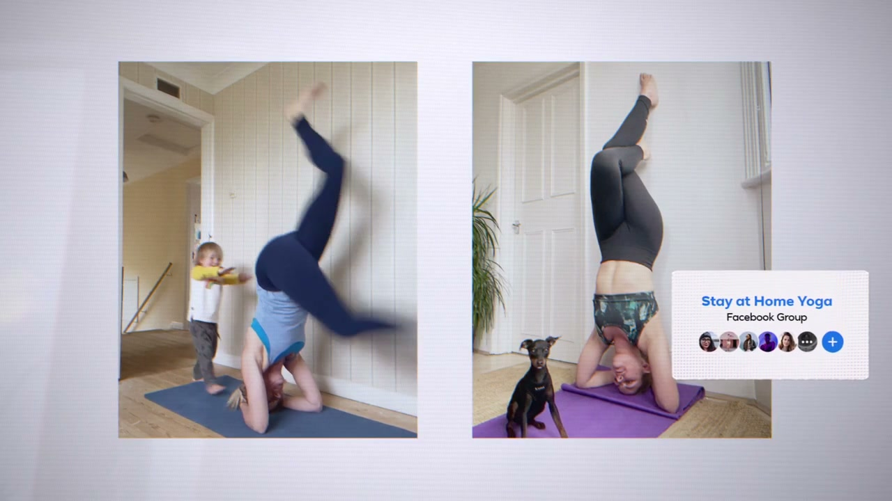

# Facebook: Still Going Strong

## The Campaign

W+K London's first TV work for Facebook, made in collaboration with W+K Portland. Part of Facebook's broader **"More Together"** platform — a celebration of what Facebook Groups make possible, even in the hardest times.

The film was created entirely during COVID-19 lockdown and made using authentic footage sourced from real Facebook Group members, demonstrating that "although we might be apart outside, in Facebook Groups there is still creativity, bravery, and kindness." The spot debuted in the US on **ESPN** during *The Last Dance* documentary, with a 30-second cut for online and a radio version.

## Collaborators

**W+K London:**
- **[Iain Tait](../collaborators/iain_tait.md)** — Executive Creative Director
- **[Tony Davidson](../collaborators/tony_davidson.md)** — Executive Creative Director
- **[James Guy](../collaborators/james_guy.md)** — Executive Producer / Head of Integrated Production, W+K London
- **[David Dao](../collaborators/david_dao.md)** — Creative Director
- **Katy Edelsten** — Creative
- **Rachel Clancy** — Creative
- **Indiana Matine, Rachel Holden, Lauren Ivory** — Strategic Planning
- **W+K Portland** — Collaboration partner

**Production:**
- **Maceo Frost** — Director (Knucklehead)
- **Knucklehead** — Production company
- **Joey Jenkins** — Production Designer

**Post:**
- **Andreas Arvidsson** — Editor
- **[Time Based Arts](../collaborators/time_based_arts.md)** — VFX
- **Luke Todd** — VFX Lead, Time Based Arts
- **Lewis Crossfield** — Colourist/Grade, Time Based Arts

## References & Media

### Assets

- [W+K London case study](https://wklondon.com/work/still-going-strong/)
- [W+K London blog post (May 2020)](https://wklondon.com/2020/05/facebook-still-going-strong/)
- [Adweek: "Facebook's Newest Ad Shows How Groups Are 'Still Going Strong' During COVID-19"](https://www.adweek.com/creativity/facebooks-newest-ad-shows-how-groups-are-still-going-strong-during-covid-19/)

### Raw Research
- [Raw research file](../raw/research/wk_facebook_still_going_strong_2026-04-08.md)
