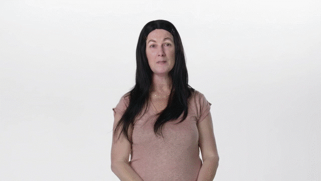
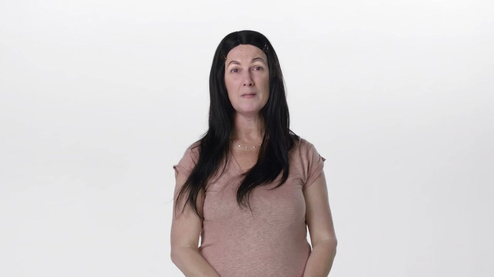
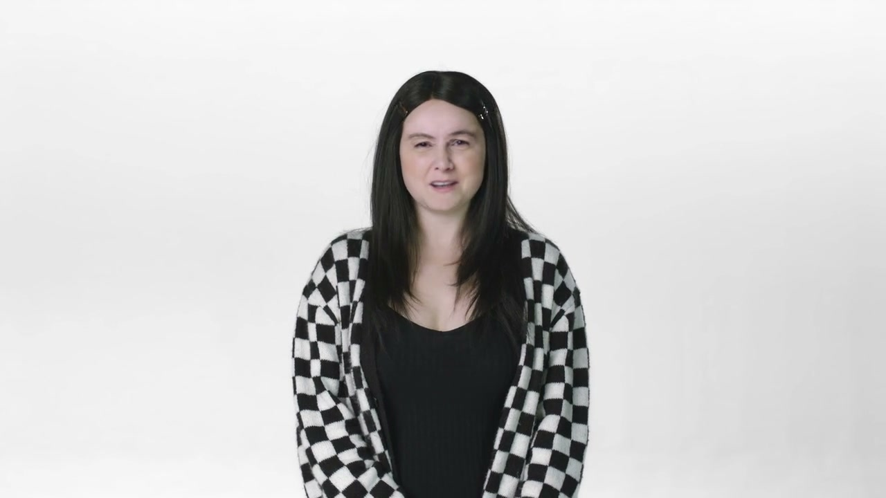
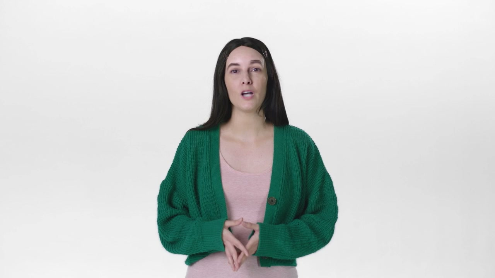
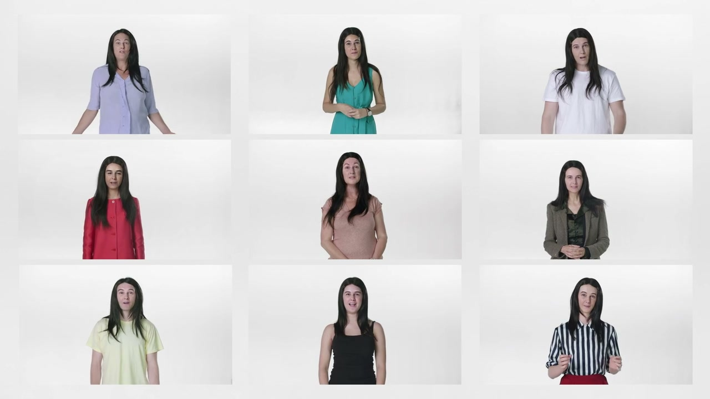
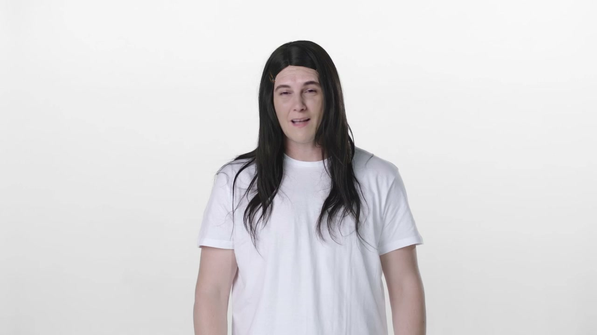
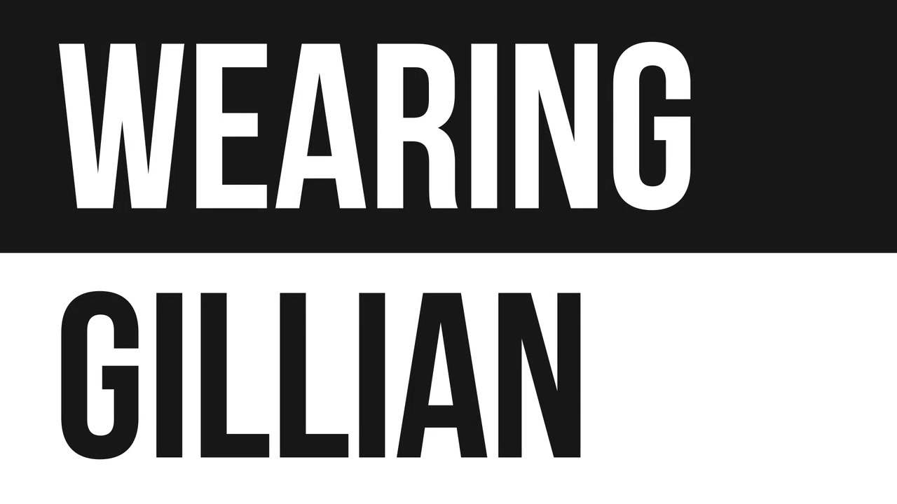

# Wearing Gillian

**Artist:** Gillian Wearing

> *"I loved it [Nothing Beats A Londoner] because it felt very in the moment, and it felt like a short film as well as an ad. So I looked up who made it, and it was Wieden+Kennedy. And it turns out they're located just a few streets away from where I live."* — Gillian Wearing, Fast Company, December 2018

A collaboration between W+K London and Turner Prize-winning artist Gillian Wearing — one of the most significant crossovers between contemporary art and advertising of its era. A five-minute film using deepfake AI (face-swapping technology) to map Wearing's face onto a diverse cast of actors and volunteers. No commercial client, no brand. Work that went from an ad agency to the Guggenheim and MoMA.

---

## The Origin Story

Gillian Wearing is one of Britain's most celebrated contemporary artists — known for her 30-year exploration of identity, masking, and the gap between public and private self (Signs That Say What You Want Them To Say, 10-16, Trauma, the silicone mask self-portraits). She is also literally a neighbour of W+K London.

The catalyst was *Nothing Beats a Londoner* (2018). Wearing saw the Nike film, loved it, researched who made it, and found W+K London was around the corner from where she lives. She contacted them and they had a meeting immediately. From the Fast Company article: the idea for a deepfake film *"came out of a conversation with Cincinnati Art Museum curator Nathaniel Stein about how the museum might market the exhibition."* Wearing then researched contemporary advertising, found Nothing Beats A Londoner, and made the connection.

Iain showed her deepfake technology at their meeting. She was immediately interested — it resonated profoundly with her practice. Her entire career had been about masking, persona, and the performed self. Deepfakes were the digital-native evolution of exactly those themes.

Iain's approach: he gave Wearing *"the most classic advertising brief template to fill out, as if she was the product or brand, making the process as much like they would go through with any other client."* This application of ad agency methodology to fine art was Iain's distinctive creative contribution.

The result was directed by Chris Boyle at Private Island — a production company founded in 2015 that would go on to become one of the leading studios in AI/generative filmmaking, in part because of what they learned on this project.

---

## The Film

- **Duration:** Five minutes
- **Format:** Video installation (gallery context); 30-second preview/trailer released publicly on Vimeo
- **Method:** Deepfake face-swapping AI — Gillian Wearing's face mapped onto actors and volunteers who responded to an open call
- **In the film:** We hear Wearing speak about herself, but the people onscreen have her facial features integrated with their own — moving, emoting, existing across varying ages and genders
- **W+K blog:** *"The five-minute film deploys face-swapping Artificial Intelligence technology and offers a candid insight into the celebrated artist."*

---

## Awards

None. Consistent across all research sources. The work was not entered into advertising award circuits — it existed as fine art, not advertising.

---

## Exhibition History

| Venue | Exhibition | Dates |
|---|---|---|
| Cincinnati Art Museum | *Life: Gillian Wearing* (largest US Wearing retrospective; world premiere) | October 5 – December 30, 2018 |
| Guggenheim Museum, New York | *Gillian Wearing: Wearing Masks* | c. late 2021 / early 2022 |
| MoMA, New York | New Work/New Acquisitions (acquisition by The Modern Women's Fund) | Date TBC |
| ACMI, Melbourne | *PHOTO 2022 International Festival of Photography* | May 22, 2022 |

Per Chris Boyle (Private Island), director: *"That ended up in MoMA, which really pushed us to take note of the technology."*

---

## Cultural Legacy

- One of the first significant artistic uses of deepfake technology, debuted December 2018 — predating widespread public awareness of deepfakes' creative applications
- Conceptually perfect: Wearing's entire career had been about identity performance, masking, and the mediated self — deepfakes were the inevitable digital evolution
- Cited by the New York Times (April 2020) as a foundational example when writing about advertising's deepfake future
- Used as a case study in academic analysis of deepfakes in arts/culture (AMT Lab, Carnegie Mellon, 2021) alongside Dalí Lives at the Dalí Museum
- The work traveled from a regional US art museum to the Guggenheim to MoMA — the canonical escalation path for significant contemporary art
- Launched Private Island's trajectory into AI/generative filmmaking — a defining moment for the company
- Direct lineage to *Nothing Beats a Londoner* (2018): one film brought Wearing to W+K; Wearing Gillian was the result

---

## Collaborators

- **[Iain Tait](../collaborators/)** — ECD, W+K London; initiated and led the collaboration; quoted in Fast Company
- **Gillian Wearing** — Artist, subject, creative director of her own image
- **Nathaniel Stein** — Curator, Cincinnati Art Museum; his conversation with Wearing sparked the project
- **[Chris Boyle](../collaborators/chris_boyle.md)** — Director, [Private Island](../collaborators/private_island.md)
- **[Helen Power](../collaborators/helen_power.md)** — Executive Producer / Co-founder, Private Island
- **[Rose Fairley](../collaborators/rose_fairley.md)** — Producer, W+K London
- **[Tony Davidson](../collaborators/tony_davidson.md)** — Co-ECD, W+K London

---

## References & Media

### Assets

### Primary
- [W+K London blog: "Wearing Gillian Explores The Space Between Real And Fake, Art And Ad" (Dec 14, 2018)](https://www.wk.com/news/wearing-gillian-explores-the-lines-between-real-and-fake-art-and-ad/)
- [Vimeo: "Wearing Gillian Trailer" — ~30 second preview (W+K London channel)](https://vimeo.com/306770925)

### Press
- [Fast Company: "This new deep fake video is both advertising and a piece of art" (Jeff Beer, Dec 11, 2018)](https://www.fastcompany.com/90279597/this-new-deep-fake-video-is-both-advertising-and-a-piece-of-art) — both Iain Tait and Wearing are quoted
- [Brooklyn Rail: "Gillian Wearing: Life" (art review, Nov 2018) — confirms Cincinnati dates and open-call participants](https://brooklynrail.org/2018/11/artseen/GILLIAN-WEARING-Life)
- [New York Times: "An ESPN Commercial Hints at Advertising's Deepfake Future" (Apr 22, 2020) — cites Wearing Gillian as precedent](https://www.nytimes.com/2020/04/22/business/media/espn-kenny-mayne-state-farm-commercial.html)
- [Shots.net: "The craft, code and controlled chaos of Chris Boyle" — confirms MoMA acquisition (Dec 2025)](https://shots.net/news/view/the-craft-code-and-controlled-chaos-of-chris-boyle)

### Institutional
- [Guggenheim: "Gillian Wearing: Wearing Masks" press release](https://www.guggenheim.org/press-release/guggenheim-museum-presents-gillian-wearing-wearing-masks)
- [ACMI: Wearing Gillian collection entry (PHOTO 2022)](https://www.acmi.net.au/works/120108--wearing-gillian)
- [Photography Database: exhibition record, Cincinnati Art Museum](https://photographydatabase.org/exhibitions/view/11495/life-gillian-wearing)

### Academic
- [AMT Lab / Carnegie Mellon: "Positive Implications of Deepfake Technology in the Arts and Culture" — Wearing Gillian as Case Study 2 (Sep 2021)](https://amt-lab.org/blog/2021/8/positive-implications-of-deepfake-technology-in-the-arts-and-culture)

### Related Video
- [Guggenheim YouTube: "Gillian Wearing: Wearing Masks" (curatorial video, not the film itself)](https://www.youtube.com/watch?v=oN8W8pP9QcM)
