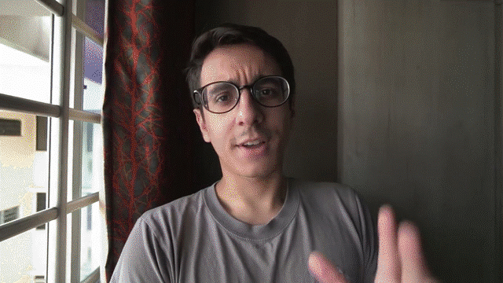
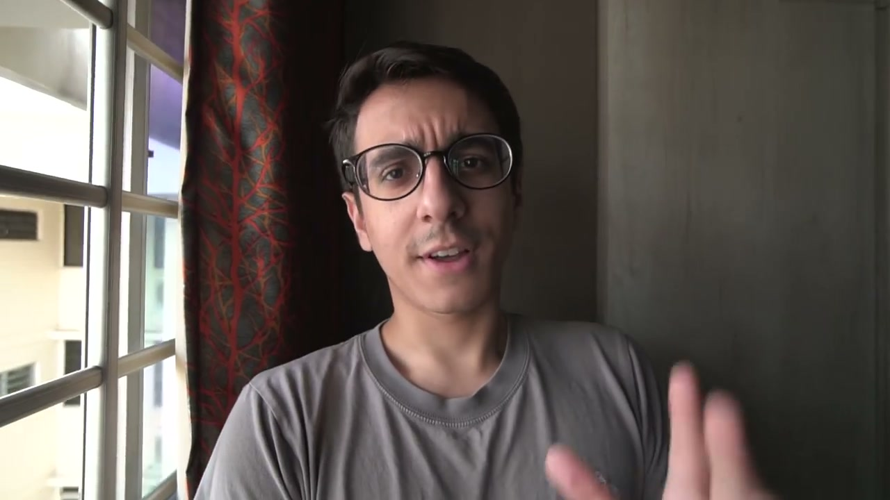
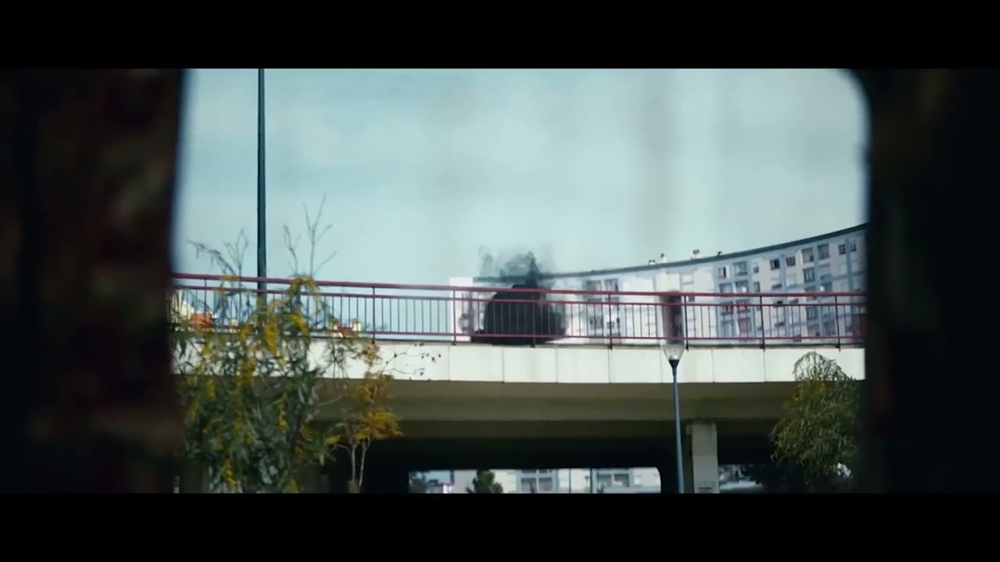
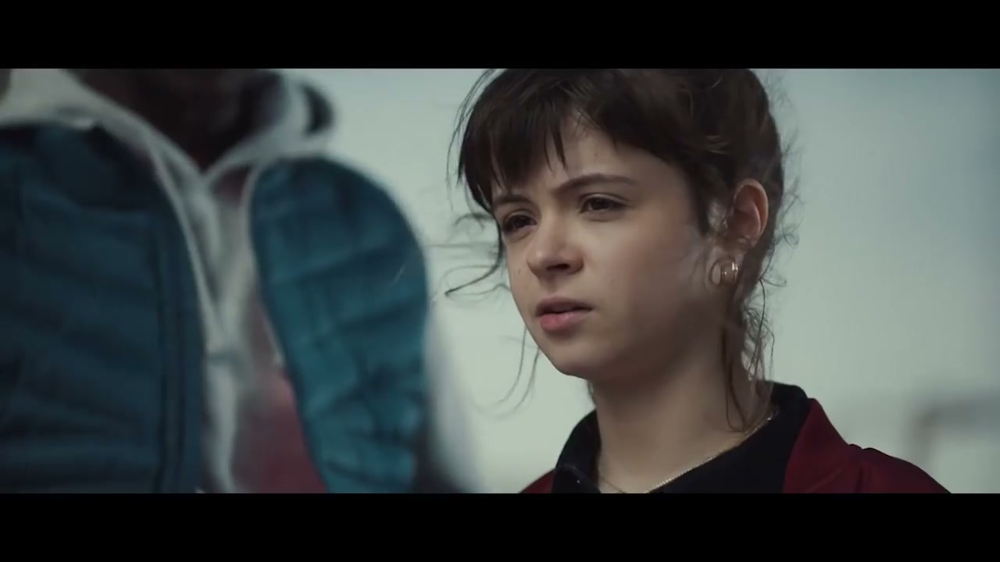
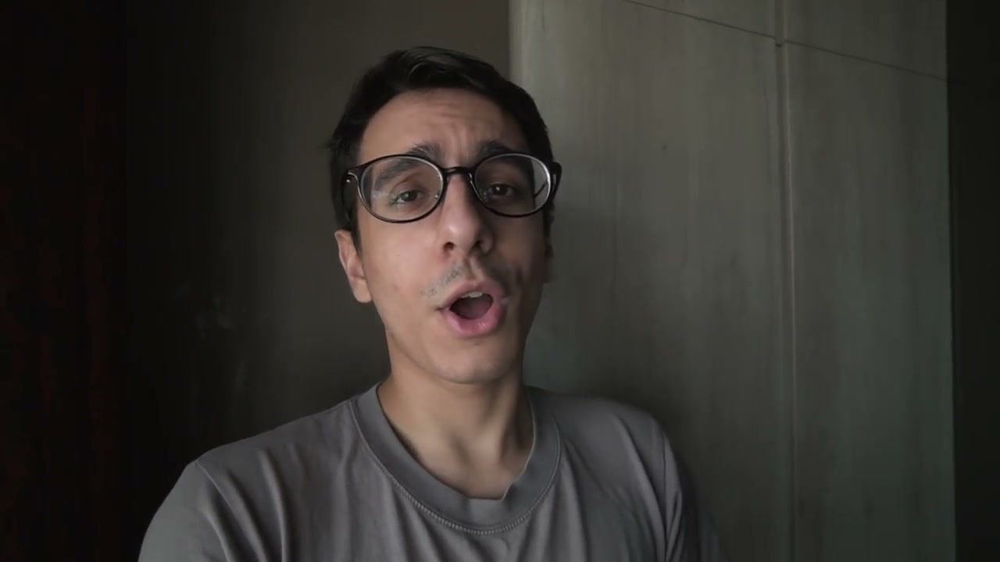
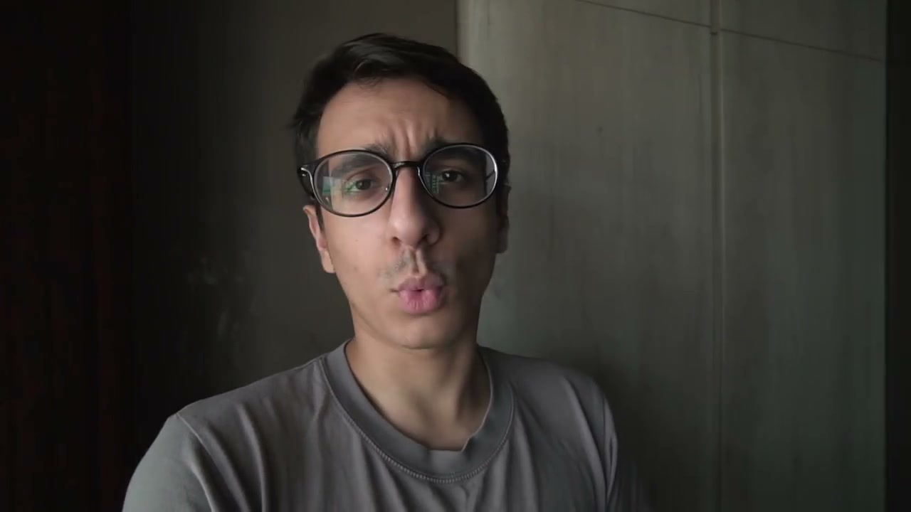
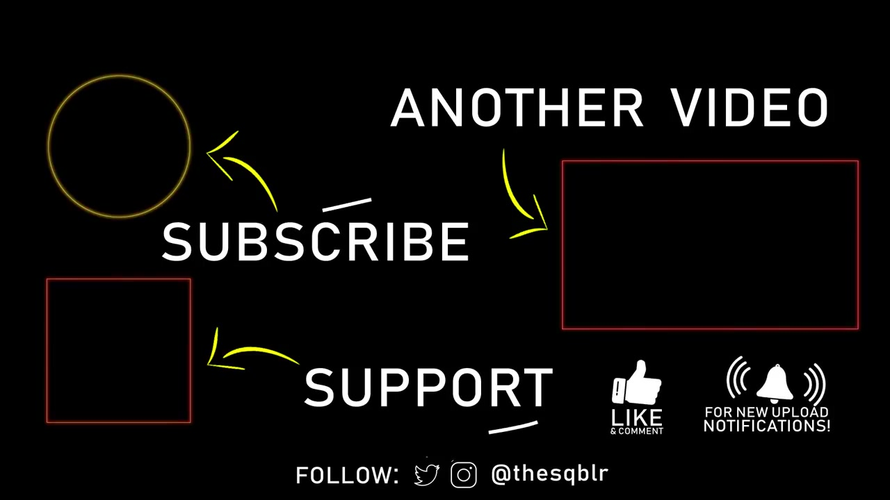

# Harry Potter: Wizards Unite — Global Launch

## The Campaign

Global launch campaign for *Harry Potter: Wizards Unite* — Niantic and Warner Bros.'s AR mobile game. Niantic's largest media investment to date. Ran across TV, cinema, digital, social, and physical touchpoints in the US, Asia, and Europe.

Rather than a conventional gameplay trailer, W+K London treated the game's premise as real-world breaking news: **"The Calamity"** — a crisis in which magical items and creatures are uncontrollably spilling into the Muggle world, forcing the Ministry of Magic to recruit ordinary people to help contain it.

## Key Executions

**Teaser phase (from January 2019):**
"Traces of magic" appearing on CCTV footage; "The Trace Report" — a found-footage style teaser that generated massive fan speculation about what the project was.
- **Directors:** William McGregor + Jorge Montiel
- **Creatives:** [Sophie Bodoh](../collaborators/sophie_bodoh.md), [Scott Dungate](../collaborators/scott_dungate.md), [Adam Newby](../collaborators/adam_newby.md), [Will Wells](../collaborators/will_wells.md)

**Launch film (June 19, 2019):**
A cinematic piece giving a grounded, chaotic perspective on being a wizard-in-training in the real world, culminating in players battling Dementors.
- **Director:** Tom Green (Stink Films)
- **Production:** Stink Films
- **VFX:** The Mill
- **Sound:** Factory Studio
- **DOP:** Ben Kracun
- **Colourist:** James Bamford (The Mill)
- **VFX leads:** Stefan Susemihi + Dan Moller

## Collaborators

- **[Iain Tait](../collaborators/iain_tait.md)** — Executive Creative Director, W+K London
- **[Dom Felton](../collaborators/dom_felton.md)** — Executive Producer, W+K London
- **[Indiana Matine](../collaborators/indiana_matine.md)** — Strategist / Planning, W+K London *(evidence: user testimony 2026-04-08)*
- **[Scott Dungate](../collaborators/scott_dungate.md)** — Creative Director
- **[Sophie Bodoh](../collaborators/sophie_bodoh.md)** — Creative Director
- **Abdou Cisse** — Creative (launch film)
- **Akwasi Poku** — Creative (launch film)
- **[Adam Newby](../collaborators/adam_newby.md)** — Creative (teaser)
- **[Will Wells](../collaborators/will_wells.md)** — Creative (teaser)
- **Tom Green** — Director, launch film (Stink Films)
- **William McGregor** — Director, teaser (co-director)
- **Jorge Montiel** — Director, teaser (co-director)
- **[Stink Films](../collaborators/stink.md)** — Production company
- **[The Mill](../collaborators/the_mill.md)** — VFX / Post production
- **Factory Studio** — Sound
- **Ben Kracun** — Director of Photography
- **James Bamford** — Colourist (The Mill)
- **Stefan Susemihi** — VFX lead (The Mill)
- **Dan Moller** — VFX lead (The Mill)

## References & Media

### Assets

- [W+K London work page](https://wklondon.com/work/harry-potter-wizards-unite/)
- [Raw research file (2026-04-07)](../raw/research/wk_niantic_campaigns_2026-04-07.md)
- [Raw research file (2026-04-08)](../raw/research/wk_harry_potter_wizards_unite_2026-04-08.md)
