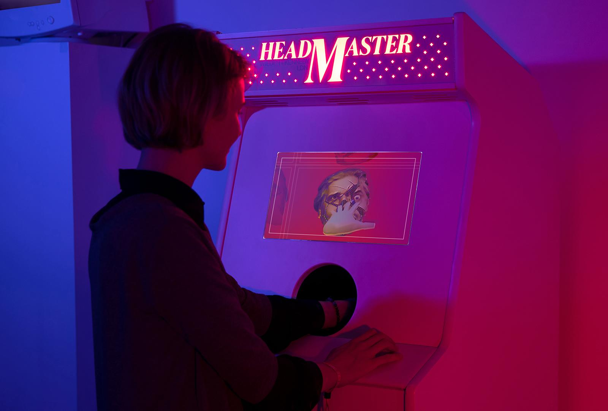
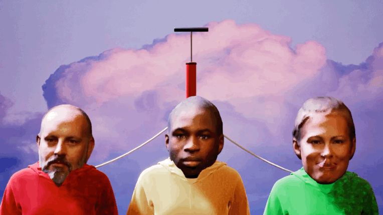
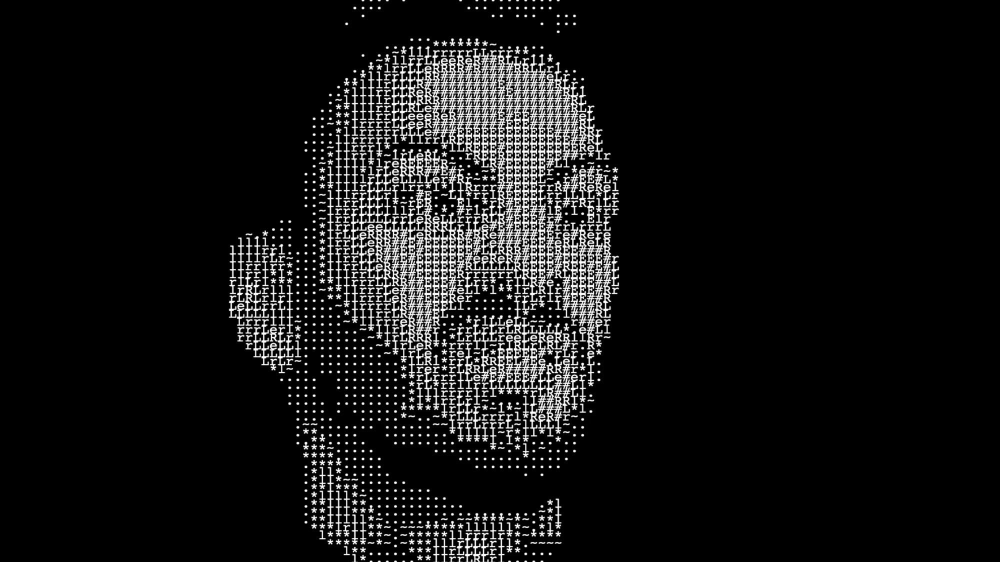
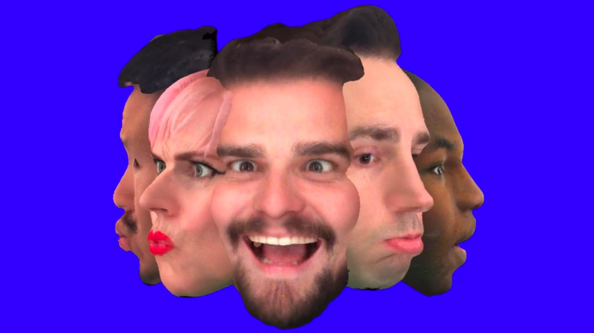
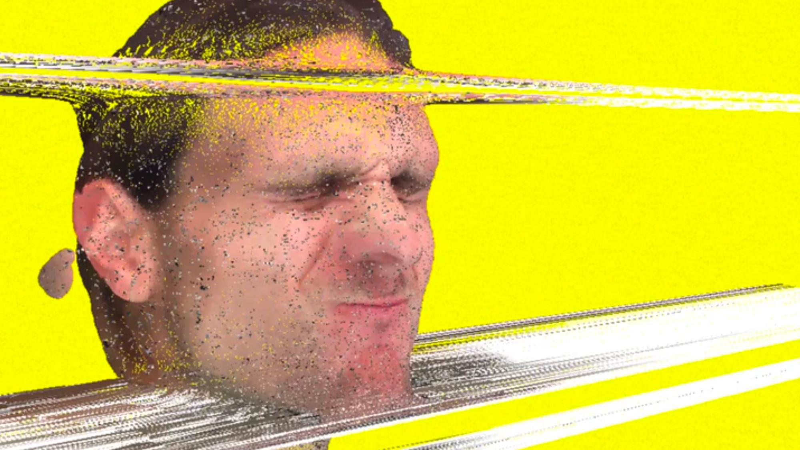
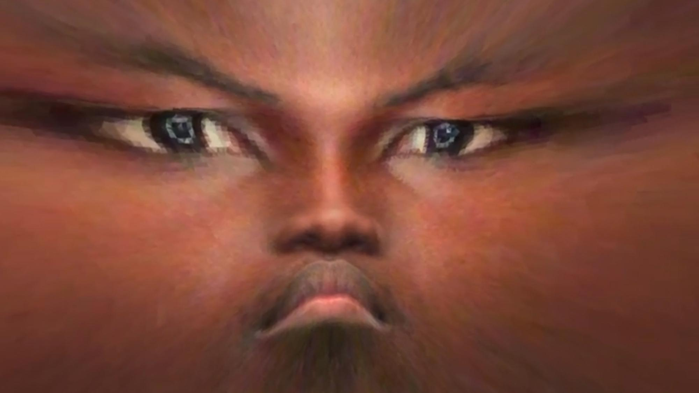
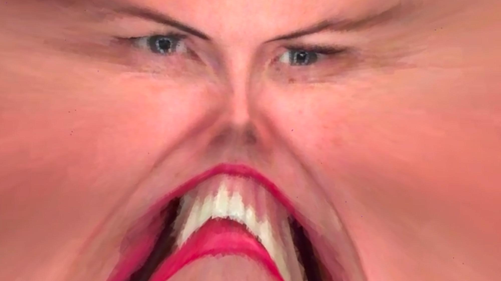
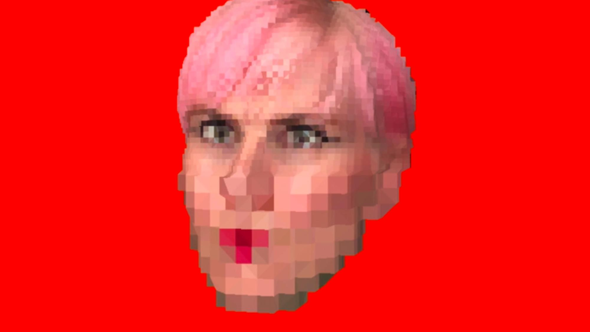

# Headmaster

A bespoke holographic arcade installation built for the Wieden+Kennedy London reception. The agency had long greeted visitors with portraits of its people; as the reception area was refreshed for the new decade, the team asked: what *is* a portrait? Does it have to be a photograph? Can you touch it? Play with it?

The answer was Headmaster — an arcade game stuffed with 3D scans of the entire W+K London staff. Visitors play with the agency's people by flailing a hand inside a dark hole on the front of the cabinet, their gestures tracked by a Leap Motion sensor while the heads float inside a Looking Glass volumetric display, all housed in an upcycled 1982 arcade cabinet.

## How it was made

- **Custom 3D-scanning mobile app** — used to capture the heads of every member of staff
- **Looking Glass holographic display** — the volumetric screen the heads appear inside
- **Leap Motion controller** — hand tracking inside the cabinet's dark hole
- **Unreal Engine** — runtime
- **Upcycled arcade machine (circa 1982)** — the physical cabinet
- **Music:** Full Force Wolf Horse

## Collaborators

- **[Iain Tait](../collaborators/iain_tait.md)** — Creative Director, W+K London
- **[Derek Man Lui](../collaborators/derek_man_lui.md)** — Creative; build and design (project authored on his portfolio)
- **[Marc Winklhofer](../collaborators/marc_winklhofer.md)** — Team *(also spelled "Mark" on derekmanlui.com)*
- **[Jonathan Plackett](../collaborators/jonathan_plackett.md)** — Team
- **Jonny Isaacson** — Team
- **[Steve Wyles](../collaborators/steve_wyles.md)** — Team
- **Michael Naman** — Team *(also "Mike" on derekmanlui.com)*
- **Full Force Wolf Horse** — Music

## References & Media

### Primary sources
- [Derek Man Lui — Headmaster](https://derekmanlui.com/Headmaster)
- [Derek + Tomas — Headmaster](https://derekandtomas.com/Headmaster)

### Assets

