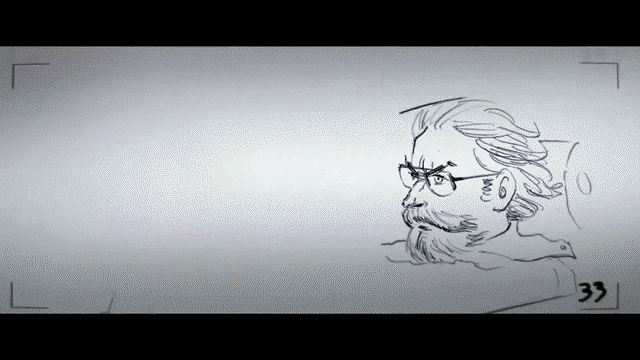
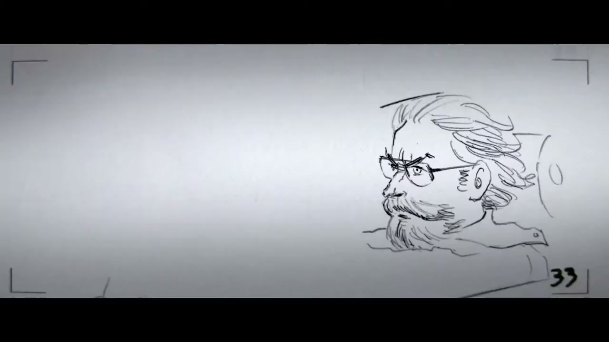
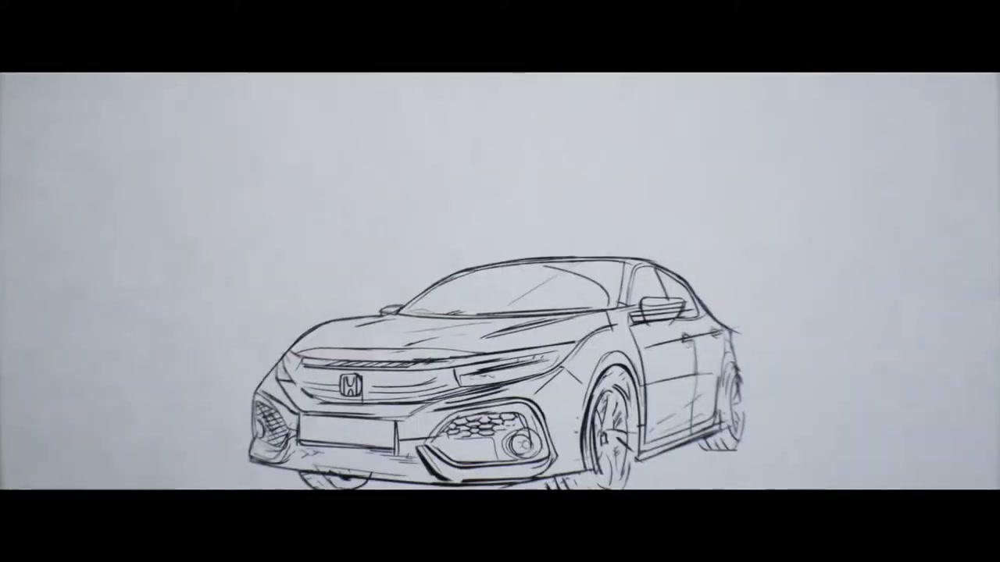
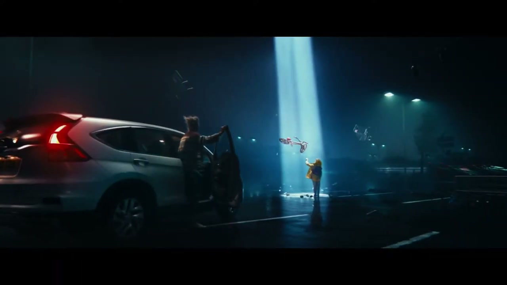
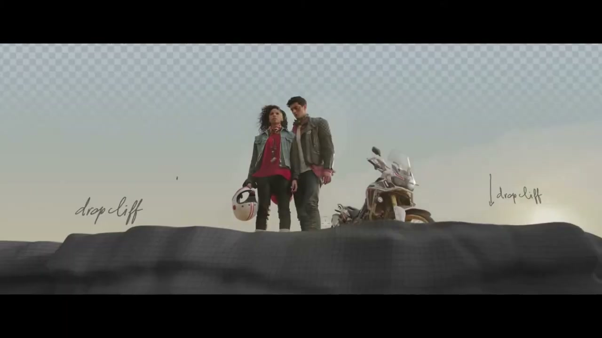
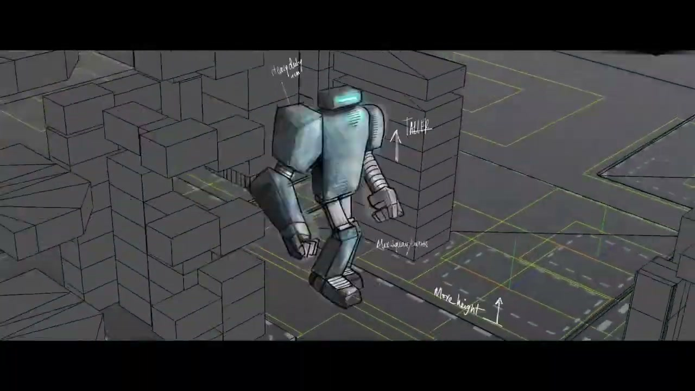
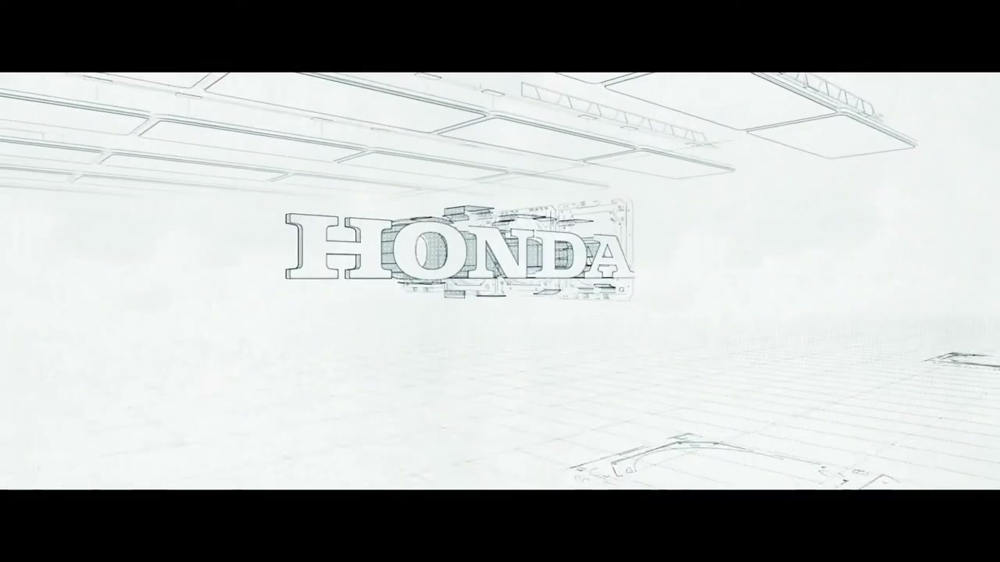

# Honda: Dream Makers

## The Work

A 90-second film paying tribute to the craft of filmmaking by directly linking it to Honda's pursuit of engineering precision. The film deconstructs iconic movie scenes — sci-fi, action, western — down to their underlying storyboards and sketches, showing how layers of craft animate a concept. Honda engine sounds were matched precisely to the changing scenes.

The film ran as **Channel 4 idents** across Channel 4, More4, Film4, and E4 for 12 months, plus online and cinema release. Time Based Arts handled directing, production, and post in full.

## Awards

- One Show 2018 — Merit, Moving Image Craft / Sound Design *(noted; not independently verified from primary source)*

## Collaborators

- **[Iain Tait](../collaborators/iain_tait.md)** — Executive Creative Director, W+K London
- **Tony Davidson** — Executive Creative Director, W+K London
- **Kim Papworth** — Executive Creative Director, W+K London
- **Carlos Alija** — Creative Director
- **Laura Sampedro** — Creative Director
- **Juan Sevilla** — Creative
- **Mico Toledo** — Creative
- **[James Guy](../collaborators/james_guy.md)** — Executive Producer, W+K London *(source: Stash Media / Time Based Arts coverage)*
- **[Time Based Arts](../collaborators/time_based_arts.md)** — Director / Production / Post
- **Daniel Landin** — Director of Photography
- **Paul Hardcastle** — Editor
- **Sam Ashwell / 750mph** — Sound design
- **Jean-Gabriel Becker / Sounds & Sons** — Music

## References & Media

### Assets

### Video
- [YouTube: Honda "Dream Makers"](https://www.youtube.com/watch?v=gmiQT_e0jRk)

### Press
- [Ads of the World: Dream Makers](https://www.adsoftheworld.com/campaigns/dream-makers)
- [LBB Online: Dream Makers coverage](https://lbbonline.com)

### Raw Research
- [Raw research file](../raw/research/wk_london_brands_2026-04-07.md)
