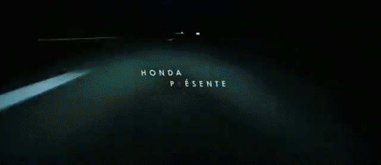
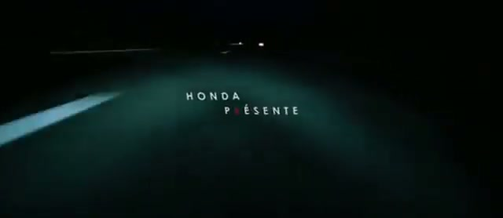
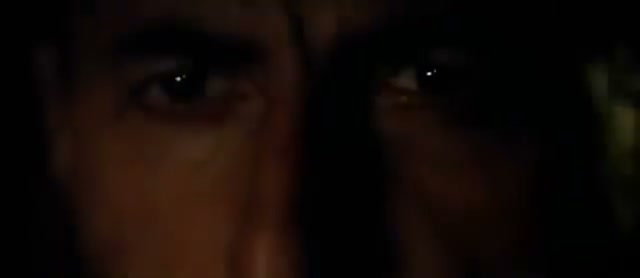
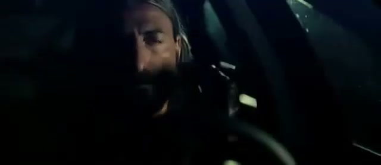
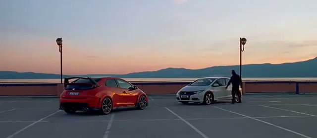

# Honda: The Other Side

## The Campaign

Described at the time as **the world's most awarded interactive campaign of 2015**. Created to address Honda's declining European sales and an ageing customer base, and specifically to communicate the dual personality of the Honda Civic Type R — functional family car and performance machine.

## The Mechanic

An interactive film with two parallel narratives running simultaneously. On one side: an ordinary suburban dad on the school run. On the other: an undercover police officer pursuing criminals through the same streets. The viewer could switch between the two at any moment by pressing the **R key** on their keyboard — mirroring the Civic Type R's "R" race mode button.

The two stories were filmed simultaneously with the same cast on the same locations, making the switch between them seamless. Interactive production was handled by Stink Digital (also known as Stink Studios).

## Metrics

- Average dwell time exceeded **3 minutes** — described as unusually long for an automotive digital campaign
- Honda Civic website traffic **doubled** during the campaign period

## Awards

| Award | Category | Result |
|---|---|---|
| D&AD 2015 | Digital Marketing | **Yellow Pencil** |
| D&AD 2015 | Integrated Innovative Media | **Yellow Pencil** |
| + multiple Graphite and Wood Pencils | Various | WIN |
| "World's most awarded interactive campaign of 2015" | — | — |

## Collaborators

- **[Iain Tait](../collaborators/iain_tait.md)** — Executive Creative Director, W+K London (lightly involved)
- **Kim Papworth** — Executive Creative Director, W+K London (credited on award entry)
- **[Tony Davidson](../collaborators/tony_davidson.md)** — Executive Creative Director, W+K London (credited on award entry)
- **Graeme Douglas** — Creative Director, W+K London
- **Scott Dungate** — Creative Director, W+K London
- **Daniel Wolfe** — Director (Somesuch & Co.)
- **Somesuch & Co.** — Production company
- **Stink Digital / Stink Studios** — Interactive production
- **Robbie Ryan** — Director of Photography
- **Thomas Grove Carter** — Editor
- **Anthony Moore** — Sound Designer
- **Tom Joyce** — Sound Designer

## References & Media

### Assets

### Video
- [YouTube: Honda — "The Other Side" (crime story)](https://www.youtube.com/watch?v=6vic5g7Gr3E)

### Press
- [D&AD 2015: Digital Marketing entry](https://www.dandad.org/awards/professional/2015/digital-marketing/24291/the-other-side/)
- [D&AD 2015: Integrated Innovative Media entry](https://www.dandad.org/awards/professional/2015/integrated-innovative-media/24242/the-other-side/)
- [W+K London case study](https://wklondon.com/work/the-other-side/)
- [Fast Company: "Anatomy of a Cannes Contender"](https://www.fastcompany.com/3047420/anatomy-of-a-cannes-contender-behind-the-coolest-car-ad-of-the-year-hondas-the-other-)
- [Campaign Live coverage](https://www.campaignlive.co.uk/article/honda-the-side-wieden-kennedy-london/1320115)
- [Scott Dungate portfolio](http://www.scottdungate.com/honda-the-other-side-gallery)

### Raw Research
- [Missed projects research file](../raw/research/missed_projects.md)
