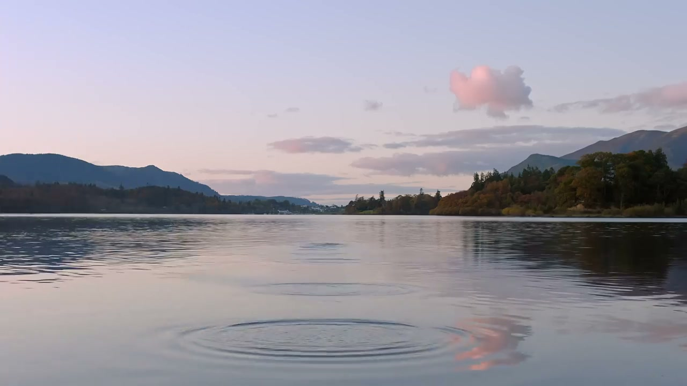
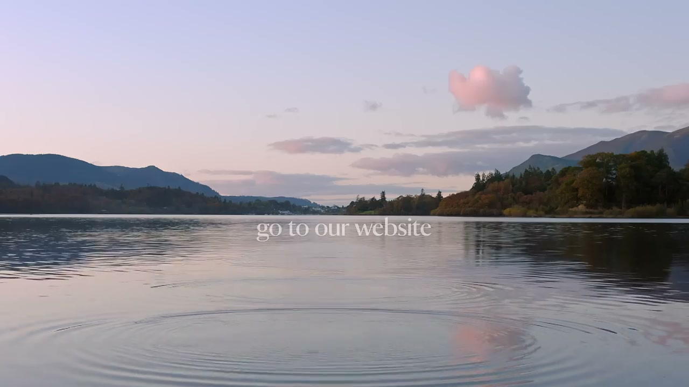
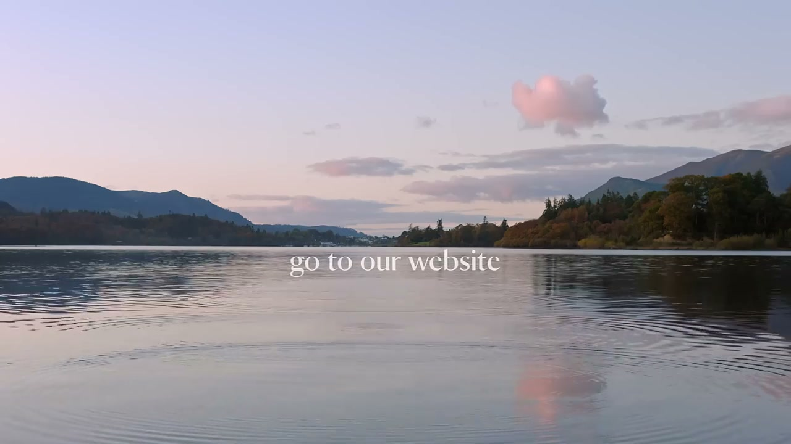
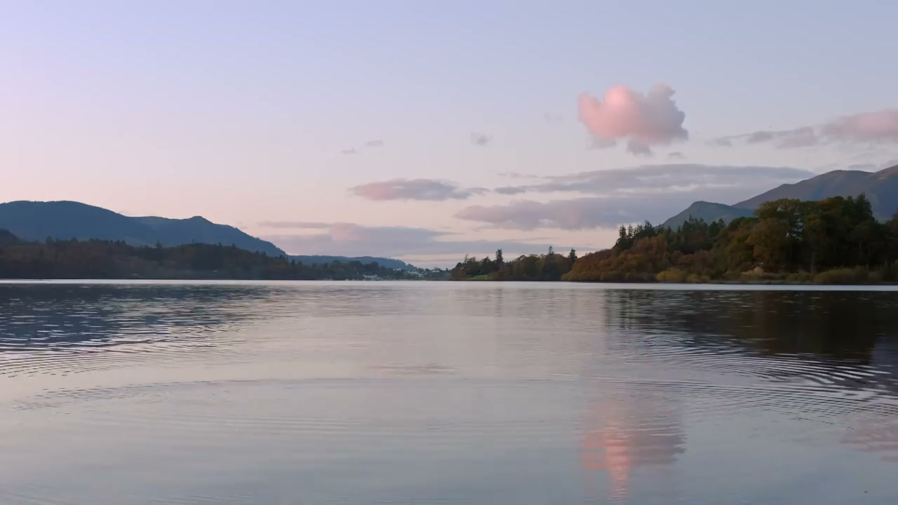
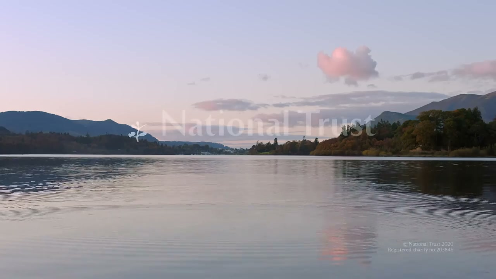
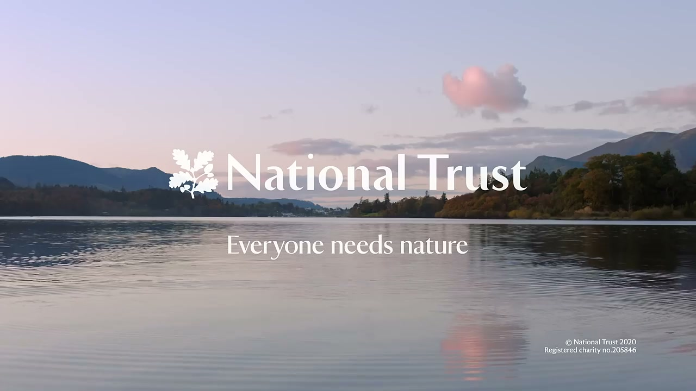

# National Trust: #EveryoneNeedsNature

## The Context

Following the first wave of COVID-19 lockdowns, The National Trust suffered massive venue closures and lost tens of millions in crucial funding, threatening conservation work. The campaign responded to the cultural moment: the lockdown had given millions of people a profound, lived experience of what access to nature means.

## The Work

Six TV commercials running across **ITV, Channel 4, and Sky** for six weeks. Rather than a membership drive, the campaign focused on **direct donations to specific conservation targets**: pledging to plant 20 million trees and establish green corridors.

The creative positioned the National Trust not as a preserver of historic houses, but as a critical steward of the country's psychological and environmental wellbeing — the guardian of something everyone had just discovered they needed.

## Collaborators

- **[Iain Tait](../collaborators/iain_tait.md)** — Executive Creative Director, W+K London
- **[Tony Davidson](../collaborators/tony_davidson.md)** — Executive Creative Director, W+K London
- **[Juan Sevilla](../collaborators/juan_sevilla.md)** — Executive Creative Director, W+K London
- **Flo Heiss** — Creative Director
- **Derek Lui** — Creative
- **Harry Ingrams** — Creative
- **Joanna Cassidy Osborne** — Creative
- **Joseph Paul** — Creative
- **Richard Biggs** — Creative
- **Anthony Dickenson** — Director / DOP (All Mighty Pictures)
- **All Mighty Pictures** — Production company
- **Jack Williams** — Editor (The Assembly Rooms)
- **[Time Based Arts](../collaborators/time_based_arts.md)** — Post production
- **String and Tins** — Sound
- **Medialabs Group** — Media agency

## References & Media

### Assets

- [LBB Online: #EveryoneNeedsNature coverage](https://lbbonline.com)
- [Raw research file](../raw/research/wk_london_brands_2026-04-07.md)
