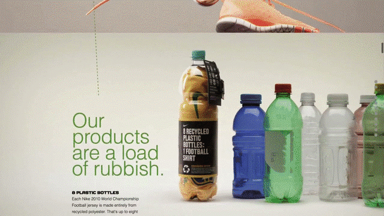
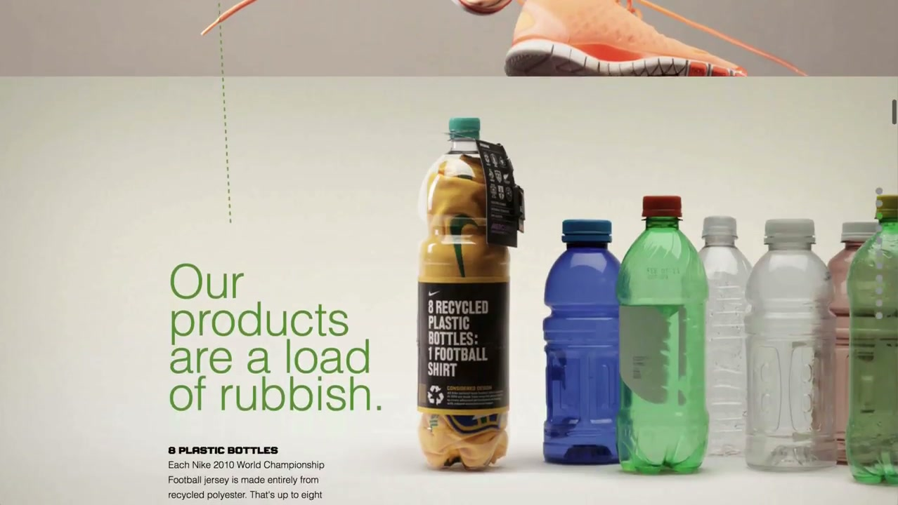
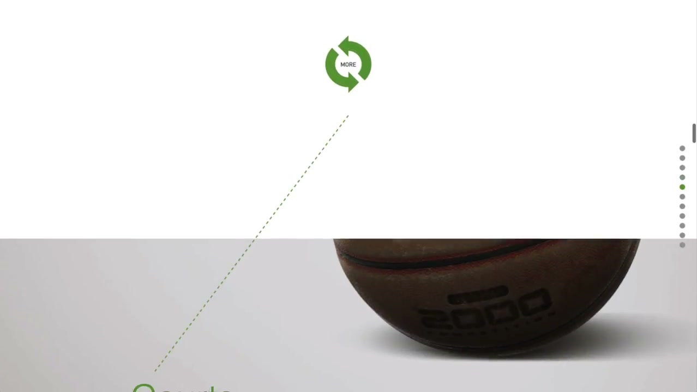
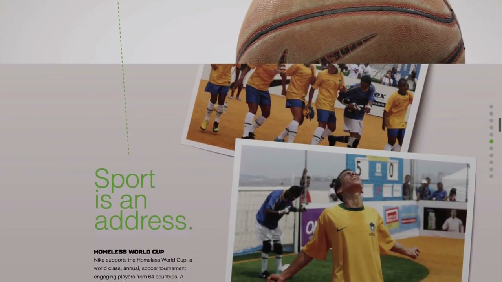
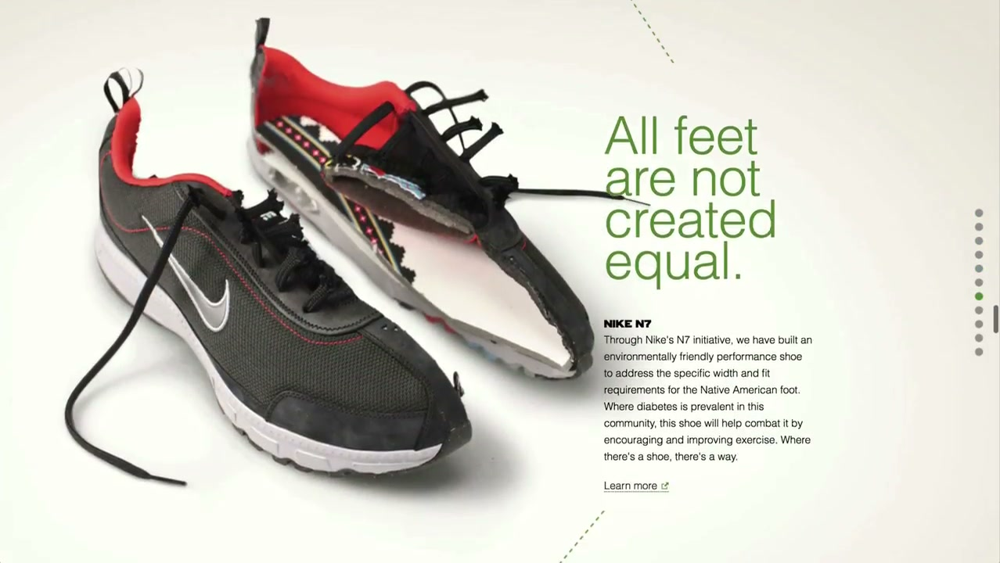
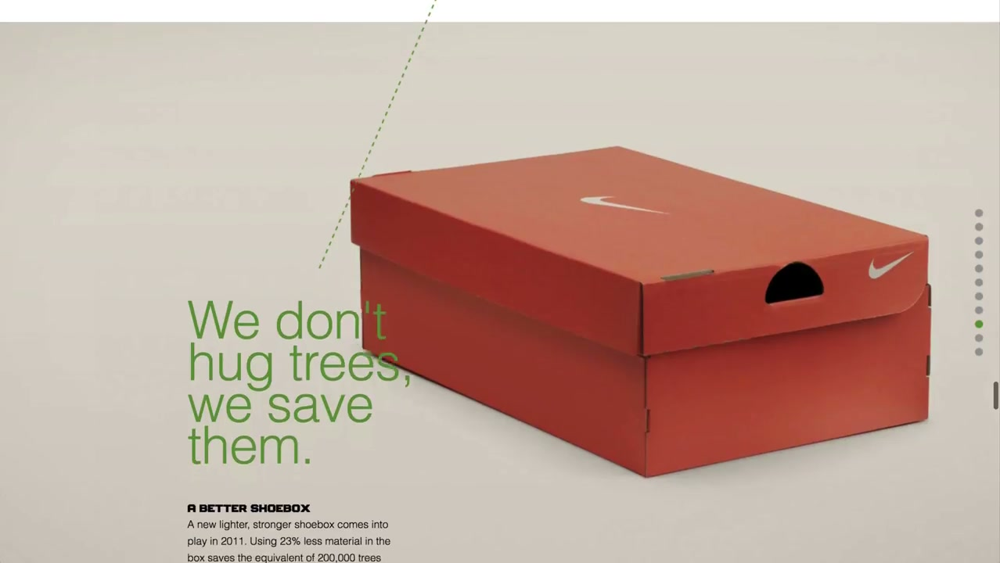
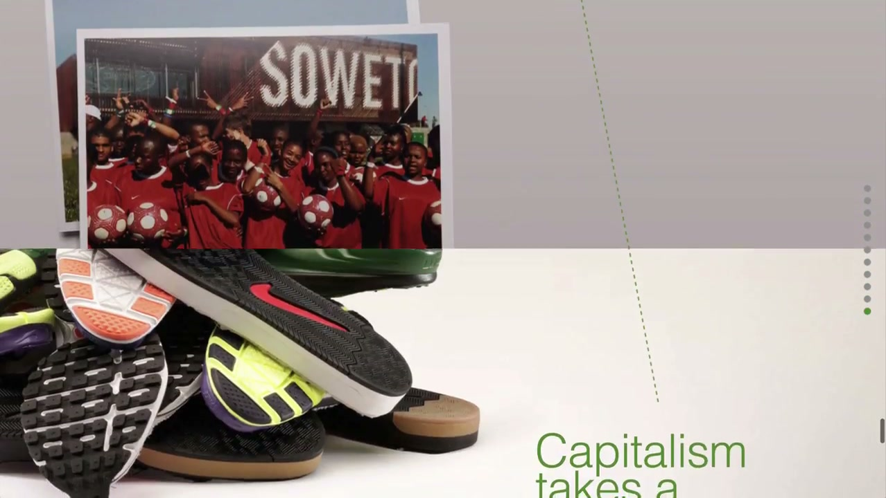

# Nike Better World

## The Objective

To create a digital platform consolidating and communicating Nike's sustainability initiatives — a brand statement about Nike's environmental and social commitments, built entirely in HTML5 at a moment when Flash dominated interactive advertising.

## The Work

Launched January 5, 2011, *Nike Better World* was a single-page, infinite-scroll website that used HTML5 and advanced JavaScript to move foreground and background elements at different velocities as the user scrolled — creating a continuous 3D illusion of depth and cinematic storytelling.

Adweek's Brian Morrissey, writing on the day of launch:
> *"You know Flash microsites are on the run when Nike skips the Adobe effects in favor of HTML5. Wieden + Kennedy has a slick new corporate-responsibility site out: Nike's Better World."*

Built by Interactive Creative Director **Seth Weisfeld**, producer **Ryan Bolls**, and design/interaction duo **Ian Coyle** and **Duane King** — without any framework, starting from reset styles alone — the site became the most discussed website of 2011 and the template for a decade of web design that followed.

## Why It Mattered: The Parallax Origin

Multiple independent sources identify *Nike Better World* as the first mainstream application of parallax scrolling in advertising web design.

- **One Page Love:** *"What makes it iconic is this was the first mainstream use of the Parallax Scrolling effect in a Landing Page."*
- **GWS Media:** *"Its popularity started to rise significantly in 2011, which was around the time Ian Coyle created the very first parallax website for Nike, 'Nike Better World'."*
- **FWA founder Rob Ford (The Next Web, 2019):** Credited Nike Better World with catalysing "responsive websites and single page parallax scrolling websites" across the web's entire design vocabulary for the decade that followed.

The site spawned a massive sub-industry of design tutorials — most notably the Smashing Magazine behind-the-scenes analysis which became one of the most-read technical web design articles of 2011 — and inspired Ian Coyle and Duane King to found King/Coyle, a studio that continued developing the interaction language they pioneered here.

## Collaborators

- **[Iain Tait](../collaborators/iain_tait.md)** — Global Interactive Executive Creative Director (executive oversight)
- **Seth Weisfeld** — Interactive Creative Director
- **Ryan Bolls** — Producer
- **Ian Coyle** — Design and Interaction (co-lead)
- **Duane King** — Design and Interaction (co-lead)
- **Katie Abrahamson** — Account / PR coordinator

## Reception & Legacy

### Awards

- **Cannes Lions 2011:** Cyber Lion Shortlist (Interactive: Craft / Interface Design)
- **FWA:** Site of the Day (January 31, 2011)
- **Webby Awards 15th Annual (2011):** Winner / Nominee
- **Net Awards 2011:** Top 10 Sites of the Year

### Cultural Legacy

- Universally credited as the first mainstream parallax scrolling website — a technical contribution to web design history
- Smashing Magazine (2011): *"Perhaps one of the most talked about websites in the last 12 months... it still stands as an example of what a great idea and some clever design and development techniques can produce"*
- FWA juror Ronald Mendez: *"the first time I saw the Nike Better World parallax site was one of those moments when I realized that being a developer was going to be perceived as something cool"*
- David Jones (CEO Havas) cited it in *Who Cares Wins* as an exemplar "Social Business Idea"
- The UX pattern became standard for product landing pages and digital portfolios worldwide for the following decade

## References & Media

### Assets

### Video

- [YouTube: Nike Better World site walkthrough (primary archive record)](https://www.youtube.com/watch?v=tAzaSZi8ycU)
- [YouTube: Second site record](https://www.youtube.com/watch?v=kmGDwm5-a80)
- [YouTube: Nike Better World — Phil Knight on the history](https://youtu.be/3osb4IYOw2Q)
- [YouTube: Nike sustainability film (plastic bottles to jerseys)](https://youtu.be/wEKFJWdJ5jg)

### Archive

- [Wayback Machine: nikebetterworld.com (January 5, 2011)](https://web.archive.org/web/20110105/http://www.nikebetterworld.com)
- [Ian Coyle parallax recreation tutorial](https://ianlunn.co.uk/articles/recreate-nikebetterworld-parallax/)

### Press & Analysis

- [Smashing Magazine: "Behind The Scenes Of Nike Better World" — full team interview (July 12, 2011)](https://www.smashingmagazine.com/2011/07/behind-the-scenes-of-nike-better-world/)
- [Adweek: "Wieden's Nike site has Flash running scared" (January 6, 2011)](https://www.adweek.com/creativity/wiedens-nike-site-has-flash-running-scared-11741/)
- [One Page Love: "first mainstream use of Parallax Scrolling"](https://onepagelove.com/nike-better-world/)
- [Core77: "no other external communication sums up more of what it feels like to work at Nike" (January 7, 2011)](https://www.core77.com/posts/18264/Nike-Better-World)
- [The Next Web: FWA founder Rob Ford credits Nike Better World with catalysing the parallax era (December 2019)](https://thenextweb.com/news/the-evolution-of-web-design-in-the-2010s)
- [GWS Media: parallax scrolling history](https://www.gwsmedia.com/articles/parallax-scrolling-web-design)

### Raw Research

- [Raw research file](../raw/research/nike_better_world_2026-04-06.md)
