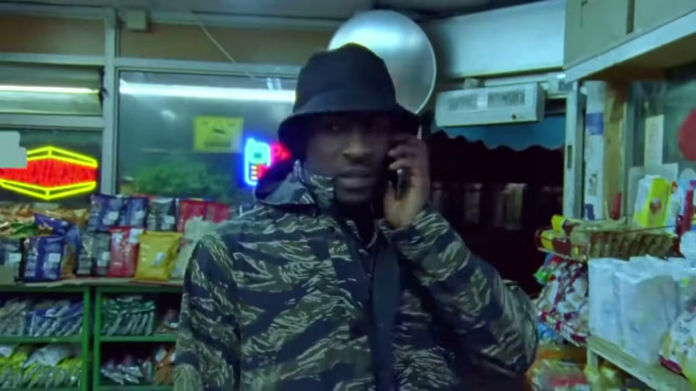
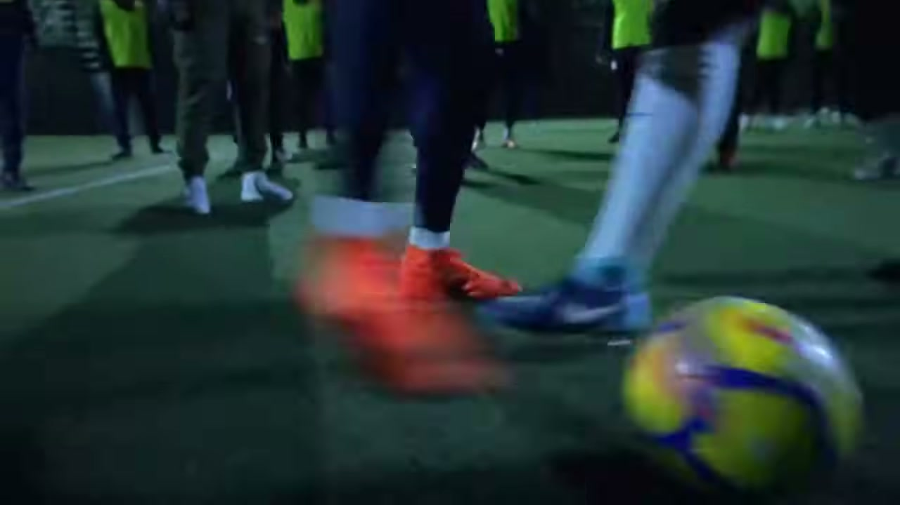
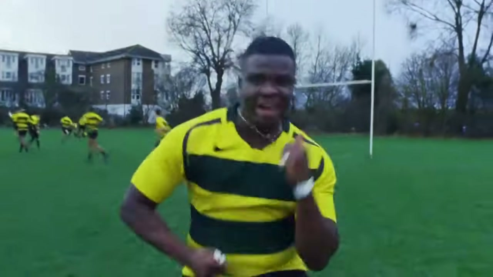
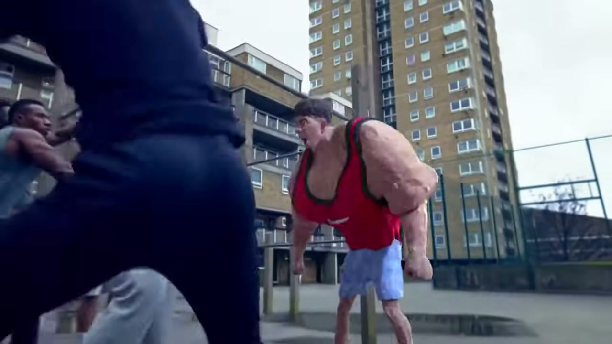
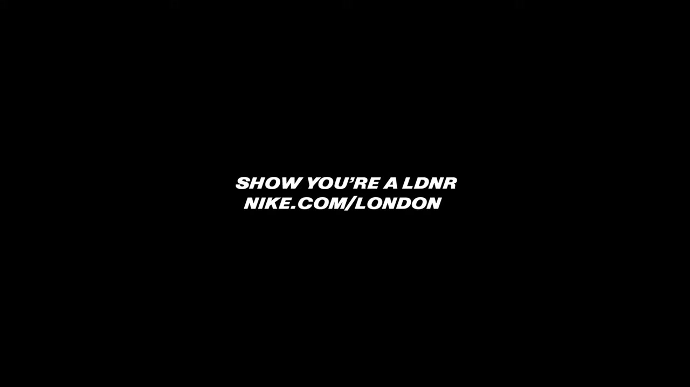

# Nothing Beats a Londoner

## The Objective

To make Nike relevant to London's youth sporting culture — not with aspirational polish, but with the raw, authentic, aggressively local vernacular of the city's actual young athletes.

## The Work

Launched February 9, 2018 — during London schools' half-term week, when the target audience would be online — *Nothing Beats a Londoner* was a three-minute film that announced itself as a radically different kind of Nike ad.

Directed by Megaforce (French quartet Clément Dozier, Raphaël Rodriguez, Clément Gallet, Adrien Lagier) and shot entirely on 16mm film by DOP Nicolas Loir, the film ran through London's boroughs on a "passing the baton" structure: young athletes in one neighbourhood complained about the hardships of training in London ("In Hackney, we train in the rain...") only to be immediately topped by kids from the next borough facing an even harder situation — and so on, cascading across the city.

258 real young Londoners appeared in the film. Celebrity cameos — Skepta, Giggs, Mo Farah, Harry Kane, Dina Asher-Smith, Jordan Nobbs and many others — appeared as equals, constantly upstaged by the actual kids. The film was seeded first through the young athletes' own Instagram channels before any paid distribution, establishing authenticity before reach.

The soundtrack opened with Skepta's "Shutdown," wove through Kano's "Typical Me," and closed with Dizzee Rascal.

Nike's original YouTube upload was pulled in March 2018 after London activewear brand LNDR successfully contested the #LDNR hashtag in a trademark dispute — the Intellectual Property Enterprise Court ruled on July 25, 2018 in LNDR's favour. The film survives on third-party channels and in awards archives.

## Collaborators

- **[Iain Tait](../collaborators/iain_tait.md)** — Executive Creative Director
- **Tony Davidson** — Executive Creative Director
- **[Mark Shanley](../collaborators/mark_shanley.md)** — Creative Director
- **[Paddy Treacy](../collaborators/paddy_treacy.md)** — Creative Director
- **[Tom Bender](../collaborators/tom_bender.md)** — Art Director
- **[Tom Corcoran](../collaborators/tom_corcoran.md)** — Copywriter
- **Jo Bruce** — Social Creative
- **Paula Bloodworth** — Planning Director
- **Ryan Fisher** — Group Account Director
- **Sophy Woltman** — Account Director
- **Holly Baker-Cliff** — Account Manager
- **James Guy** — Head of Production / Executive Producer
- **Michelle Brough** — TV Producer
- **[Rose Fairley](../collaborators/rose_fairley.md)** — TV Production Assistant
- **Tom Dean** — Social Producer
- **[Megaforce](../collaborators/megaforce.md)** — Directors (Riff Raff Films)
- **[Riff Raff Films](../collaborators/riff_raff_films.md)** — Production Company
- **Matthew Fone** — Executive Producer (Riff Raff)
- **Nick Goldsmith** — Line Producer
- **Nicolas Loir** — Director of Photography (16mm film)
- **Joe Guest** — Editor (Final Cut)
- **[Time Based Arts](../collaborators/time_based_arts.md)** — Post Production / VFX
- **Sheldon Gardner** — VFX Supervisor (TBA)
- **Francois Roisin** — VFX Supervisor (TBA)
- **Simone Grattarola** — Colourist (TBA)
- **Cinelab London** — Film Lab
- **Sam Ashwell** — Sound Designer (750mph)
- **Mary-Ann D'Cruz** — Sound Producer (750mph)
- **Jamie Brunskill** — Nike Creative (Nike LDN Creative Studio)
- **Jamie McCall** — Marketing Director London/West (Nike)
- **Mindshare** — Media agency

## Reception & Legacy

### Awards

- **Cannes Lions 2018:**
  - Titanium Lion (festival's highest honour)
  - Grand Prix — Social & Influencer (inaugural category)
  - Gold — Film
  - 2 Silvers (Mobile; Social & Influencer)
  - 8 shortlists
  - W+K London placed 3rd among all UK agencies
- **D&AD 2018:** 7 Yellow Pencils
- **One Show 2018:** Gold Pencil
- **Creative Review Annual 2019:** Best in Book
- **British Arrows 2019:** Commercial of the Year
- **Immortal Awards 2018:** One of only 4 inaugural winners
- **Creative Circle 2018:** Gold of Golds
- **Cresta Awards 2019:** Gold — Moving Image, Apparel
- **Campaign Magazine 2018:** #1 Film Ad of the Year
- Craft awards (750mph/Sam Ashwell): Shots Gold; Ciclope Gold; Music & Sound Awards; NY Advertising Festival; Creative Circle Gold; Clio Bronze; Eurobest Bronze

### Metrics

| Metric | Figure |
|---|---|
| YouTube peak views | ~9 million |
| Views in first week | 4.6 million |
| UK trending position | #1 video |
| London Nike product searches (Lyst) | +93% |
| Manchester Nike searches | +72% |
| UK-wide Nike searches | +54% |
| Site click-throughs | 171,000+ |
| VEVO view-through rate | ~90% |

### Cultural Legacy

- Mayor of London Sadiq Khan shared the film organically on social media
- Drake commented on Instagram saying he "couldn't believe he wasn't invited" — became a viral moment in itself
- The Guardian created a parody cartoon strip the day after release
- Provoked "Nothing Beats a Brummy / Manc" etc. parody genre across the country
- UM survey (Aug 2018): 56% of non-Londoners feel ads don't represent them — NBAL became the central exhibit in a national debate about advertising's "London bubble"
- Nike replicated the format for Shanghai ("Shanghai's Never Done," March 2019)
- Campaign Magazine: Tait and Davidson named **#2 in UK's Top Creatives of 2018** — *"most acclaimed ad of the year"*
- Creative Review published a 2023 essay: *"Ok advertising, it's time to let go of Nothing Beats a Londoner"* — the campaign's influence had spawned so many clones that the industry needed to move on
- LBB Immortal Awards: *"Decades from now, people will show their kids Nike's 'Nothing Beats a Londoner' to demonstrate what growing up in the British capital in 2018 looked, sounded and felt like"*
- Immortals jury president: *"If Nike's 'Good vs Evil' set the bar for advertising in the '90s, this piece encapsulates millennial culture"*

## References & Media

### Assets

### Video

- [YouTube: Nothing Beats a Londoner (main surviving copy)](https://www.youtube.com/watch?v=26qmJzTCRG4)
  - Local archive: `../raw/media/2018_nothing_beats_a_londoner.webm`
- [YouTube: Cannes Lions archive version](https://www.youtube.com/watch?v=lKa8hn-IarQ)
- [YouTube: Behind the Scenes (2018)](https://www.youtube.com/watch?v=Sg1f5xdPRfo)
  - Local archive: `../raw/media/2018_nothing_beats_a_londoner_bts.mkv`
- [Vimeo copy](https://vimeo.com/groups/575107/videos/300516370)
- *Note: Nike pulled the film from official channels following LNDR trademark ruling (July 25, 2018)*

### Awards & Credits

- [W+K London case study](https://wklondon.com/work/nothing-beats-londoner/)
- [W+K London Cannes post](https://wklondon.com/2018/06/nikes-nothing-beats-londoner-cleans-cannes/)
- [Cresta Awards — full credits](https://www.cresta-awards.com/?action=ows:entries.details&e=27739&project_year=2019)
- [Creative Review: Best in Book](https://www.creativereview.co.uk/nothing-beats-a-londoner-by-wieden-kennedy-london/)
- [750mph: craft awards full list](https://www.750mph.com/clips/nothing-beats-a-londoner/)
- [Jamie Brunskill Nike credits](http://www.jamiebrunskill.com/nike-londoner)

### Press

- [Campaign Live: Credits & review (Feb 10, 2018)](https://www.campaignlive.co.uk/article/nike-nothing-beats-londoner-wieden-kennedy-london/1456851)
- [Campaign Live: Making-of (Feb 13, 2018)](https://www.campaignlive.co.uk/article/nike-wieden-kennedy-made-viral-ad-speaks-real-london-youth/1456978)
- [Campaign Live: Film pulled (Mar 19, 2018)](https://www.campaignlive.co.uk/article/nike-pulls-nothing-beats-londoner-ads/1459767)
- [Campaign Live: Cannes Grand Prix win (Jun 21, 2018)](https://www.campaignlive.co.uk/article/wieden-kennedy-nike-win-social-influencer-grand-prix-cannes-nothing-beats-londoner/1485727)
- [Campaign: 2022 retrospective "Why nothing beats..."](https://www.campaignlive.co.uk/article/why-nothing-beats-nikes-nothing-beats-londoner/1798179)
- [Creative Review: Initial news (Feb 9, 2018)](https://www.creativereview.co.uk/nikes-nothing-beats-londoner-spot-features-258-athletes-city/)
- [Creative Review: 2023 retrospective](https://www.creativereview.co.uk/onothing-beats-a-londoner-advertising/)
- [The Drum: Ad of the Day (Feb 9, 2018)](https://www.thedrum.com/news/nothing-beats-londoner-says-nike-ad-intent-mobilising-fanatically-fit-youth)
- [The Drum: For and Against (Feb 16, 2018)](https://www.thedrum.com/news/and-against-nikes-nothing-beats-londoner-campaign)
- [The Drum: LNDR trademark loss (Jul 26, 2018)](https://www.thedrum.com/news/ldnr-vs-lndr-nike-s-nothing-beats-londoner-loses-trademark-battle-with-ldnr)
- [Adweek: Megaforce deep dive (Feb 15, 2018)](https://www.adweek.com/creativity/how-french-directors-megaforce-captured-the-spirit-of-london-in-nikes-wild-new-ad/)
- [LBB: Behind the brilliance (Feb 13, 2018)](https://lbbonline.com/news/behind-the-brilliance-of-nikes-love-letter-to-london)
- [LBB: Immortal Awards making-of (Nov 12, 2018)](https://lbbonline.com/news/why-nothing-beats-nothing-beats-a-londoner)
- [Contagious: Cannes Social & Influencer report](https://www.contagious.com/en/article/news-and-views/cannes-lions-social-and-influencer-winners-2018)
- [BuzzFeed: Launch (Feb 10, 2018)](https://www.buzzfeed.com/ikrd/people-love-this-nike-ad-because-it-actually-shows-what-its)

### Raw Research

- [Raw research file](../raw/research/nothing_beats_a_londoner_2026-04-06.md)
