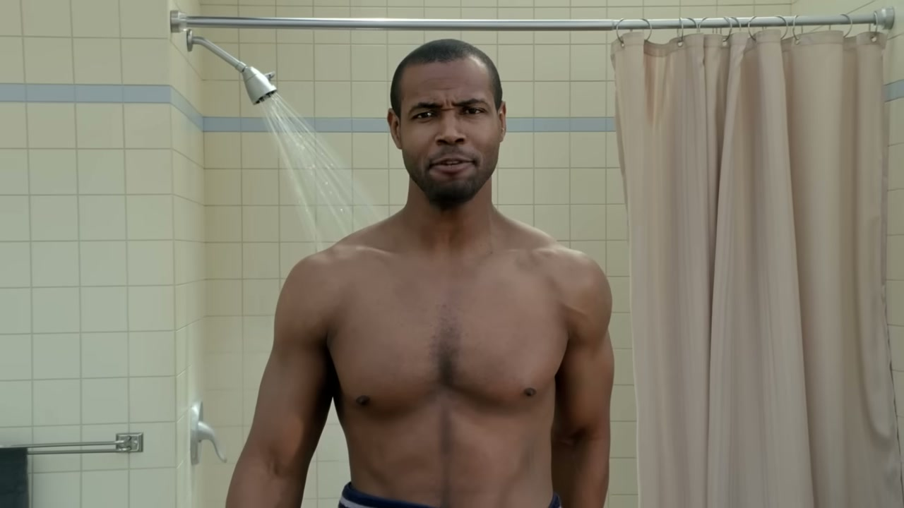
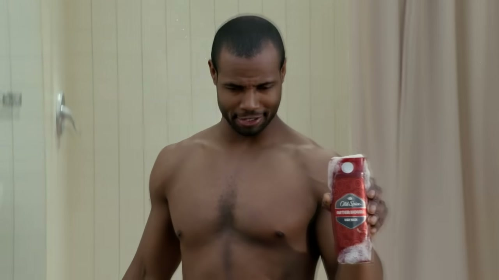
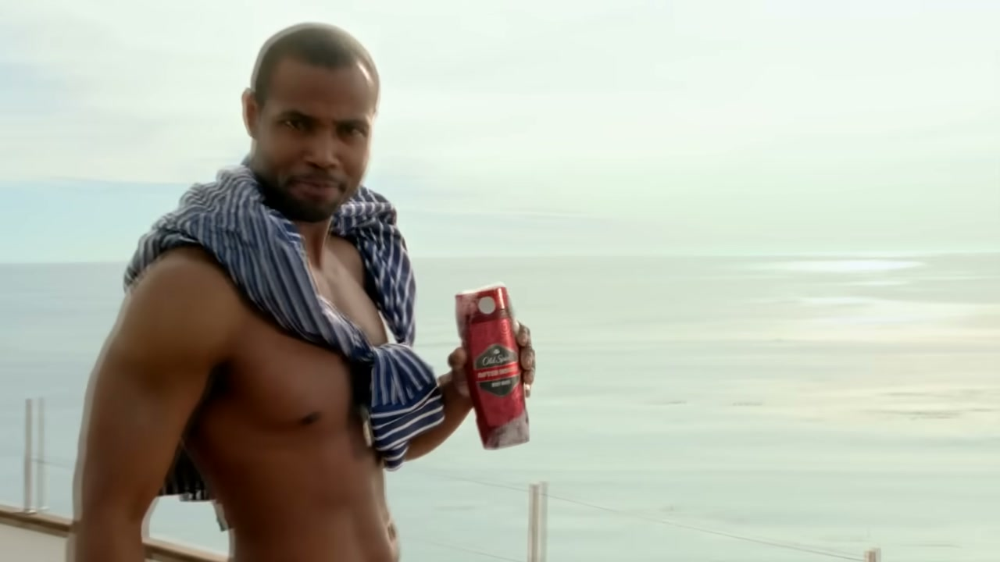
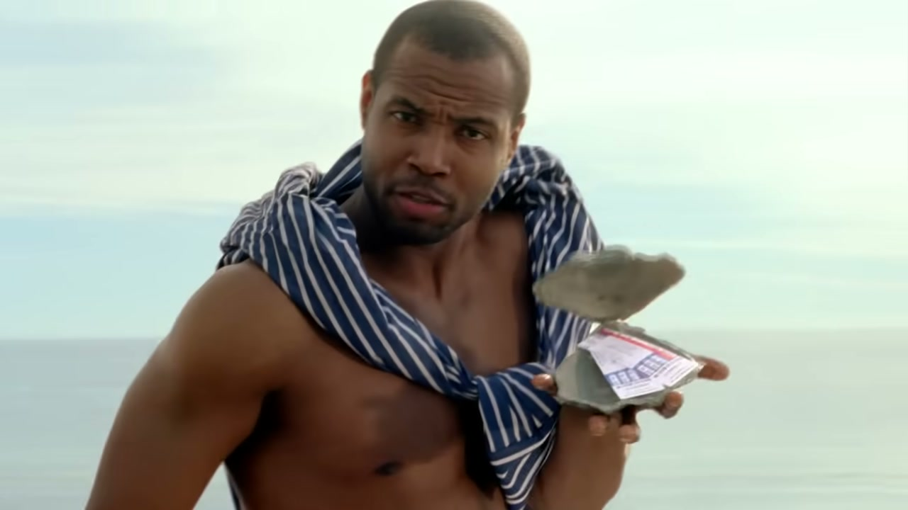
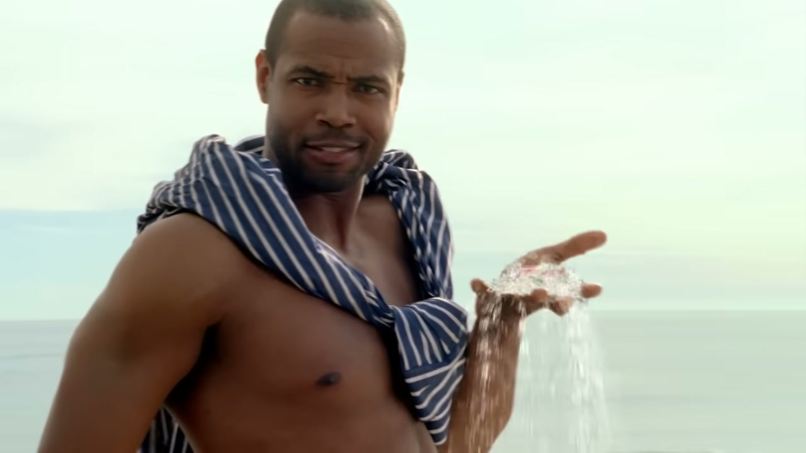
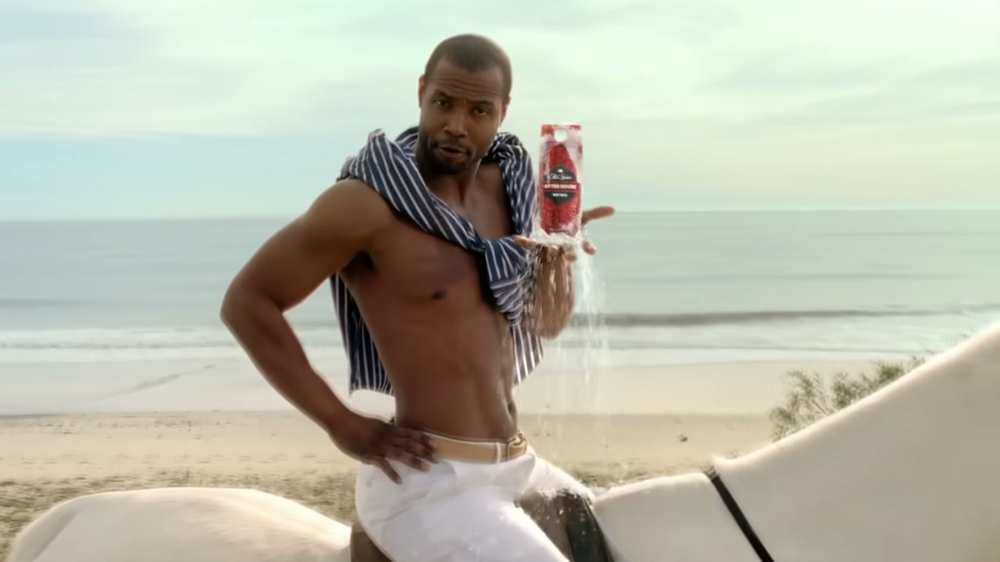

# Old Spice: Responses

## The Objective

To transform the viral cultural momentum from the Super Bowl "The Man Your Man Could Smell Like" broadcast spot into an unprecedented real-time social media engagement — making the campaign itself into a two-way conversation with the internet.

## The Work

In July 2010, Wieden+Kennedy Portland executed what became the defining proof-of-concept for real-time branded content. Over 2.5 days, a bespoke team of writers, strategists, and creatives — with Isaiah Mustafa in character and on set throughout — produced 186 personalised video responses to fan tweets, celebrity messages, and internet culture moments.

The targets were strategically selected for influence and virality: Twitter co-founder Biz Stone, Digg founder Kevin Rose, Perez Hilton, Ellen DeGeneres, Demi Moore, Alyssa Milano, Starbucks. Each response was written, filmed, edited, and uploaded within minutes of the original message.

The campaign launched on July 13, 2010. Within 24 hours it was outpacing the Obama victory speech in YouTube views. Within three days it had become the most viewed YouTube channel in history at that point.

Iain Tait described the key insight to Fast Company on the day of the campaign:
> *"We had this character who is not only loved by ladies, but equally loved by guys... And we realized there were no edges to where he could exist."*

## Why It Mattered

The Responses campaign established a new model for branded entertainment: instead of broadcasting at an audience, Old Spice became part of the conversation. It demonstrated that a brand — with the right character, the right creative team, and the right infrastructure — could act with the speed and wit of a human social media participant.

D&AD's case study described the practice that followed as "a go-to practice for marketers." The Webby Awards, in their 30th anniversary retrospective, identified the campaign as the moment W+K "taught brands to act like people online and to make culture, not just ads."

## Collaborators

- **[Iain Tait](../collaborators/iain_tait.md)** — Creative Director / Global Interactive ECD
- **[Jason Bagley](../collaborators/jason_bagley.md)** — Creative Director, Art Director, Director, Writer
- **[Eric Baldwin](../collaborators/eric_baldwin.md)** — Creative Director, Art Director, Director, Writer
- **[Mark Fitzloff](../collaborators/mark_fitzloff.md)** — Creative Director
- **[Susan Hoffman](../collaborators/susan_hoffman.md)** — Creative Director
- **Craig Allen** — Art Director, Director, Writer
- **Eric Kallman** — Art Director, Director, Writer
- **Matthew Carroll** — Designer
- **Ann-Marie Harbour** — Agency Producer
- **Emily Fincher** — Producer
- **Trent Johnson** — Programmer
- **John Cohoon** — Programmer
- **Dean McBeth** — Content Strategist
- **Josh Millrod** — Content Strategist
- **Isaiah Mustafa** — Talent (The Old Spice Guy)
- **Don't Act Big** — Production Company
- **James Moorhead** — Brand Manager, Old Spice (P&G)

## Reception & Legacy

### Awards

- **Cannes Lions Grand Prix — Film** (2010, for the original "The Man Your Man Could Smell Like" spot)
- **D&AD:** 2 Yellow Pencils + 1 Graphite Pencil (2011, Digital Design; Writing for Advertising)
- **One Show:** 3 Gold Pencils (2011) — Experiential Advertising; Online Films & Video; Interactive Advertising Campaign
- **Webby Awards:** Winner + People's Voice — Best Use of Social Media (2011)
- **Grand Effie** (2011)
- **W+K named Webby Agency of the Year 2011** — partly due to this campaign

### Metrics

| Metric | Figure |
|---|---|
| Videos produced | 186 |
| Day 1 YouTube views | 5.9 million |
| Day 3 views | 20 million |
| Day 7 views | 40 million+ |
| Total Responses views | 65 million |
| Campaign impressions | 1.4–2 billion |
| Twitter follower growth | +2,700% |
| Facebook fans | +800% |
| Oldspice.com traffic | +300% |
| Sales lift (1 month) | +107% |
| Sales lift (3 months) | +55% |
| Sales lift (end July) | +125% YoY |

*Note: Some sales figures are disputed — a concurrent P&G coupon campaign complicates attribution. All figures from D&AD/W+K/Webby case studies.*

### Cultural Legacy

- Ranked **#4 on Ad Age's Top 15 Campaigns of the 21st Century**
- Day 1 views outpaced Obama victory speech and Susan Boyle on YouTube (Visible Measures/Mediapost)
- Inspired an entire generation of "real-time marketing" attempts — D&AD noted the Responses model became "a go-to practice for marketers"
- Webby 30th anniversary (2022): "W+K taught brands to act like people online and to make culture, not just ads"
- Iain Tait was made a W+K **Partner in 2011** specifically in recognition of this campaign; the One Club's Board bio identifies it as "his most recognized work"

## References & Media

### Assets

### Video

- [YouTube: "The Man Your Man Could Smell Like" (LIVE — original Super Bowl spot)](https://www.youtube.com/watch?v=owGykVbfgUE)
  - Local archive: `../raw/media/2010_old_spice_man_your_man_could_smell_like.webm`
- [YouTube: "Questions" follow-up spot (LIVE)](https://www.youtube.com/watch?v=uLTIowBF0kE)
  - Local archive: `../raw/media/2010_old_spice_questions.webm`
- [YouTube: Grand Effie 2011 — Old Spice case study](https://www.youtube.com/watch?v=iS-4WxmKBNI)
- [Old Spice YouTube channel](https://www.youtube.com/oldspice)

### Awards & Case Studies

- [D&AD Archive — Old Spice Response Campaign](https://www.dandad.org/work/d-ad-awards-archive/old-spice-response-campaign)
- [D&AD Case Study / Insights](https://www.dandad.org/insights/awards/old-spice-case-study-insights)
- [One Show Gold Pencil — Experiential Advertising](https://www.oneclub.org/awards/theoneshow/-award/13695/response-campaign/)
- [One Show Gold Pencil — Online Films & Video](https://www.oneclub.org/awards/theoneshow/-award/13915/old-spice-response-campaign/)
- [One Show Gold Pencil — Interactive Advertising Campaign](https://www.oneclub.org/awards/theoneshow/-award/45124/old-spice-response-campaign/)
- [Webby Awards: Best Use of Social Media (2011)](https://winners.webbyawards.com/2011/advertising-media-pr/media-campaigns/best-use-of-social-media/150256/old-spice-response-campaign)

### Press

- [Fast Company: "The Team Who Made Old Spice Smell Good Again" — interviews Iain Tait on the day (July 14, 2010)](https://www.fastcompany.com/1670314/team-who-made-old-spice-smell-good-again-reveals-whats-behind-mustafas-towel/)
- [Fast Company: 10th Anniversary retrospective (2020)](https://www.fastcompany.com/90454029/the-old-spice-guy-celebrates-its-10th-anniversary-as-an-embarrassing-old-spice-dad)
- [Ad Age: Campaign documentation (July 12, 2010)](https://adage.com/creativity/work/responses/20626/)
- [Ad Age: Best of the Decade (August 3, 2010)](https://adage.com/creativity/work/old-spice-responses-case-study/20896/)
- [Ad Age: Top 15 Campaigns of the 21st Century — #4](https://adage.com/article/agency-news/top-15-ad-campaigns-21st-century/2162916)
- [Ad Age: Hottest Brands 2010](https://adage.com/article/print-edition/spice-america-s-hottest-brands-2010/147064/)
- [Adweek: Grand Marketer of the Year — James Moorhead (Sep 2010)](https://www.adweek.com/brand-marketing/grand-marketer-year-2010-james-moorhead-old-spice-94431/)
- [Webby 30th Anniversary: W+K retrospective](https://www.webbyawards.com/webby30/most-iconic-companies-wiedenkennedy/)
- [AAF bio — confirms Iain's role](https://www.aaf.org/Public/Public/Bios/AHOA_Members/S-T/Tait_Iain.aspx)
- [One Club Board bio — "his most recognized work"](https://www.oneclub.org/directors/-bio/ian-tait/)
- [TechCrunch: "Google Creative Lab Gets 'Old Spice' Creative Director Iain Tait" (April 2012)](https://techcrunch.com/2012/04/16/iait-tait-google-creative-lab-wieden-kennedy/)

### Raw Research

- [Raw research file](../raw/research/old_spice_responses_2026-04-06.md)
