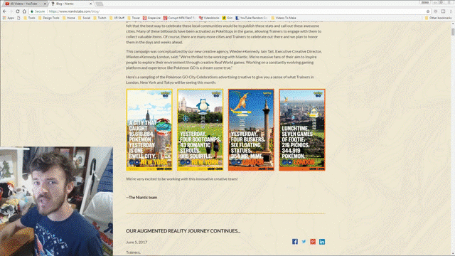
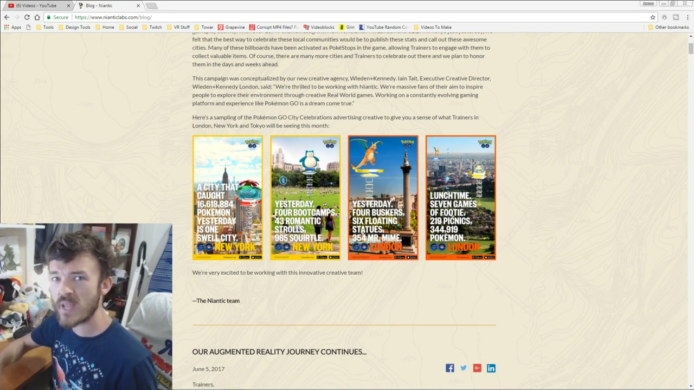
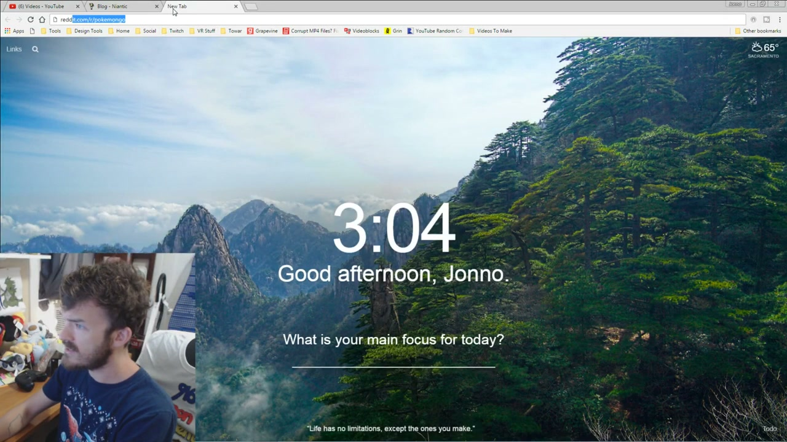
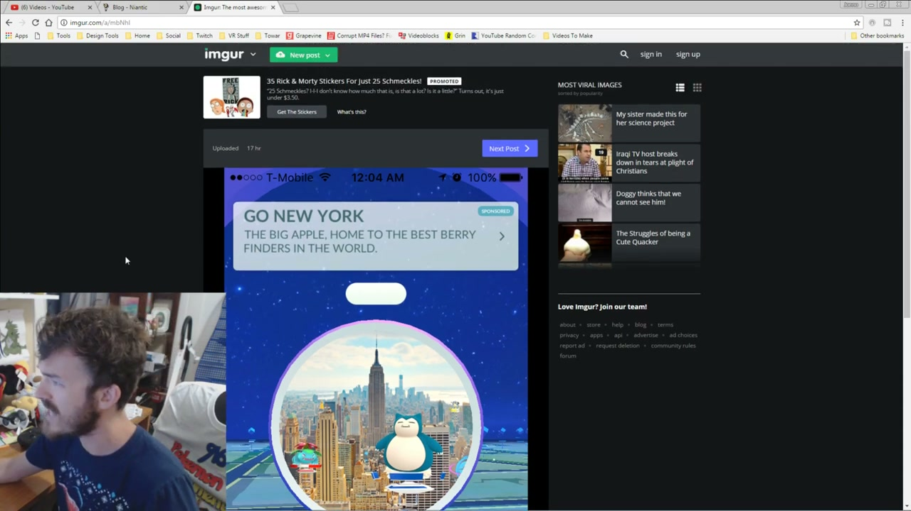
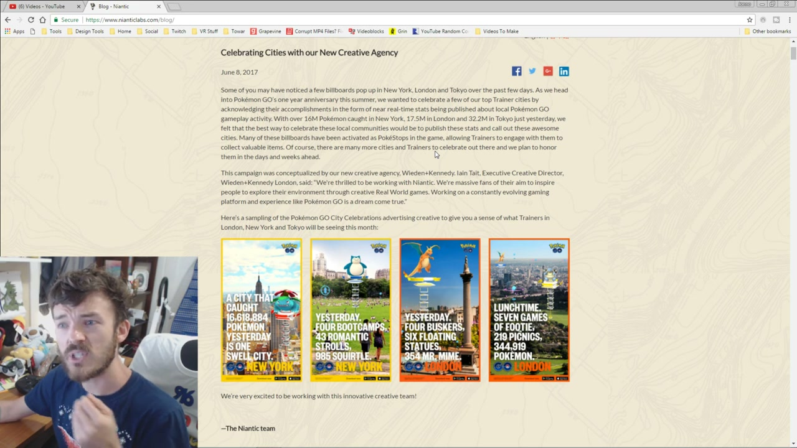
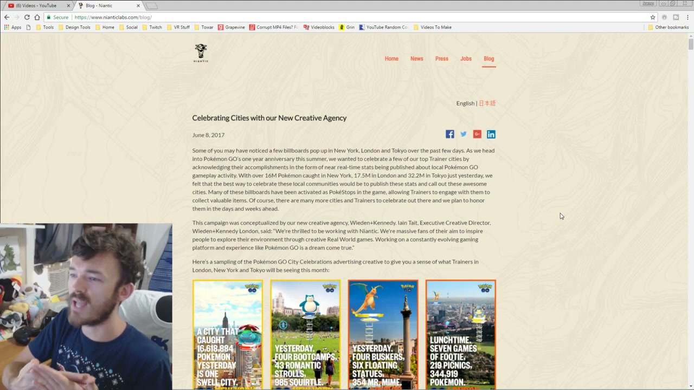
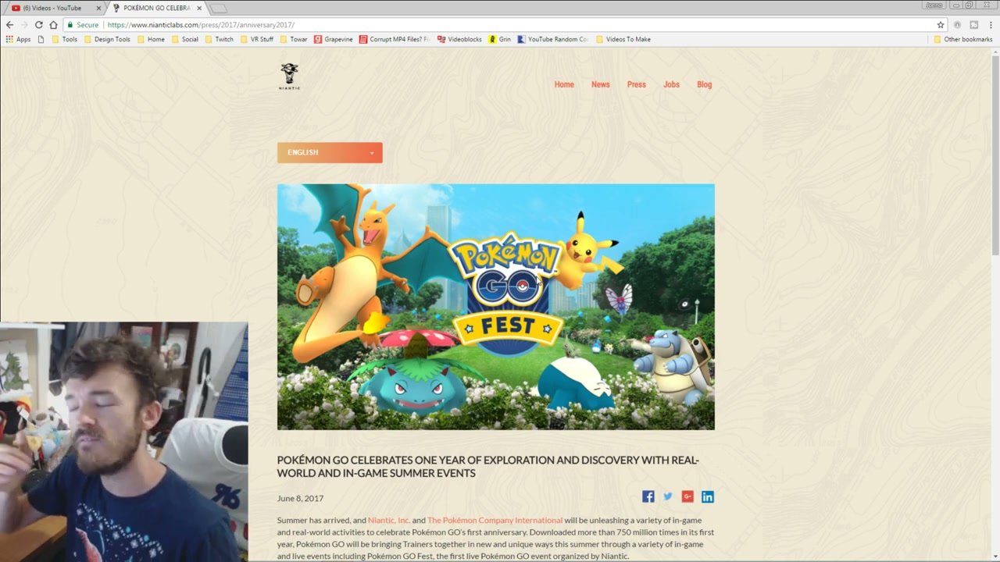

# Pokémon GO: City Celebrations

## The Campaign

The **first-ever above-the-line advertising campaign for Pokémon GO**, created to celebrate the game's one-year anniversary. Launched simultaneously across three "Trainer Cities": **London, New York, and Tokyo**. This campaign also marked the public announcement of W+K as Niantic's new creative agency — the campaign and the agency appointment were revealed together on the same day.

## The Work

OOH billboards displayed **near-real-time Pokémon catch statistics** for their specific city or neighbourhood — live data pulled from the game itself. Many of the **physical billboards were simultaneously activated as PokéStops inside the game**, giving players a direct reason to seek out the advertising in real life in order to collect in-game items.

The campaign fused brand advertising with live gameplay mechanics at a scale that had never been done before in outdoor advertising.

> *"We're thrilled to be working with Niantic. We're massive fans of their aim to inspire people to explore their environment through creative Real World games. Working on a constantly evolving gaming platform and experience like Pokémon GO is a dream come true."*
>
> — **Iain Tait**, ECD, Wieden+Kennedy London

## Metrics (at launch, June 8, 2017)

| City | Pokémon caught |
|---|---|
| New York | 16 million |
| London | 17.5 million |
| Tokyo | 32.2 million |

**Game context at campaign time:**
- 750 million total downloads in first year
- 65 million active monthly players
- 7.5 million US downloads in the first week post-launch (July 2016)

## Billboard Formats

- **London Trafalgar Square** — 48-sheet crosstrack
- **London 6-sheet** — standard poster format
- **New York** — vertical 1080×1920 (Yankees-area location)
- **New York** — "legendary catches" themed creative

## Agency Structure

- W+K London — creative lead
- W+K Portland — global media planning and buying

## Collaborators

- **[Iain Tait](../collaborators/iain_tait.md)** — Executive Creative Director, W+K London
- **[Dom Felton](../collaborators/dom_felton.md)** — Producer, W+K London
- **[Indiana Matine](../collaborators/indiana_matine.md)** — Strategist / Planning, W+K London *(evidence: user testimony 2026-04-08)*

*No below-ECD creative credits (CD, AD, writer) confirmed in available public sources. Full credits may exist in the paywalled Campaign Live article (Omar Oakes, June 8, 2017) or Ad Age Creativity entry (Alexandra Jardine, June 8, 2017).*

## References & Media

### Assets

### Video
- [W+K London: City Celebrations digital outdoor (MP4)](https://wklondon.com/wp-content/uploads/2017/06/London-Pokemon-Go-digital-outdoor.mp4)
- [YouTube: "Pokemon GO Billboard Campaign Celebrating Top Trainer Cities" (community video)](https://www.youtube.com/watch?v=5mTB8ImPxtk)

### Images (W+K London CDN)
- [Trafalgar Square 48-sheet crosstrack](https://wklondon.com/wp-content/uploads/2017/07/NIA01F17000_Pokemon_Go_TrafalgarSquare_LDND6_V05-960x0-c-default.jpg)
- [London 6-sheet](https://wklondon.com/wp-content/uploads/2017/07/London-Pokemon-GO-6-sheet-960x0-c-default.jpg)
- [New York "legendary catches" billboard](https://wklondon.com/wp-content/uploads/2017/07/New-York-legendary-catches-Pokemon-GO-960x0-c-default.jpg)
- [New York Yankees-area vertical billboard](https://wklondon.com/wp-content/uploads/2017/06/Niantic-Pokemon-GO-Yankees-1080x1920-05.30.17-360x640.jpg)

### Images (Niantic official)
- https://nianticlabs.com/img/posts/wk1.jpg
- https://nianticlabs.com/img/posts/wk2.jpg
- https://nianticlabs.com/img/posts/wk3.jpg
- https://nianticlabs.com/img/posts/wk4.jpg

### Press
- [Niantic blog: "Celebrating Cities with our New Creative Agency" (June 8, 2017)](https://nianticlabs.com/news/wk)
- [W+K London work page](https://wklondon.com/work/pokemon-go/)
- [W+K London blog: campaign announcement (June 8, 2017)](https://wklondon.com/2017/06/city-celebrations-for/)
- [Creativepool: "Wieden+Kennedy celebrate a year of Pokémon Go" (June 9, 2017)](https://creativepool.com/magazine/leaders/wiedenkennedy-celebrate-a-year-of-pokemon-go.14606)
- [The Drum: John McCarthy (June 8, 2017)](https://www.thedrum.com/news/pokemon-go-marks-first-birthday-with-data-powered-outdoor-ads-tokyo-london-and-new)
- [Campaign Live: Omar Oakes (June 8, 2017) — paywalled](https://www.campaignlive.co.uk/article/pokemon-go-celebrates-year-anniversary-outdoor-ads-w-k/1435963)
- [Ad Age Creativity: Alexandra Jardine (June 8, 2017) — credits section paywalled](https://adage.com/creativity/work/pokemon-go-one-year-celebration/51977/)
- [LBBonline work entry](https://lbbonline.com/work/pokemon-go-city-celebrations)

### Raw Research
- [Original research file](../raw/research/wk_niantic_campaigns_2026-04-07.md)
- [Deep research file (2026-04-07)](../raw/research/wk_pokemon_go_deep_2026-04-07.md)
- [Raw research file (2026-04-08)](../raw/research/wk_pokemon_go_city_celebrations_2026-04-08.md)
