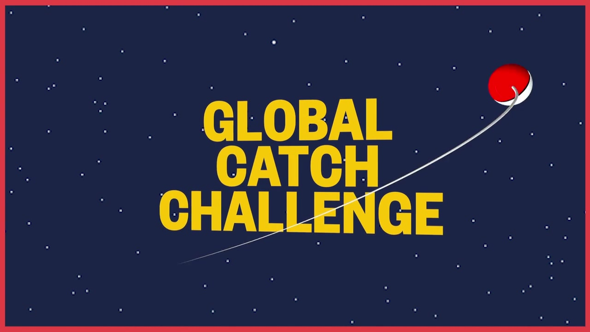
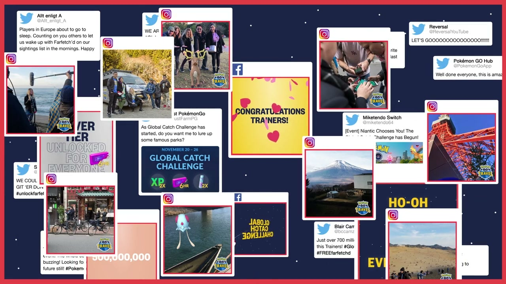
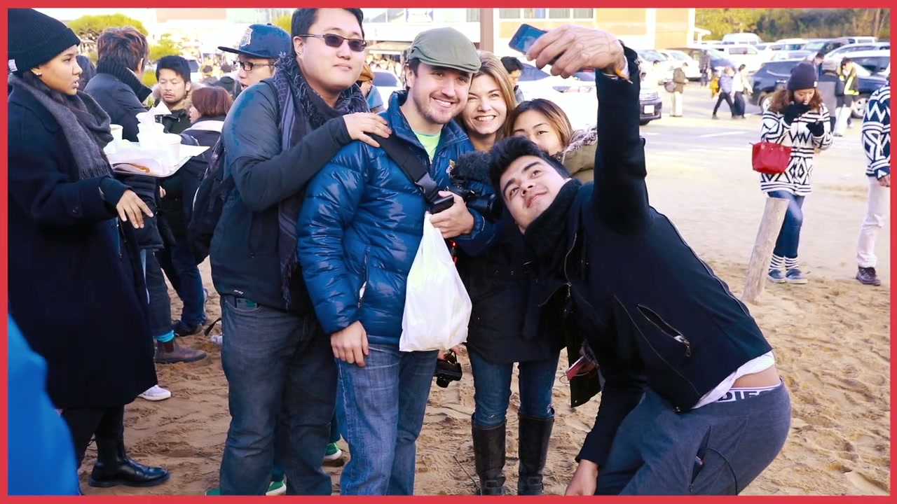
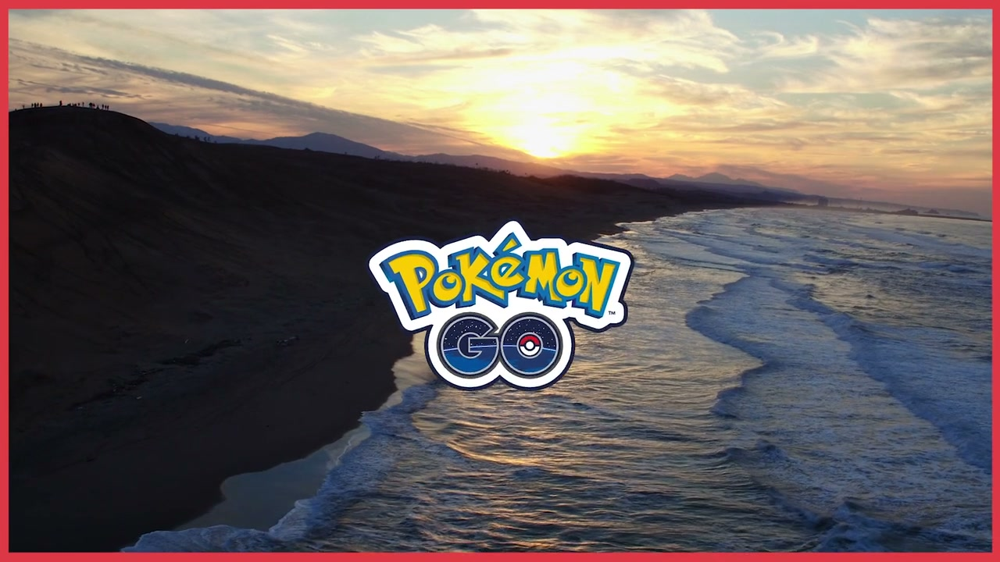

# Pokémon GO Travel: Global Catch Challenge

## The Campaign

To counter the narrative that Pokémon GO was dead — its playerbase had fallen sharply from the 2016 peak — W+K created **Pokémon GO Travel**: a challenge to the global community to collectively catch **3 billion Pokémon in 7 days**, seeded by sending three YouTube influencers on a live, documented tour across Japan.

The stunt served two purposes: produce compelling content that would travel on YouTube, and demonstrate that the game's community was enormous and still very much alive.

## The Challenge

Three reward tiers were set for the global community:

| Tier | Target | Reward |
|---|---|---|
| 1 | 500 million caught | Farfetch'd (Japan-exclusive) available worldwide 48h |
| 2 | 1.5 billion caught | Kangaskhan appears in East Asia 48h |
| 3 | 3 billion caught | Ho-Oh in Legendary Raids globally (first ever) |

**The community caught 3.36 billion Pokémon in under 7 days** — blowing past all three tiers. 140+ countries participated.

## The Japan Trip

Three influencers were flown to Japan for a 7-day Pokémon GO tour, filming at:

- **Tokyo Tower**
- **Mount Fuji** foothills
- **Kyoto**
- **Nara Park** (deer + Pokémon)
- **Tottori Sand Dunes** — finale: the Safari Zone event, attended by **89,000 trainers**

The Tottori event generated an estimated **US$16 million in tourism revenue in 3 days** — making it a genuine economic impact story for Tottori Prefecture.

## The Influencers

| Influencer | Real Name | Handle |
|---|---|---|
| IHasCupquake | Tiffany Garcia | @tiffyquake |
| Coisa de Nerd | Leon | @cdnleon |
| Rachel Quirico | Rachel Quirico | @seltzerplease |

## YouTube Content

- ["Pokémon GO Travel takes the Global Catch Challenge to Tokyo"](https://www.youtube.com/watch?v=_tJk0kNIMwk)
- ["Pokémon GO Travel takes the Global Catch Challenge to meet the deer of Nara Park"](https://www.youtube.com/watch?v=WR2vMsboyJQ)
- ["Pokémon GO Travel — A Japan Adventure" (full recap)](https://www.youtube.com/watch?v=s-ZvTpIQ4JY)
- [W+K London case study film (Vimeo — uploaded by Pete Browse)](https://vimeo.com/289157518)

## Awards

| Award | Category | Result |
|---|---|---|
| Webby Awards 2018 | Best Community Engagement — PR Campaigns | Entered (win/nominee status unconfirmed) |
| Cannes Lions 2018 | Entered (lovethework.com/campaigns/417572) | Status unconfirmed |

## Collaborators

- **[Iain Tait](../collaborators/iain_tait.md)** — Executive Creative Director, W+K London
- **[Pete Browse](../collaborators/pete_browse.md)** — Creative, W+K London (confirmed: uploaded the case study film to his Vimeo; Computer Science background with scriptwriting and digital production expertise)
- **[Joe Koprowski](../collaborators/joe_koprowski.md)** — Creative, W+K London
- **[Indiana Matine](../collaborators/indiana_matine.md)** — Strategist / Planning, W+K London *(evidence: user testimony 2026-04-08)*
- **IHasCupquake (Tiffany Garcia)** — Influencer talent
- **Coisa de Nerd (Leon)** — Influencer talent
- **Rachel Quirico** — Influencer talent

*Production company and director for the Japan content not yet confirmed.*

## References & Media

### Assets

- [Webby Awards 2018 entry: "Pokémon Go Travel Launches Global Catch Challenge"](https://winners.webbyawards.com/2018/advertising-media-pr/pr-campaigns/best-community-engagement/57908/pokémon-go-travel-launches-global-catch-challenge)
- [Vimeo: W+K London case study film (Peter Browse)](https://vimeo.com/289157518)
- [YouTube: "Pokémon GO Travel — A Japan Adventure" (recap)](https://www.youtube.com/watch?v=s-ZvTpIQ4JY)
- [YouTube: Tokyo episode](https://www.youtube.com/watch?v=_tJk0kNIMwk)
- [YouTube: Nara Park episode](https://www.youtube.com/watch?v=WR2vMsboyJQ)
- [Cannes Lions work database](https://lovethework.com/campaigns/417572)

### Raw Research
- [Raw research file](../raw/research/pokemon_go_global_catch_challenge_2026-04-07.md)
