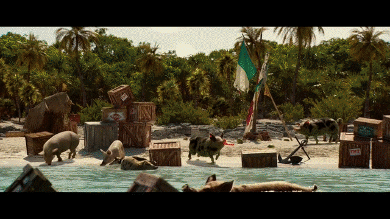
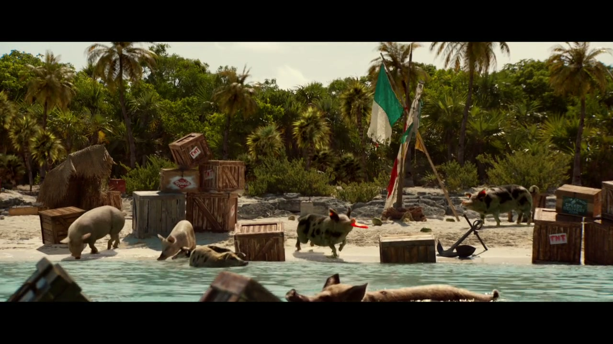
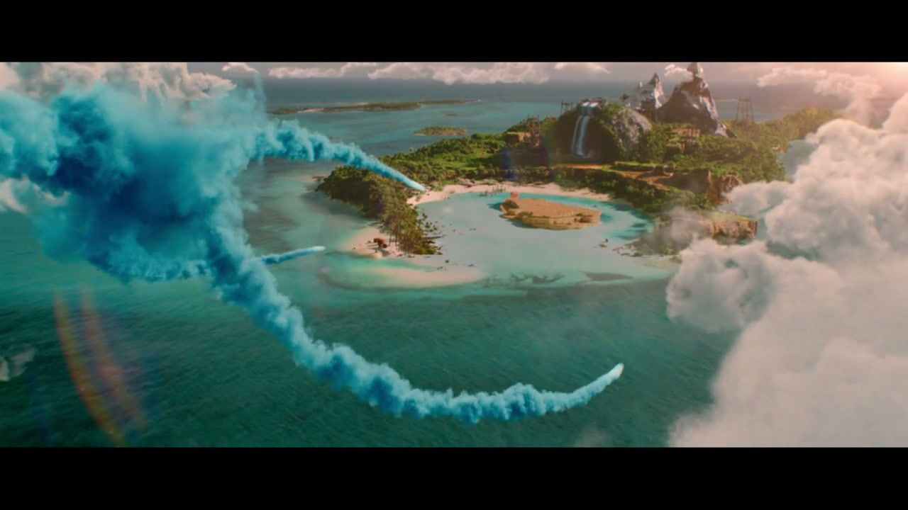
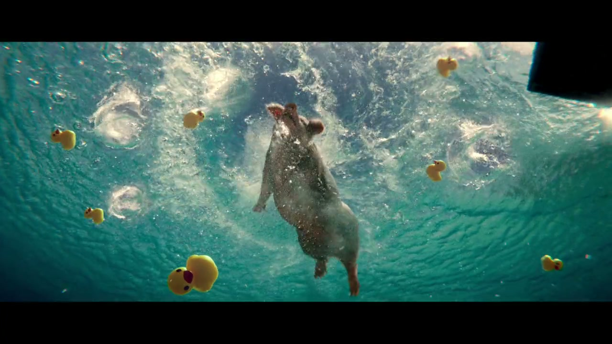
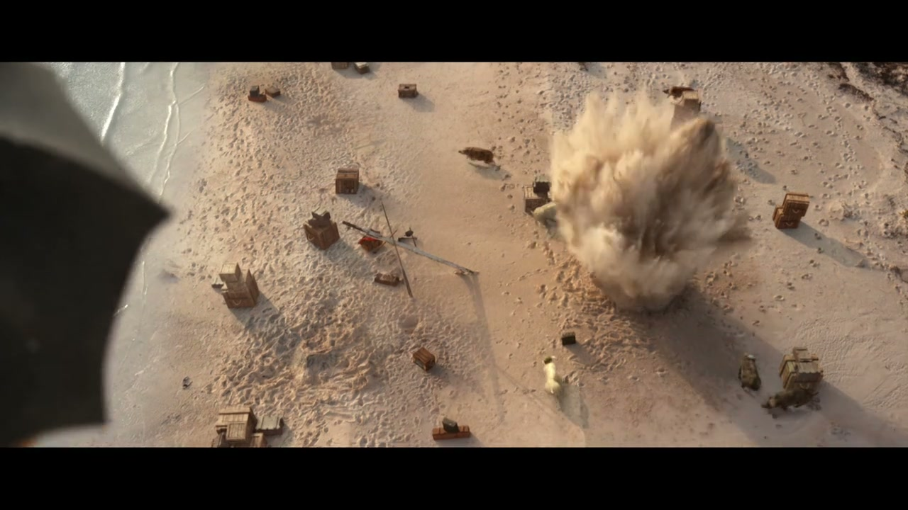
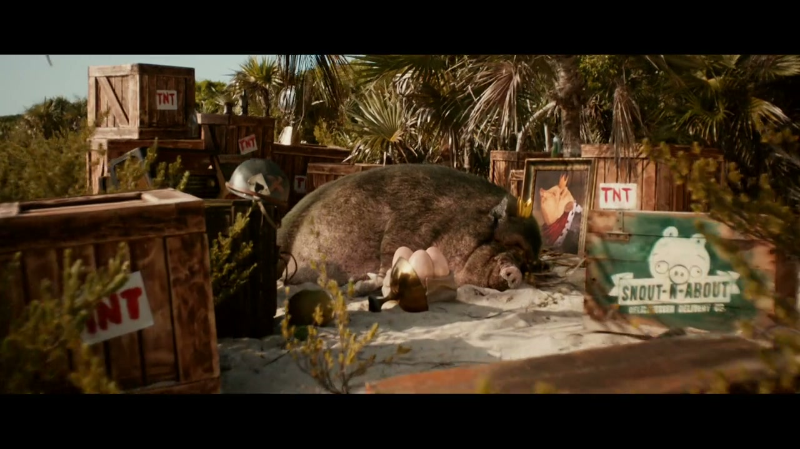
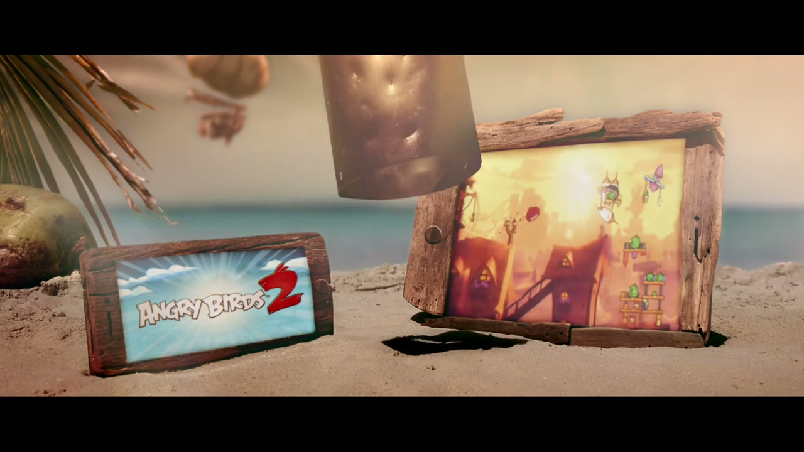

# Angry Birds 2: Bigger. Badder. Birdier.

## The Campaign

W+K London's first work for Rovio — a global multi-channel launch campaign for Angry Birds 2. The core was a 60-second live-action film, but the campaign ran an elaborate social layer before, during, and after launch.

The film transported viewers to **Piggy Island**: a genuinely luxurious tropical paradise where fat, smug pigs live the good life — until the Birds arrive. Shot on **Big Major Cay in the Bahamas**, the real island where wild pigs actually do swim in the sea, grounding the game's absurdist premise in a strangely real location. The Birds' ambush detonates the idyll into carnage.

## The Social Layer

Before launch, a **@smugpigsofinstagram** account was created, parodying "Rich Kids of Instagram" — pigs living their best Piggy Island lives. Propaganda-style countdown posters built tension. At launch: a bespoke illustrated poster by artist **Paul Shipper**, Birds vs Pigs Spotify playlists, a Tumblr re-skin, "Wanted Pigs" and "Got Eggs?" social content.

## Metrics

| Metric | Figure | Source |
|---|---|---|
| Downloads (first 12 hours) | 1 million | Campaign |
| Downloads (first 3 days) | 10 million | Campaign |
| Downloads (first ~27 days) | **50 million** | The Guardian, 26 Aug 2015 |
| AB2 lifetime revenue (to 2018) | €253 million | PocketGamer.biz |

## Collaborators

**W+K London:**
- **[Iain Tait](../collaborators/iain_tait.md)** — Executive Creative Director
- **[Tony Davidson](../collaborators/tony_davidson.md)** — Executive Creative Director
- **[Paddy Treacy](../collaborators/paddy_treacy.md)** — Copywriter
- **Philippa Beaumont** — Copywriter
- **[Mark Shanley](../collaborators/mark_shanley.md)** — Art Director
- **Artur Faria** — Art Director
- **David Goss** — Art Director
- **Dannie Stewart** — Agency Executive Producer
- **Lou Hake** — TV Producer
- **Michael Winek** — Creative Producer
- **David Mannall** — Group Account Director
- **Laura McGauran** — Account Director
- **Katie Savelli** — Account Manager
- **Beth Bentley** — Head of Planning
- **Rob Meldrum** — Planner

**Production:**
- **François Rousselet** — Director
- **[Riff Raff Films](../collaborators/riff_raff_films.md)** — Production company
- **Matthew Fone** — Executive Producer, Riff Raff
- **Jane Tredget** — Producer
- **Martin Ruhe** — Director of Photography

**Post:**
- **[The Mill](../collaborators/the_mill.md)** — VFX
- **Andrew Wood (Barnsley)** — Lead 2D, The Mill
- **Adam Droy** — Lead 3D, The Mill
- **Dominic Leung** — Editor (Trim)
- **Sam Ashwell** — Sound Design (750mph)

- **Jussi Mäkinen** — VP Marketing, Rovio

## References & Media

### Assets

- [Vimeo: launch film (Mark Shanley archive)](https://vimeo.com/628947321)
- [W+K London blog: "Pigs Might Fly" (July 30, 2015)](https://wklondon.com/2015/07/pigs-might-fly/)
- [LBBonline: Editors' Choice](https://lbbonline.com/news/wk-london-goes-bigger-badder-birdier-for-angry-birds-2-campaign)
- [Campaign US: full credits](https://www.campaignlive.com/article/angry-birds-2-bigger-badder-birdier-wieden-+-kennedy-london/1358793)
- [It's Nice That](https://www.itsnicethat.com/news/wieden-and-kennedy-angry-birds-piggy-island)
- [Stash Magazine: VFX detail](https://www.stashmedia.tv/angry-birds-2-bigger-badder-birdier/)
- [The Guardian: 50M download milestone](https://www.theguardian.com/technology/2015/aug/26/angry-birds-rovio-lay-off-260-staff)

### Raw Research
- [Deep research file](../raw/research/angry_birds_2_launch_2026-04-07.md)
- [Missed projects research file](../raw/research/missed_projects.md)
