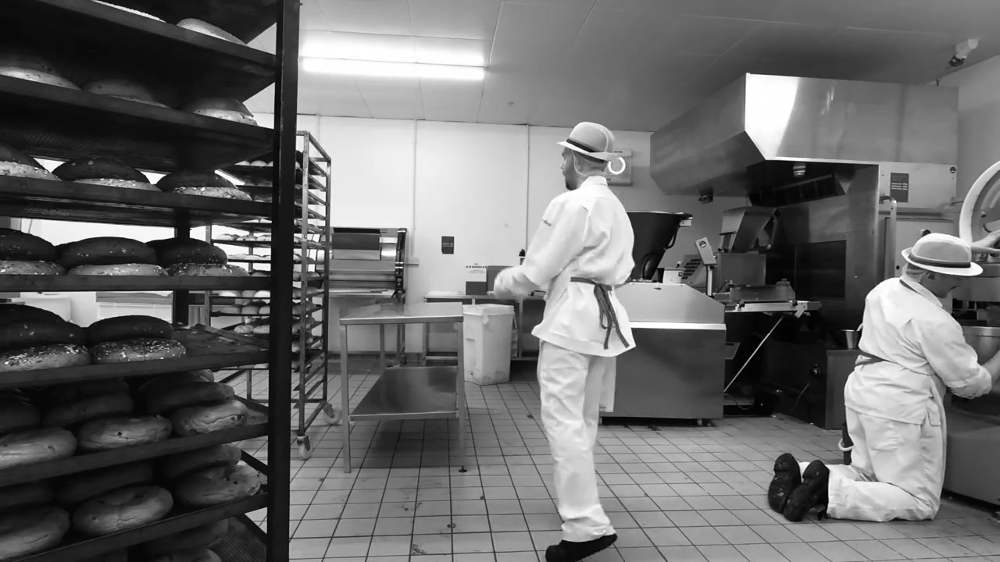
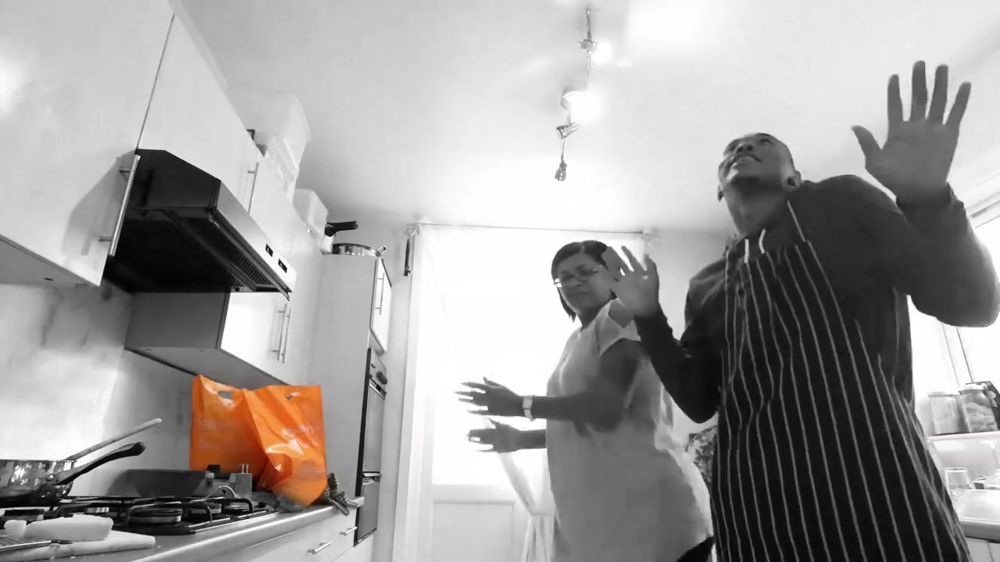
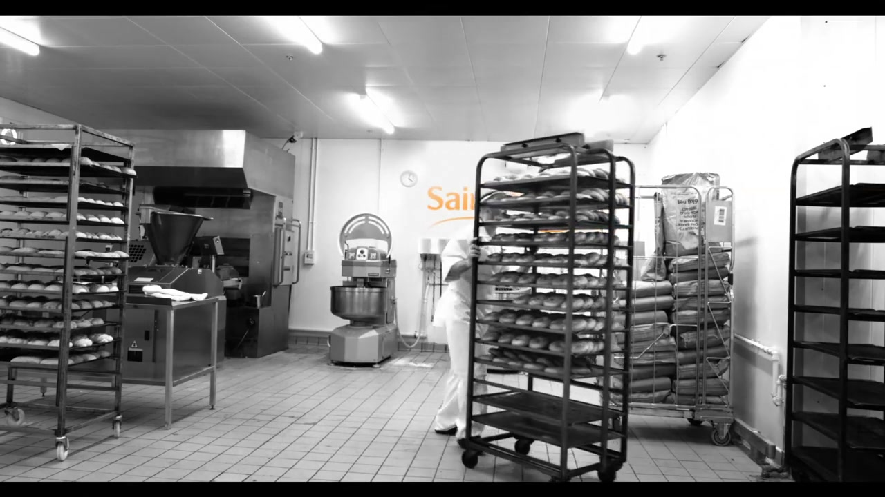

# Sainsbury's: Food Dancing

## The Campaign

W+K London's debut campaign for Sainsbury's — won from AMV BBDO — built around a single, irresistibly simple truth: people dance when they cook. The film celebrates "the real power of food" and the simple joy that comes with it, cutting between real people in domestic kitchens across the UK losing themselves in the act of cooking.

The campaign centred on a bespoke track commissioned for the spot: **"Food Dancing (Yum Yum Yum)"** by UK artist **MysDiggi**. The song became a phenomenon in its own right — hitting **#1 on the UK Spotify Viral Chart** within days of launch. The film was complemented by food still life photography (David Sykes) and black-and-white portraiture (Josh Cole), and a rich social/digital layer.

## Metrics

| Metric | Figure |
|---|---|
| Social impressions | 85.6 million |
| Twitter sentiment | 96% positive/neutral |
| GIF views | 16.8 million |
| TV reach | 39 million |
| Spotify Viral Chart | #1 (10 Feb 2017) |

## Awards

| Award | Result |
|---|---|
| FAB Awards | Gold + 3 Silvers |

## Collaborators

**W+K London:**
- **[Iain Tait](../collaborators/iain_tait.md)** — Executive Creative Director
- **[Tony Davidson](../collaborators/tony_davidson.md)** — Executive Creative Director
- **[Scott Dungate](../collaborators/scott_dungate.md)** — Creative Director
- **[Sophie Bodoh](../collaborators/sophie_bodoh.md)** — Creative Director
- **[Freddy Taylor](../collaborators/freddy_taylor.md)** — Creative
- **[Philippa Beaumont](../collaborators/philippa_beaumont.md)** — Creative
- **Andrew Bevan** — Creative
- **Karen Jane** — Design Director
- **Stephanie McArdle, Tobias Bschorr** — Designers
- **Danielle Stewart** — Agency Executive Producer
- **Michelle Brough** — TV Producer
- **Sahar Bluck** — TV Production Assistant
- **Dom Felton** — DOOH Producer
- **Mark D'Abreo** — Project Director
- **Emily Khoury** — Creative Producer
- **Tom Lloyd** — Planning Director
- **Katherine Thomson** — Group Account Director
- **Francesca Purvis, Will Smith** — Account Directors

**Production:**
- **Siri Bunford** — Director (Knucklehead)
- **Knucklehead** — Production company

**Photography:**
- **David Sykes** — Food stills photographer
- **Josh Cole** — B&W portraiture photographer

**Music:**
- **MysDiggi** — Artist ("Food Dancing (Yum Yum Yum)")

## References & Media

### Assets

- [W+K London case study](https://wklondon.com/work/food-dancing/)
- [W+K London blog: "#fooddancing — W+K's first campaign for Sainsbury's"](https://wklondon.com/2017/01/fooddancing-wiedenkennedys-first-campaign-sainsburys/)
- [Campaign US: full credits](https://www.campaignlive.com/article/sainsburys-food-dancing-wieden-kennedy-london/1421234)
- [Campaign UK: full credits](https://www.campaignlive.co.uk/article/sainsburys-food-dancing-wieden-kennedy-london/1421234)
- [Lürzer's Archive: Scott Dungate credit](https://www.luerzersarchive.com/work/sainsburys-19/)
- [Adweek: "W+K London Dances Around the Kitchen in First Work for Retail Giant Sainsbury's"](https://www.adweek.com/agencyspy/wk-london-dances-around-the-kitchen-in-first-work-for-retail-giant-sainsburys/124221/)

### Raw Research
- [Missed projects research file](../raw/research/missed_projects.md)
