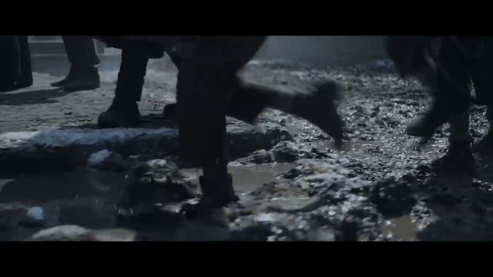
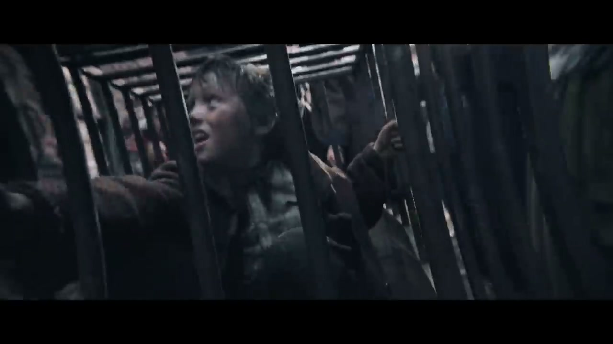
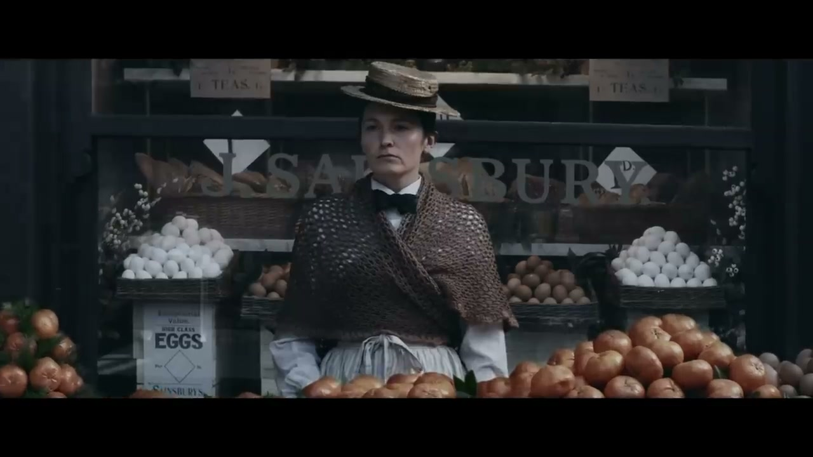
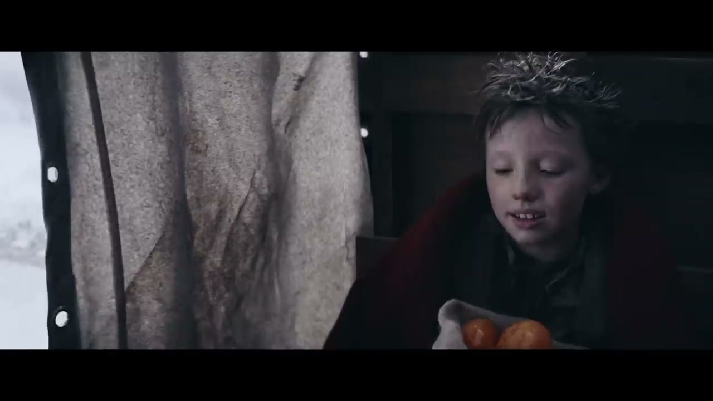
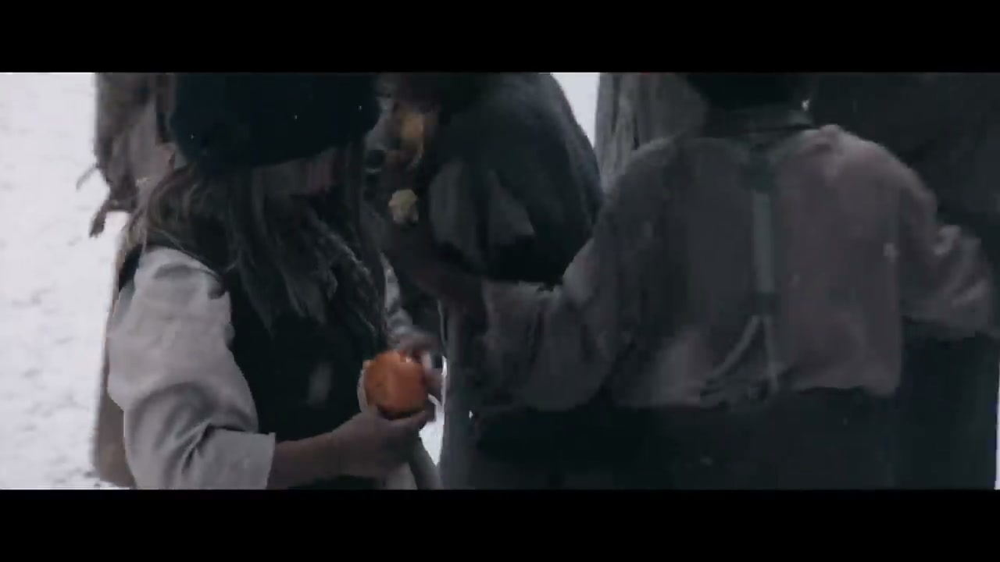
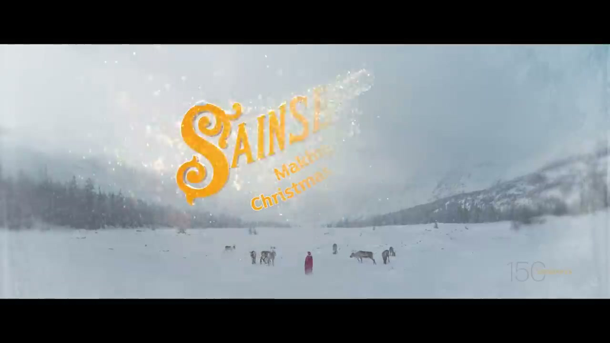

# Sainsbury's: Nicholas the Sweep

## The Campaign

Sainsbury's 150th anniversary Christmas campaign — the year Sainsbury's first opened on Drury Lane, 1869. A "true-ish" Father Christmas origin story, described internally as *"like Batman's origin story but for Father Christmas."*

Nicholas (Nick), an orphaned chimney sweep, is wrongly accused of stealing a clementine from outside the Sainsbury's stall. Chased out of town into a blizzard, he is rescued by a kindly Sainsbury's worker. Nick and Mrs. Sainsbury secretly fill children's stockings with clementines and deliver coal to an evil boss. The film ends with Nick walking away in a red and white outfit — the moment Father Christmas was born.

Populated with Dickensian archetypes — a Fagin figure, a Javert-style policeman, ghosts, a cackling witch, orphan children. Easter egg: a horse-drawn carriage with a "Zero Emissions" sign. Tagline: *"Helping make Christmas, Christmas since 1869."*

Shot in Romania on a pre-existing Victorian London studio lot (September 2019). 90-second version launched on ITV during Emmerdale; full 2m30s cut online only. Deliberately released after Armistice Day.

## Metrics

| Metric | Figure |
|---|---|
| YouTube views (first 24 hours) | ~5 million |
| YouTube ranking | Trended in top 10 within 24 hours |
| YouTube ranking (overall Christmas 2019) | **#2 most popular Christmas ad** |
| Easy peelers sold (attributed to film) | 34 million |
| Overall grocery sales increase | +0.4% |
| Online sales increase | +5% |
| Campaign Hot 2019 | Ranked #9 in top 13 film ads of the year |

## Awards

| Award | Category | Result |
|---|---|---|
| One Show 2020 | Film / Television & VOD / Long Form – Single | **Merit** |
| British Arrows 2020 | Included in 2020 showcase | Shortlist/level unconfirmed |

*Cannes Lions 2020 was heavily disrupted/cancelled due to COVID-19.*

## Collaborators

**W+K London:**
- **[Iain Tait](../collaborators/iain_tait.md)** — Executive Creative Director
- **[Tony Davidson](../collaborators/tony_davidson.md)** — Executive Creative Director
- **[James Guy](../collaborators/james_guy.md)** — Executive Producer / Head of Integrated Production, W+K London
- **[Dan Norris](../collaborators/dan_norris.md)** — Creative Director
- **[Ray Shaughnessy](../collaborators/ray_shaughnessy.md)** — Creative Director
- **[Tom Bender](../collaborators/tom_bender.md)** — Creative
- **[Tom Corcoran](../collaborators/tom_corcoran.md)** — Creative
- **[Tomas Coleman](../collaborators/tomas_coleman.md)** — Creative
- **Mat Kramer** — Creative

**Production:**
- **Ninian Doff** — Director (Pulse Films)
- **Pulse Films** — Production company
- **James Sorton** — Executive Producer
- **Richard Adkins, Dee Fenning, Rashel Taschian, George Saunders** — Producers
- **John Mathieson** — Director of Photography (*Gladiator*, *X-Men*)

**Post:**
- **[Time Based Arts](../collaborators/time_based_arts.md)** — VFX
- **Leo Weston, Sam Osborne** — VFX Supervisors, Time Based Arts
- **Lewis Crossfield** — Colourist / Grade, Time Based Arts
- **Leo King** — Editor (Stitch / London)
- **Charlie Von Rotberg** — Editor (Stitch / London)

**Music & Sound:**
- **Chris White** — Composer
- **London Metropolitan Orchestra** — performed at Angel Studios, conducted by Andy Brown
- **Sian Rogers** — Music Supervisor
- **Jack Sedgwick** — Sound Designer
- **Siren** — Music (London)
- **Wave** — Sound (London)

- **Laura Boothby** — Head of Broadcast Marketing, Sainsbury's

## References & Media

### Assets

### Video
- [YouTube: Nicholas the Sweep (official)](https://www.youtube.com/watch?v=ak5HEPpubhk)

### Press
- [W+K London case study](https://wklondon.com/work/nicholas-the-sweep/)
- [LBBonline Behind the Work: "How can we tell the origin story of Father Christmas like it was Batman?"](https://lbbonline.com/news/how-can-we-tell-the-origin-story-of-father-christmas-like-it-was-batman)
- [Adweek: "Sainsbury's Goes Dickensian for Christmas Ad"](https://www.adweek.com/agencies/sainsburys-goes-dickensian-for-christmas-ad-creating-a-surprising-origin-story/)
- [The Guardian (Nov 11, 2019)](https://www.theguardian.com/business/2019/nov/12/sainsburys-christmas-ad-offers-new-twist-on-dickensian-london)
- [Muse by Clios](https://musebyclios.com/advertising/sainsburys-returns-to-dickensian-london-for-its-2019-christmas-ad/)
- [Time Based Arts: VFX case study](https://www.time-based-arts.com/sainsburys-nicholas-the-sweep)
- [Campaign Live](https://www.campaignlive.co.uk/article/sainsburys-nicholas-sweep-wieden-kennedy-london/1665445)

### Raw Research
- [Deep research file](../raw/research/sainsburys_nicholas_the_sweep_2026-04-07.md)
- [Missed projects research file](../raw/research/missed_projects.md)
