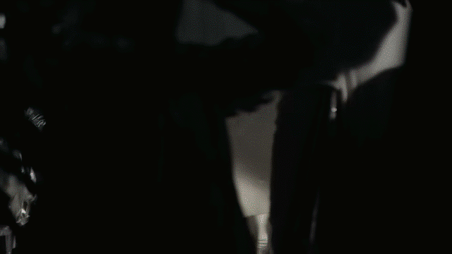
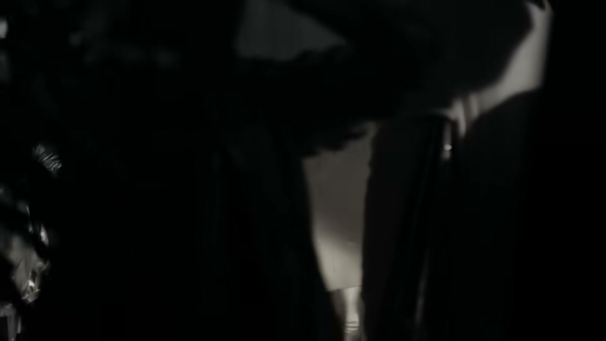
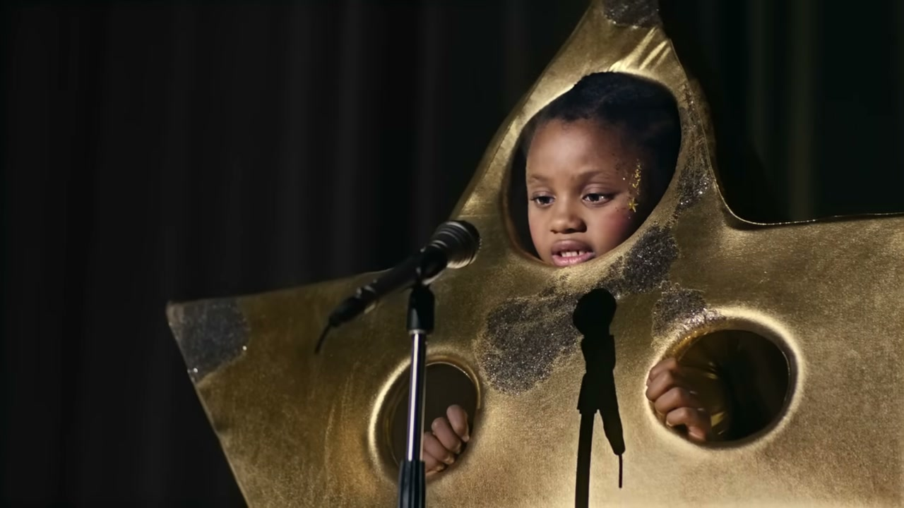
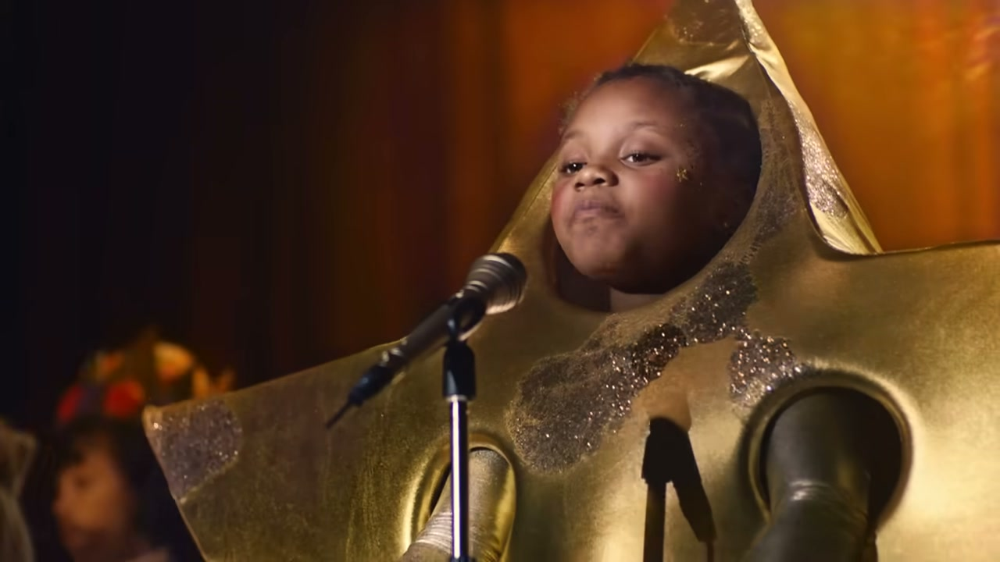
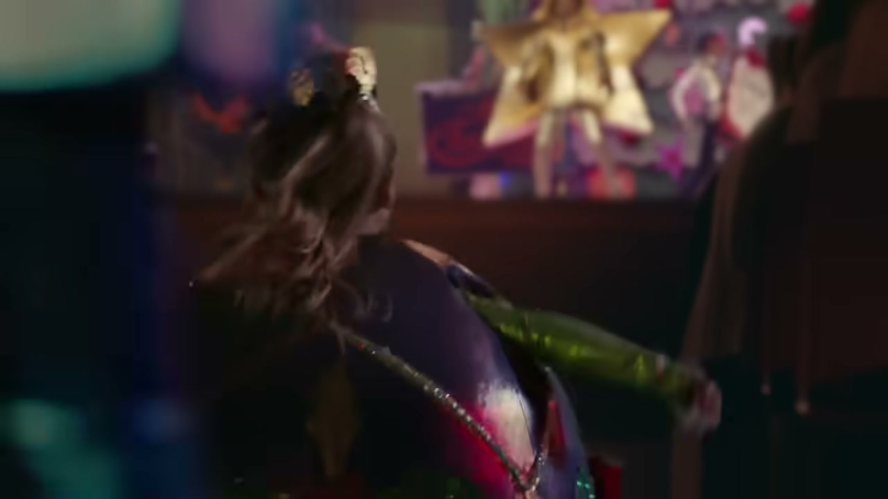
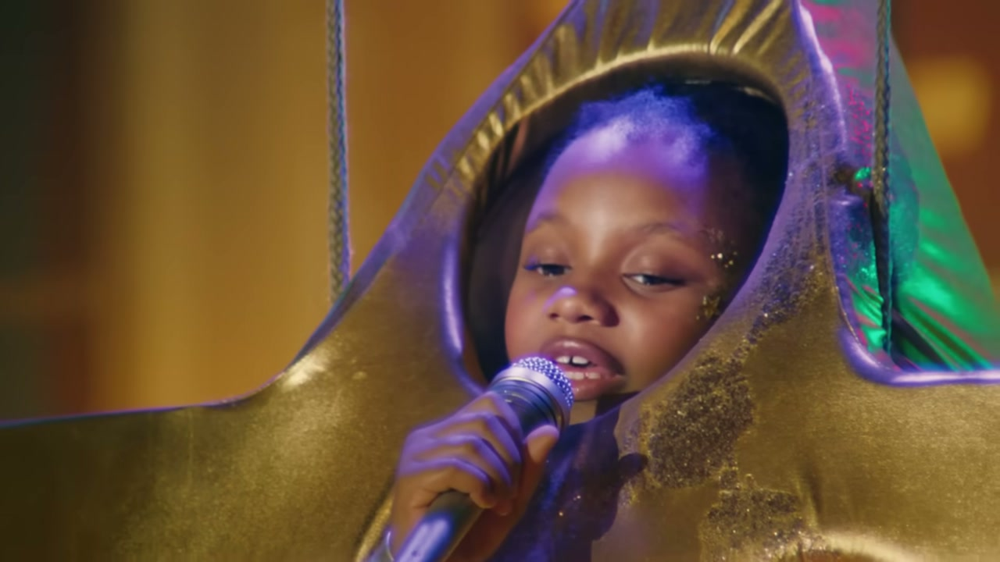

# Sainsbury's: The Big Night

## The Campaign

Sainsbury's Christmas 2018. A two-minute film — directed by **Michael Gracey**, the director of *The Greatest Showman* — following a young girl performing a rendition of **"You Get What You Give"** by New Radicals on stage, surrounded by child actors dressed as Christmas characters.

The breakout star was a child dressed as an electrical plug — "**Plugboy**" — whose deadpan cameo became a viral sensation under the hashtag **#PlugLife**, spawning thousands of memes and social media mentions. The lead performer was **Tia Isaac** (aged 8); Plugboy was played by **Harrison Wilmot**. The lead child actor was subsequently invited to switch on her hometown's Christmas lights.

Tagline: *"We give all we've got for the ones we love."*

Campaign extended across radio, print, digital, social, and out-of-home.

## Awards

| Award | Category | Result |
|---|---|---|
| British Arrows | Best Over 90 Second Commercial | Silver |
| British Arrows | Retailers | Silver |
| Campaign | Pick of the Month | — |
| Campaign | Films of the Year | #8 |

## Collaborators

**W+K London:**
- **[Iain Tait](../collaborators/iain_tait.md)** — Executive Creative Director
- **[Tony Davidson](../collaborators/tony_davidson.md)** — Executive Creative Director
- **[James Guy](../collaborators/james_guy.md)** — Executive Producer / Head of Integrated Production, W+K London
- **[Sophie Bodoh](../collaborators/sophie_bodoh.md)** — Creative Director
- **[Scott Dungate](../collaborators/scott_dungate.md)** — Creative Director
- **[Freddy Taylor](../collaborators/freddy_taylor.md)** — Creative
- **[Philippa Beaumont](../collaborators/philippa_beaumont.md)** — Creative
- **Andrew Bevan** — Creative
- **Karen Jane** — Design Director
- **Phil Rosieur, Kate Whitley, Adam Hunt** — Designers
- **Jon Harris** — Motion/Animation Designer
- **Michelle Brough** — TV Producer
- **Amy Leach** — Production Assistant
- **Mark D'Abreo** — Project Director
- **Rebecca Herbert, Emily Khoury, Rashel Tashchian** — Creative Producers
- **Tom Lloyd** — Planning Director
- **Rachel Hamburger** — Planner
- **Katherine Thomson** — Group Account Director
- **William Smith** — Account Director
- **Johno Fagan** — Account Manager
- **Oliver Mitchell, Matt Whiteside** — Account Executives
- **Lee Ramsay** — Communications Planning Director

**Production:**
- **Michael Gracey** — Director (Partizan; also directed *The Greatest Showman*)
- **Partizan** — Production company
- **Jenny Beckett** — Executive Producer
- **David Stewart** — Line Producer
- **Pau Castejon** — Director of Photography

**Post:**
- **Stuart Bowen** — Editor

**Music:**
- **"You Get What You Give"** — New Radicals

- **Laura Boothby** — Head of Broadcast Marketing, Sainsbury's

## References & Media

### Assets

- [W+K London case study](https://wklondon.com/work/the-big-night/)
- [Campaign UK: full credits](https://www.campaignlive.co.uk/article/sainsburys-the-big-night-wieden-kennedy/1498689)
- [LBBonline: "Michael Gracey Directs Sainsbury's On-Stage 'Big Night' Christmas Ad"](https://lbbonline.com/news/michael-gracey-directs-sainsburys-on-stage-big-night-christmas-ad)

### Raw Research
- [Raw research file](../raw/research/wk_sainsburys_the_big_night_2026-04-08.md)
