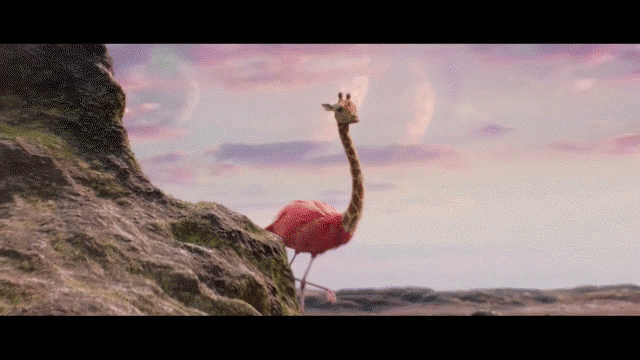
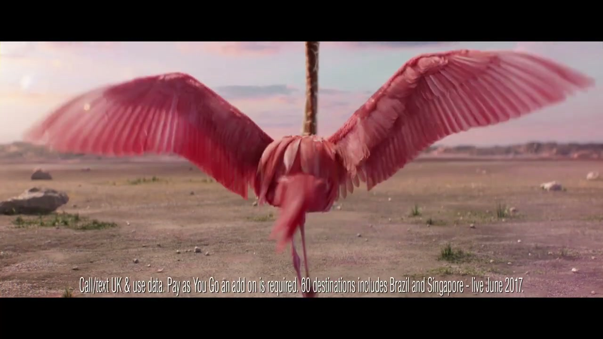
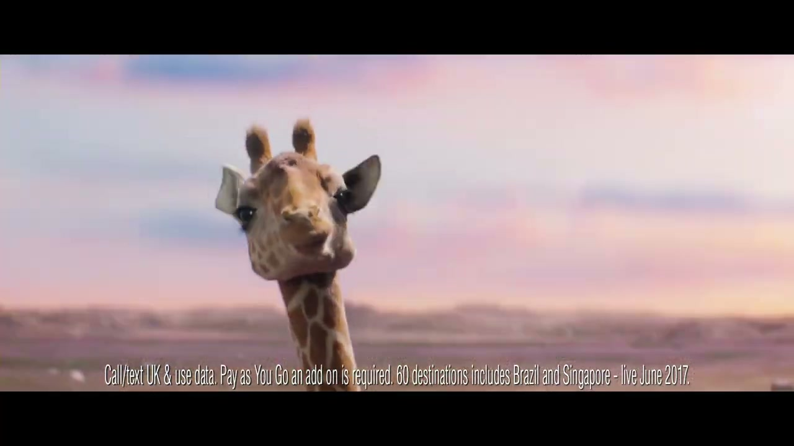
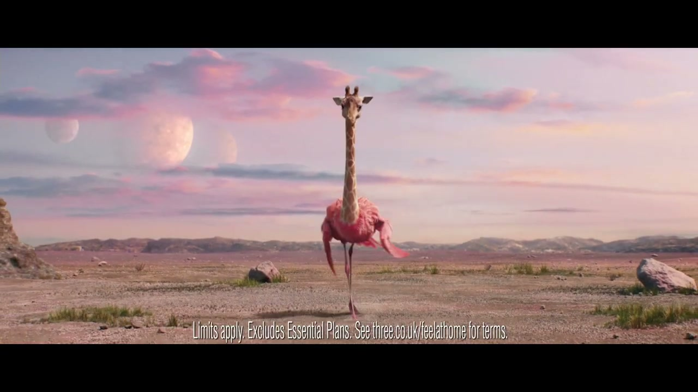
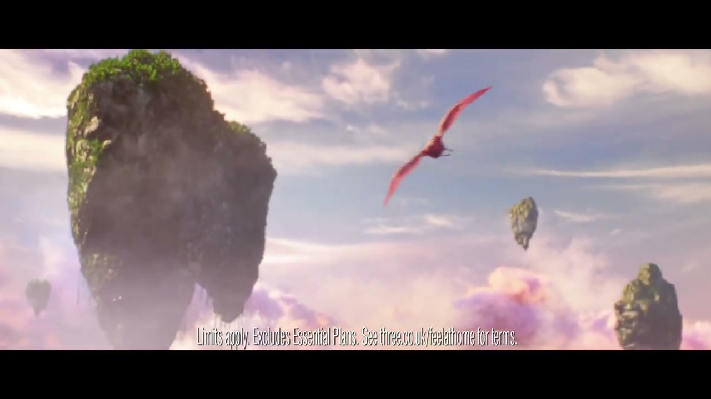
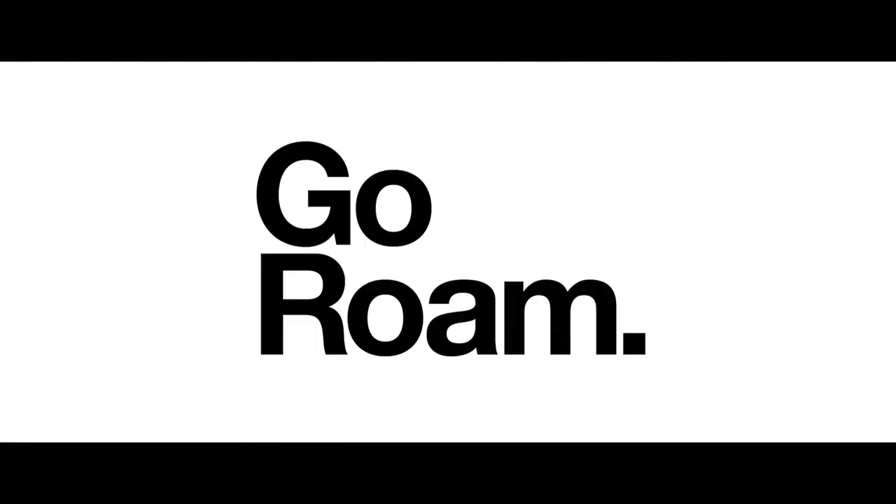

# Three: Go Roam — Giraffe-amingo

## The Campaign

A CGI-led campaign for Three's Go Roam proposition — the network feature that lets customers use their UK data allowance in 71 destinations worldwide at no extra cost. The creative idea: an animal hybrid called a **giraffe-amingo** (giraffe + flamingo), a shy, self-conscious creature that discovers its true self when it's free to roam. The campaign was announced as "the first in a series of animal hybrids to demonstrate the feelings of being on Three's network."

Ran across television, OOH, digital OOH, online, cinema, social, and print.

## Collaborators

- **[Iain Tait](../collaborators/iain_tait.md)** — Executive Creative Director, W+K London
- **[Tony Davidson](../collaborators/tony_davidson.md)** — Executive Creative Director, W+K London
- **[James Guy](../collaborators/james_guy.md)** — Executive Producer / Head of Integrated Production, W+K London
- **Larry Seftel** — Creative Director, W+K London
- **David Day** — Creative Director, W+K London
- **Katy Edelsten** — Creative, W+K London
- **Chloe Cordon** — Creative, W+K London
- **Andy Wright** — Planning Director, W+K London
- **Nick Exford** — Planner, W+K London
- **Danielle Stewart** — Executive Producer, W+K London
- **Anna Neilson** — TV Producer, W+K London
- **Rich Adkins** — TV Producer, W+K London
- **The Perlorian Brothers** — Directors (MJZ)
- **MJZ** — Production company
- **Lindsay Turnham** — Executive Producer, MJZ
- **Yann Gorriz** — Line Producer
- **The Mill** — VFX
- **Alex Hammond** — VFX Supervisor, The Mill
- **"Shoop"** — Salt-N-Pepa (featured track)
- **Wake The Town** — Music
- **Wave Studios** — Sound
- **Jack Sedgwick** — Sound Designer

## References & Media

### Assets

- [Campaign Live: launch article (May 2017)](https://www.campaignlive.com/article/three-go-roam-wieden-kennedy-london/1434379)

### Raw Research
- [Raw research file](../raw/research/wk_three_go_roam_2026-04-08.md)
