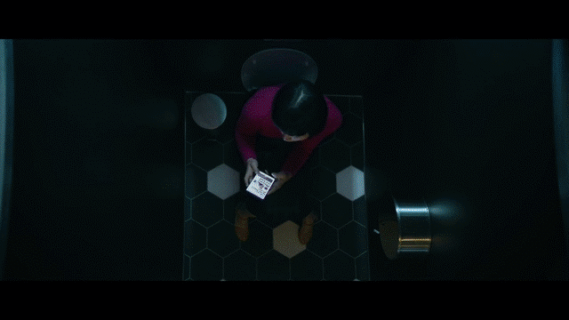
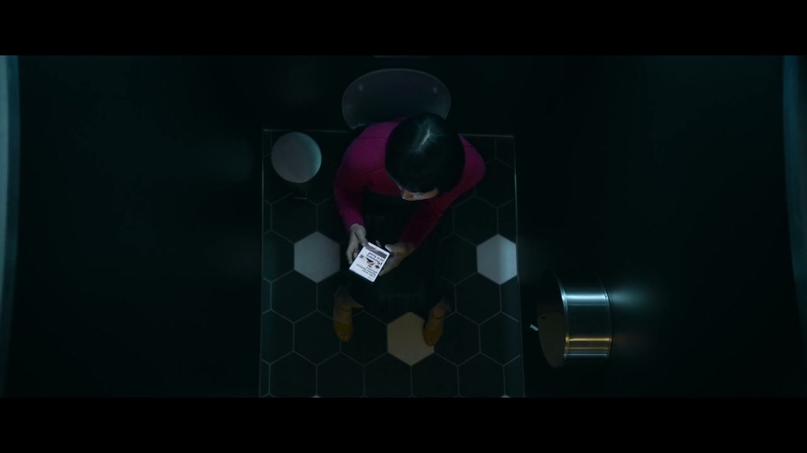
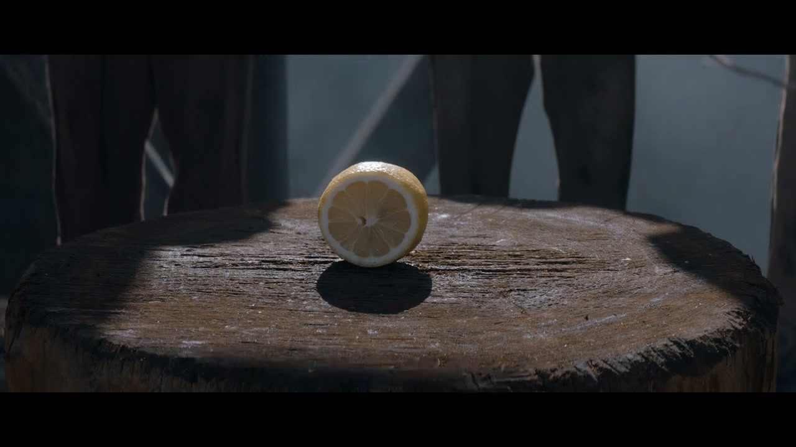
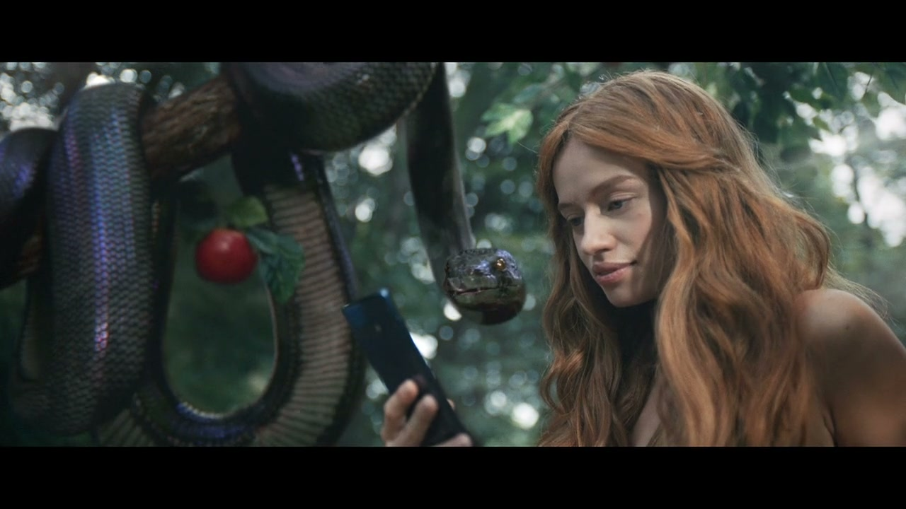
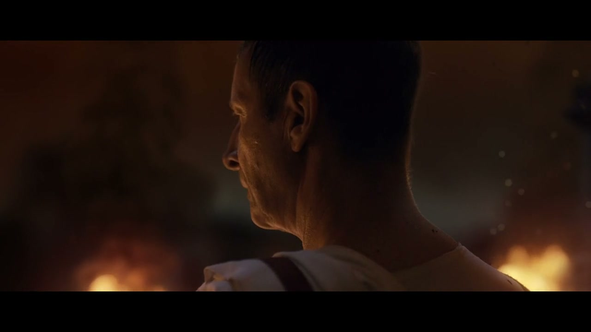
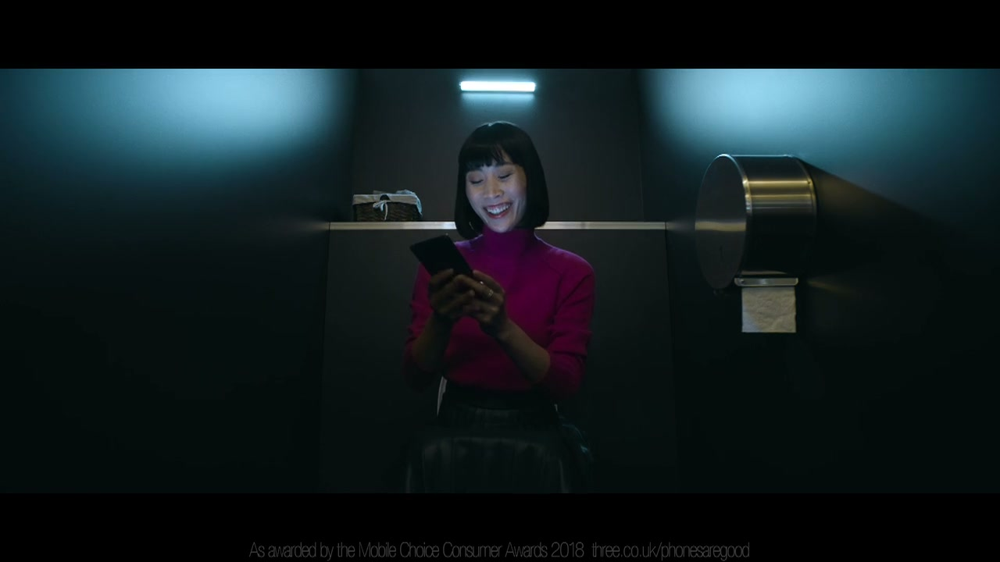

# Three: Phones Are Good

**Director:** Ian Pons Jewell — Friend London
**Creatives:** Tom Bender (Art Director) + Tom Corcoran (Copywriter)

A sweeping historical comedy film arguing — against a cultural tide of digital detox panic — that phones are, simply, good. The hero film is a 2:33 time-travel epic showing pivotal moments in history that would have been substantially improved by smartphones. Directed by Ian Pons Jewell through Friend London, with VFX by Time Based Arts.

The campaign delivered approximately **£189 million in incremental revenue uplift** and spawned a direct sequel campaign in 2020. Still cited in industry "best ads" roundups as recently as 2025.

---

## The Concept

In 2018, 40% of Millennials considered Three a "bad network." The digital detox movement was at its cultural height — phones were being blamed for everything from attention collapse to teenage mental health crises. Three and W+K London made an audacious counter-bet: position against the entire anti-phone cultural narrative.

The hero film time-travels through history, imagining pivotal moments improved by smartphones:
- Starving cavemen ordering Deliveroo
- Henry VIII's wives avoiding execution via Tinder
- Moses parting the Red Sea for an unmissable Snap Story
- And more — featuring Samsung, Instagram, Deliveroo, Snapchat, LinkedIn, Tinder as recognisable brand partners within the narrative

**Launch strategy:** Mobile-first via Three's Twitter (@ThreeUK), then rolling out across Instagram, Facebook, YouTube, digital, TV, cinema, and OOH. Media planned by Mindshare.

---

## Awards

| Award | Category | Status |
|---|---|---|
| The One Show 2019 | — | WIN confirmed |
| Creative Circle | Best VFX / CGI | WIN confirmed |
| Creative Circle | Best Grade | WIN confirmed |

Cannes Lions and D&AD not confirmed from open sources.

---

## Business Impact

| Metric | Figure | Source |
|---|---|---|
| Incremental revenue uplift | ~£189 million | IPA effectiveness data (via Selfstorming) |
| Brand perception at launch | 40% of Millennials called Three a "bad network" | Campaign analysis |
| Result | Record-high brand consideration | Campaign analysis |

---

## The Campaign (Beyond the Film)

This was a full brand platform, not just a single film:

- **Valentine's Day extension (Feb 2019):** Hero film recut with Tinder/romance focus. Three's Oxford Street flagship filled with thousands of roses. 45 stores had themed window features.
- **Reuben Dangoor art gallery (Oct 26–27, 2018):** London painter Reuben Dangoor — known for painting grime artists in 17th-century grandeur style — commissioned to reimagine historical figures through a modern social-media-profile lens. Exhibited at 13 Soho Square, London.
- **Retail store takeovers:** Gallery-style exhibitions across Glasgow, Belfast, Manchester, Liverpool, Cardiff, and London from 17 October.
- **Phone Spa activations:** In-store screen cleaning and protection experiences rolled out from late October 2018.
- **Sequel (2020):** "Real 5G" — directed by Ian Pons Jewell again for W+K London — explicitly framed in press as a continuation of the Phones Are Good platform.

---

## Cultural Legacy

- Cited by Kenneth Moore (We Are Social), The Drum, June 2021: *"Easily the most unforgettable phone ad for me is 2018's 'Phones Are Good' for Three, directed by Ian Pons Jewell for W+K London."*
- Still appearing in Campaign Live "greatest ads" roundups in July 2025
- Campaign launched as a deliberate "Backlash Brand" positioning against the digital detox movement — a bold cultural bet that paid off commercially
- The Jennifer Aniston Instagram debut (Oct 2019, Guinness World Record: 1M followers in 5h 16m) has been cited as part of the broader "Phones Are Good" brand platform activation — though whether this was explicitly Three-branded requires further verification

---

## Collaborators

**Agency: Wieden+Kennedy London**
- **[Iain Tait](../collaborators/)** — Executive Creative Director
- **[Tony Davidson](../collaborators/tony_davidson.md)** — Executive Creative Director
- **Hollie Walker** — Creative Director
- **[Tom Bender](../collaborators/tom_bender.md)** — Art Director
- **[Tom Corcoran](../collaborators/tom_corcoran.md)** — Copywriter
- **Richard Adkins** — TV Producer

**Production: Friend London**
- **Ian Pons Jewell** — Director *(Iain recalled "Iain Pond's Jules" — confirmed as Ian Pons Jewell)*
- **Luke Jacobs** — Executive Producer
- **Jon Adams** — Producer
- **Mauro Chiarello** — Director of Photography
- **Mark Connell** — Production Designer

**Post-production**
- **[Time Based Arts](../collaborators/time_based_arts.md)** — VFX and Grade (Creative Circle wins for Best VFX/CGI + Best Grade)
- **Cut & Run** (Ben Campbell, editor) — Edit
- **750mph** (Sam Ashwell, Jake Ashwell) — Sound design

---

## References & Media

### Assets

### Primary
- [Vimeo: Phones Are Good (full film, full credits — uploaded by Ian Pons Jewell)](https://vimeo.com/295647868)
- [W+K London case page](https://wklondon.com/2018/10/phones-good-three/)
- [W+K global case page](https://www.wk.com/work/three-phones-are-good/)
- [Three Media Centre official press release (Oct 16, 2018)](https://www.threemediacentre.co.uk/content/phones-are-good/)

### Awards
- [Time Based Arts VFX case — Creative Circle awards listed](https://www.time-based-arts.com/cases/three-phones-are-good-mfvix)

### Press
- [The Drum: "Three CMO on how 'phones are good' belief underpins its new marketing strategy" (Oct 17, 2018)](https://www.thedrum.com/news/three-cmo-how-phones-are-good-belief-underpins-its-new-marketing-strategy)
- [The Drum: "Are these the best mobile ads ever?" (June 2021) — Phones Are Good cited as "most unforgettable phone ad"](http://www.thedrum.com/news/are-these-the-best-mobile-ads-ever-the-art-selling-cellphone)
- [Campaign Live: Valentine's Day extension (Feb 12, 2019)](https://www.campaignlive.co.uk/article/three-phones-good-valentines-day-wieden-kennedy-london/1525437)
- [Campaign Live: Sequel "Real 5G" — confirms Phones Are Good legacy (Feb 26, 2020)](https://www.campaignlive.co.uk/article/three-counters-britains-future-threats-joyous-phones-good-sequel/1675098)
- [Campaign Live (July 2025): Phones Are Good in "3 great ads I had nothing to do with"](https://www.campaignlive.co.uk/article/3-great-ads-i-nothing-%E2%80%93-85-fold7s-dave-billing/1925729)

### Video
- [YouTube: Three official film](https://www.youtube.com/watch?v=v9kWY2_DFMU)
- [Ian Pons Jewell portfolio: ianponsjewell.com](https://ianponsjewell.com/)
