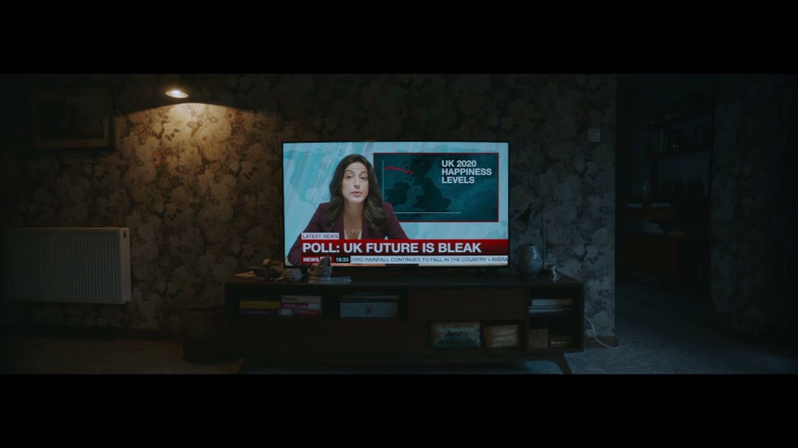
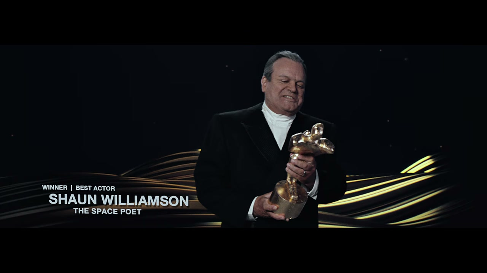
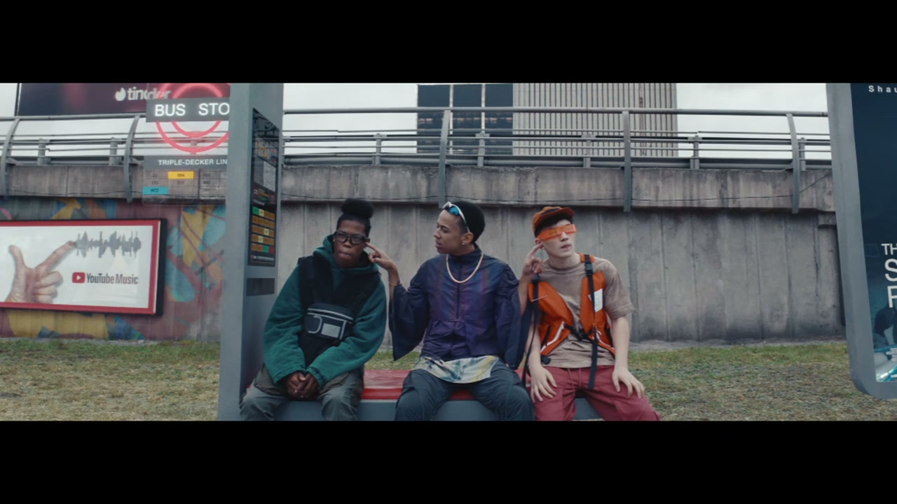
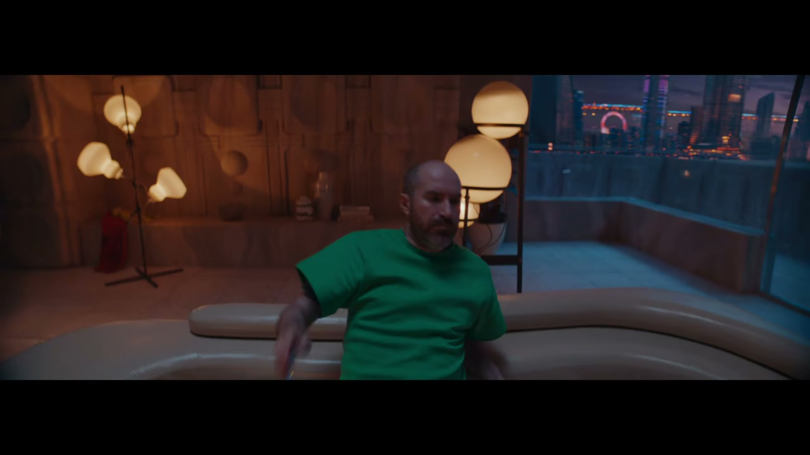
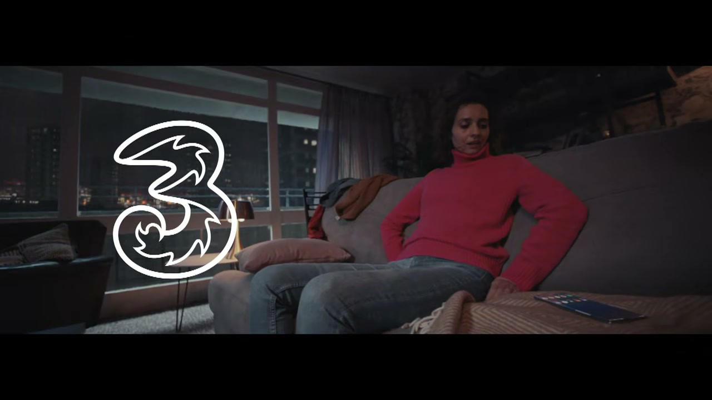

# Three: Real 5G

## The Campaign

Direct sequel to *Phones Are Good* (2018) — another epic-scale, visually ambitious film from the same creative team and director, this time launching Three's 5G network. Where *Phones Are Good* was a comic history of human progress enabled by technology, *Real 5G* imagined the near-future made possible by 5G: a mind-bending parade of absurdist visions including a Lewis Capaldi hologram beamed into a couple's living room.

The 90-second version aired during ITV's Ant & Dec's Saturday Night Takeaway on February 29, 2020.

**Brands featured in the spot:** Tinder, Samsung, YouTube Music, Deliveroo, Greggs.

## Collaborators

- **[Iain Tait](../collaborators/iain_tait.md)** — Executive Creative Director, W+K London
- **[Tony Davidson](../collaborators/tony_davidson.md)** — Executive Creative Director, W+K London
- **[Hollie Walker](../collaborators/hollie_walker.md)** — Creative Director, W+K London
- **[Adam Newby](../collaborators/adam_newby.md)** — Creative, W+K London
- **Will Wells** — Creative, W+K London
- **Ryan Teixeira** — Design Director, W+K London
- **Alex Thursby-Pelham** — Lead Designer, W+K London
- **James Laughton** — TV Producer, W+K London
- **[Ian Pons Jewell](../collaborators/ian_pons_jewell.md)** — Director (Academy Films)
- **Academy Films** — Production company
- **Simon Cooper** — Executive Producer
- **Jon Adams** — Producer
- **Mauro Chiarello** — Director of Photography
- **Robin Brown** — Production Designer
- **Ameena Callender** — Costume Designer
- **[The Mill](../collaborators/the_mill.md)** — VFX
- **Lewis Capaldi** — Talent (5G hologram)

## References & Media

### Assets

- [Campaign Live: "Three counters Britain's future threats in joyous 'Phones are good' sequel"](https://www.campaignlive.co.uk/article/three-counters-britains-future-threats-joyous-phones-good-sequel/1675098)
- [Campaign Live: full credits](https://www.campaignlive.co.uk/article/three-real-5g-wieden-kennedy-london/1675173)
- [LBBonline coverage](https://lbbonline.com/news/three-promises-uk-a-5g-powered-future-as-an-antidote-to-the-nations-ills)
- [The Mill case study](https://www.themill.com/work/case-study/creating-a-mind-bending-futuristic-universe-with-three-to-launch-their-new-5g-network/)

### Raw Research
- [Missed projects research file](../raw/research/missed_projects.md)
