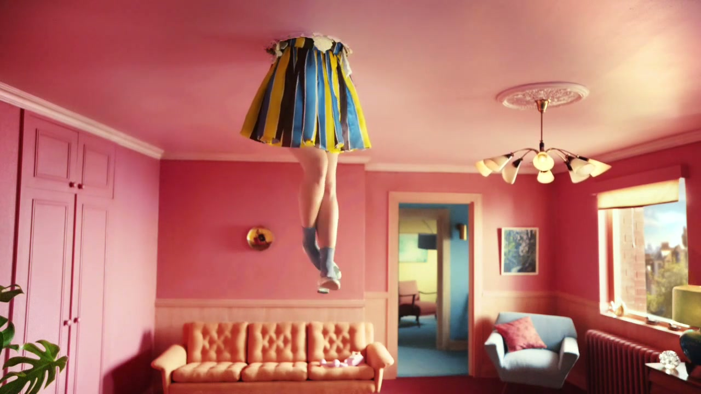
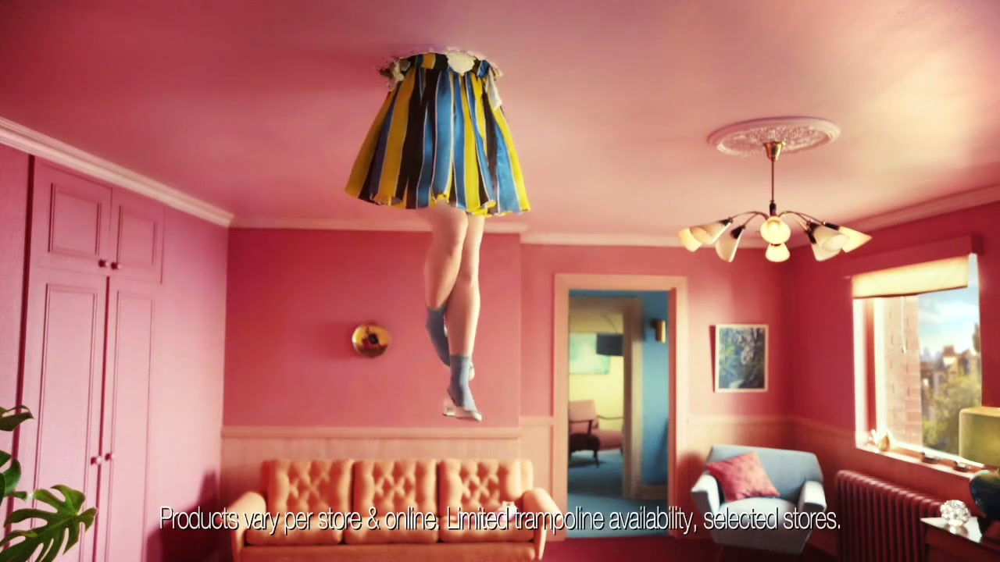

# TK Maxx: Ridiculous Possibilities

## The Campaign

W+K London won the TK Maxx account from Grey London in November 2015. "Ridiculous Possibilities" was the resulting brand platform — W+K's first work for the brand, and the beginning of a multi-year relationship that ran through at least 2019 across UK, Ireland, Germany, Poland, Netherlands, and Austria.

**The idea:** Buying something unexpected at TK Maxx sets off a chain reaction of ridiculous-but-brilliant consequences. Each spot follows a character narrating how one impulsive TK Maxx purchase led them somewhere they never expected. Shot in a deadpan, vivid, hyper-real cinematic style that became the brand's hallmark.

**Executions (launch spring 2016):**
- *"Trampoline"* — a woman's legs dangling through a ceiling; a TK Maxx dress and a trampoline somehow led to her meeting her boyfriend upstairs
- *"Weekend Bag"* — a man clinging to the back of a car to the seaside after impulse-buying a new bag
- *"Biker Ballet"* (A/W 2016) — stunt rider Sarah Luzita performing motorbike ballet in a TK Maxx dress and leather jacket
- *"Space Odyssey"* (A/W 2016) — astronaut applying TK Maxx beauty products in zero gravity; she bought so many for the crew they invited her on the mission
- *"The Sing-Song"* (Christmas 2016) — ranked **#6 in Ad Age's Best UK Christmas Ads of the Decade**
- *"Why Would Anyone Shop at TK Maxx?"* (May 2017) — dinner party guests transported to absurd scenarios; first use of **Bill Nighy** as narrator

**Note on Bill Nighy:** He did NOT narrate the original 2016 launch work. He first appeared with the May 2017 campaign and subsequently became closely associated with the platform.

## Collaborators

**W+K London:**
- **[Iain Tait](../collaborators/iain_tait.md)** — Executive Creative Director
- **[Tony Davidson](../collaborators/tony_davidson.md)** — Executive Creative Director
- **[James Guy](../collaborators/james_guy.md)** — Executive Producer / Head of Integrated Production, W+K London
- **[Hollie Walker](../collaborators/hollie_walker.md)** — Creative Director (long-standing partnership with Freddie Powell; both met at Central Saint Martins)
- **[Freddie Powell](../collaborators/freddie_powell.md)** — Creative Director
- **[Paddy Treacy](../collaborators/paddy_treacy.md)** — Creative (copywriter, launch work)
- **[Mark Shanley](../collaborators/mark_shanley.md)** — Creative (art director, launch work)

**Production (launch spring 2016):**
- **Traktor** — Director (Rattling Stick)
- **Rattling Stick** — Production company
- **Antonio Paladino** — Director of Photography
- **Rick Russell** — Editor (Final Cut)
- **MPC** — VFX
- **Nadia Lee Cohen** — Photographer (stills)

**A/W 2016:**
- **Tom Kingsley** — Director of "Space Odyssey" (Colonel Blimp)
- **Colonel Blimp** — Production company

**Christmas 2016 ("The Sing-Song"):**
- **Andreas Nilsson** — Director (Biscuit Filmworks)
- **Biscuit Filmworks** — Production company

**May 2017 ("Why Would Anyone Shop at TK Maxx?"):**
- **Adam & Dave** — Directors (Bold)
- **Bill Nighy** — Narrator (first appearance)

**Christmas 2017 ("A White Christmas"):**
- **[Ian Pons Jewell](../collaborators/ian_pons_jewell.md)** — Director
- **Bill Nighy** — Narrator

## Awards & Recognition

- Christmas 2016 "The Sing-Song" — **#6 in Ad Age's Best UK Christmas Ads of the Decade** (2019)
- LBBonline: listed in "15 Projects Adlanders Wish They'd Worked On in 2016"
- The Marketing Society cited as exemplary British advertising

## References & Media

### Assets

### Video
- [YouTube: "Trampoline" spot](https://www.youtube.com/watch?v=tWvg0qO55hA)

### Press
- [W+K London case study](https://wklondon.com/work/tk-maxx-ridiculous-possibilities/)
- [Campaign US: launch credits (March 2016)](https://www.campaignlive.com/article/tk-maxx-ridiculous-possibilities-wieden-kennedy-london/1388655)
- [Campaign US: Weekend Bag credits](https://www.campaignlive.com/article/tk-maxx-ridiculous-possibilities-weekend-bag-wieden-kennedy-london/1389795)
- [LBBonline: A/W 2016 campaign](https://lbbonline.com/news/tk-maxx-boldly-goes-where-no-brand-has-gone-before-with-latest-ridiculous-possibilities-campaign)
- [LBBonline: "Why Would Anyone" (2017)](https://lbbonline.com/news/tk-maxxs-new-spot-dares-shoppers-to-discover-the-ridiculous-possibilities-of-their-offers)
- [LBBonline: Christmas 2017 "A White Christmas"](https://lbbonline.com/news/white-christmas-becomes-a-possibility-with-tk-maxxs-christmas-campaign)
- [Ad Age: Best UK Christmas Ads of the Decade (Christmas 2016 at #6)](https://adage.com/article/year-end-lists-2019/top-10-uk-christmas-ads-decade/2221436)
- [Hollie Walker + Freddie Powell: Behance](https://www.behance.net/freddieandhollie)

### Raw Research
- [Deep research file](../raw/research/tk_maxx_ridiculous_possibilities_2026-04-07.md)
- [Missed projects research file](../raw/research/missed_projects.md)
