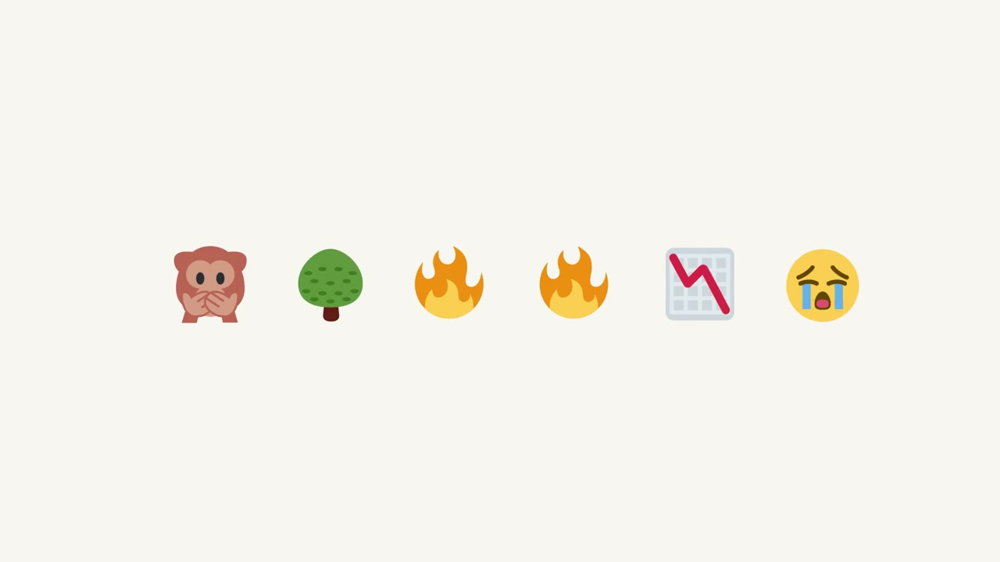
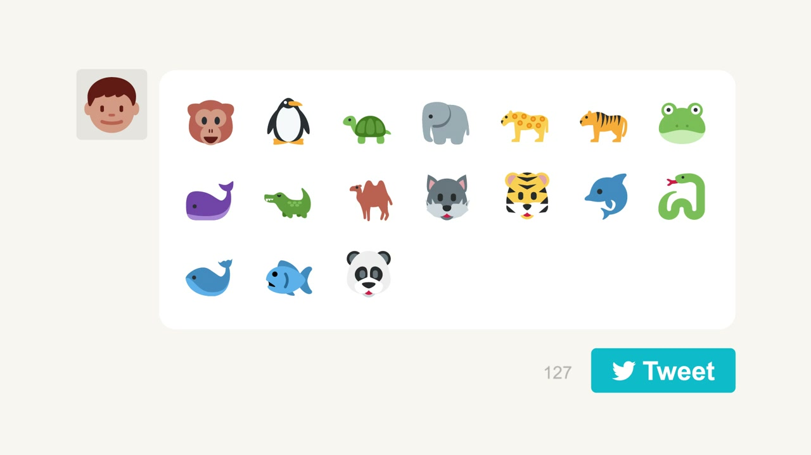
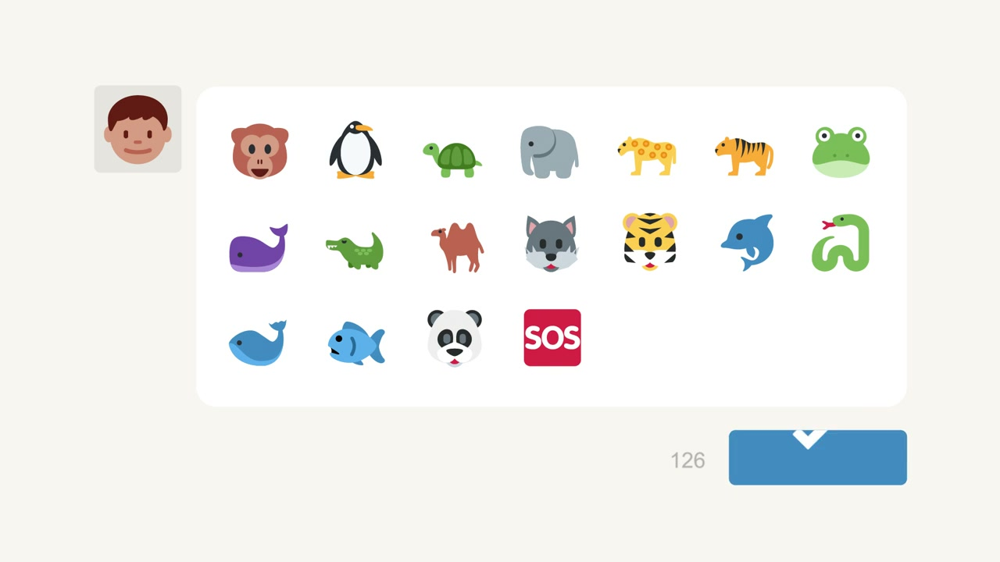
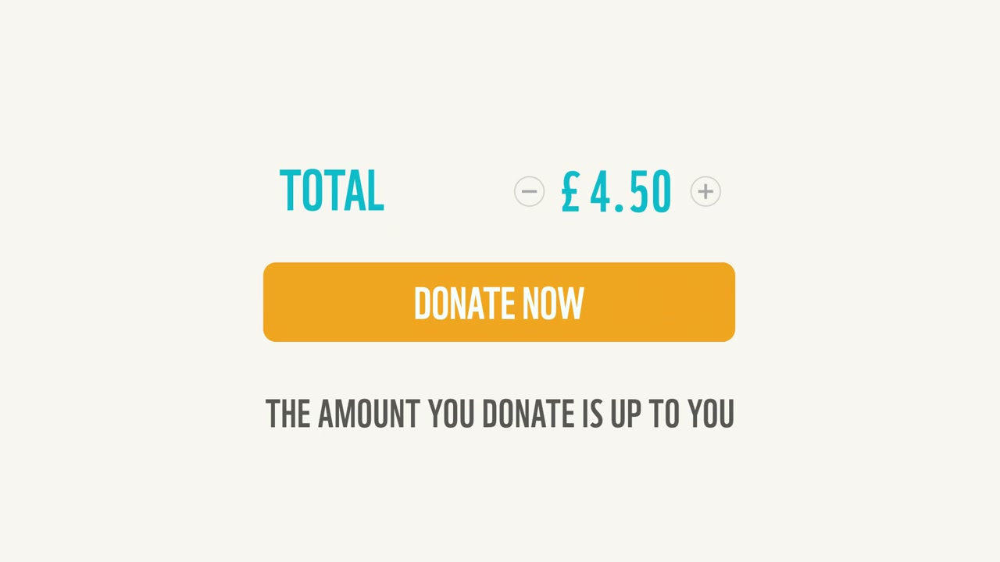
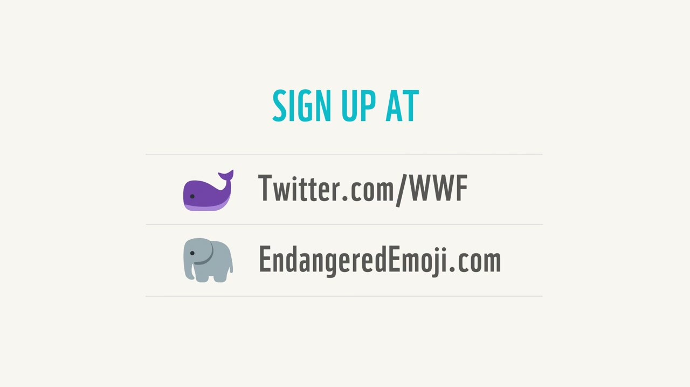
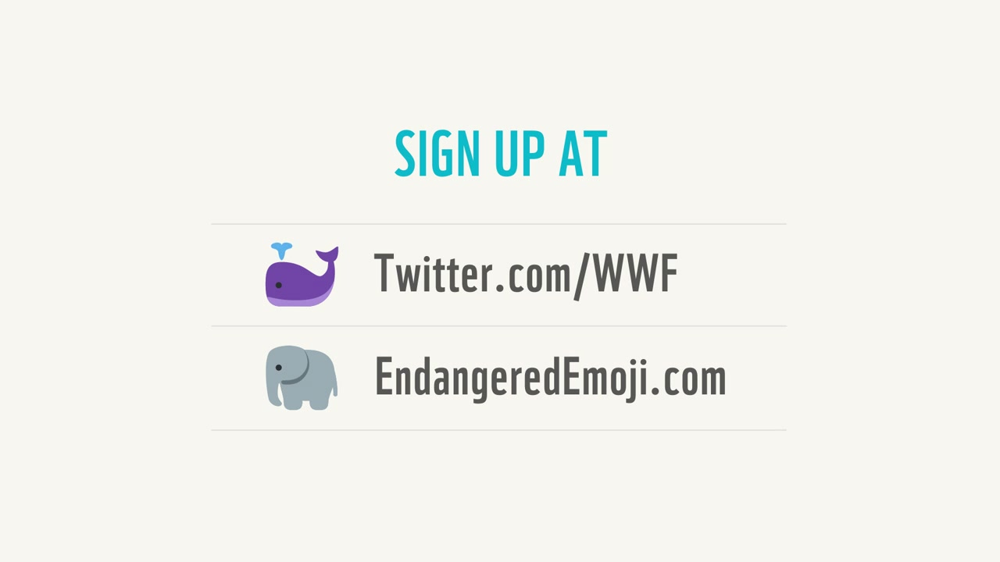

# WWF Endangered Emojis

**Creatives:** Jason Scott (Copywriter) + Joris Philippart (Art Director)

> *"The world's first emoji-based fundraising initiative."* — Coherence (technical partner)

A campaign that turned the standard emoji keyboard into a micro-donation platform on Twitter. 17 emojis on every phone in the world happen to represent real, endangered animal species. Every tweet became a donation. Built on a simple, arresting insight and executed with a system that made giving as frictionless as tapping a panda.

---

## The Concept

The team — W+K creatives Jason and Joris, who are also "animal lovers" per the agency's own blog — noticed that 17 characters on the standard global emoji keyboard directly represented real endangered species (including tiger, giant panda, elephant, blue whale, and others). The leap: turning those everyday emoji into a fundraising trigger.

**How it worked:**
1. WWF tweets an image showing all 17 Endangered Emoji
2. Users retweet to enroll — consent and sign-up in one action
3. Every subsequent tweet containing an endangered animal emoji adds £0.10 / €0.10 to the user's voluntary monthly donation tally
4. At end of each month, WWF sends a summary tweet with a payment link — users choose their final donation amount

No app. No separate donation page. No friction beyond a retweet. The campaign also prompted WWF to temporarily swap its iconic panda logo for a panda emoji — a decision that caused internal discussion but was ultimately correct.

**Campaign URL:** `endangeredemoji.com` (now defunct)

---

## Metrics

| Metric | Figure | Source | Timeframe |
|---|---|---|---|
| Day 1 retweets | 12,000+ | Coherence case study | First 24 hours |
| Twitter mentions | 500,000+ | Coherence case study | First four days |
| Registrations | 59,000+ | Coherence / The Drum | First four days |
| Signups within one week | 30,000+ | Civil Society (15 May 2015) | Week 1 |
| Total mentions | 559,000 | The Drum (28 July 2015) | May–July 2015 |
| Total signups | 59,000 | The Drum (28 July 2015) | May–July 2015 |
| Donations total | Not publicly disclosed | — | — |

**Viral misfire (widely cited lesson):** A Banksy fan account (1.3M followers) told followers to retweet without signing up. 31,000 retweets followed — including from Russell Crowe (1.8M followers) and Jenson Button (2M followers) — generating massive #EndangeredEmoji pickup that didn't convert to donations. Became a textbook case study in influencer coordination.

**Scale context:** At launch, endangered animal emojis had been used approximately 100 million times on Twitter in the months prior. Emojis overall had been used 202 million times since Twitter integrated them in April 2014.

---

## Awards

Referenced in Cannes 2015 industry dispatches as inspirational work shown at the festival. Specific Lions shortlist or win status not confirmed from open sources (paywalled).

Named one of W+K London's creative milestones in Campaign's 20th anniversary feature (August 2018): *"WWF 'Endangered emojis' (2015). Turned emojis into a micropayment system to help fund WWF."*

Named one of Marketing Week's top campaigns of 2015 (December 2015).

---

## Technical Build

Built by Coherence (formerly Cohaesus), London — three applications:
- **Stream App** — monitors Twitter in real-time for sign-ups, unsubscribes, and endangered emoji usage
- **Bill App** — tracks per-user emoji usage and generates monthly donation summary tweets with payment links
- **Web App** — the campaign website (endangeredemoji.com)

Architecture: Docker containers, horizontally scalable using RabbitMQ, MongoDB, and Python workers — designed to handle the massive real-time spikes from celebrity and high-profile user participation.

---

## Cultural Legacy

- Described as "the world's first emoji-based fundraising initiative"
- Frequently cited in academic and industry literature on emoji marketing, digital fundraising, and cause marketing
- Still cited in 2022+ analyses of standout social media campaigns
- Highlighted a previously overlooked cultural fact: 17 of the animal emoji on standard keyboards represent endangered species — a simple, arresting insight at the campaign's core
- Influenced subsequent charity and brand emoji marketing strategies globally

---

## Collaborators

- **[Iain Tait](../collaborators/)** — ECD, W+K London
- **[Tony Davidson](../collaborators/tony_davidson.md)** — ECD, W+K London
- **Jason Scott** — Copywriter (the "Jason" of "Jason and Joris")
- **Joris Philippart** — Art Director (the "Joris" — a Belgian/Dutch name; Iain remembered it as "Yoris")
- **Grotesk Studio** — Production (listed in Lürzer's Archive credits)
- **Brains and Hunch (London)** — Production (listed in Lürzer's Archive credits)
- **Cohaesus / Coherence (London)** — Technical partner; built the full Twitter backend system

---

## References & Media

### Assets

### Primary
- [W+K London blog: "Turn #EndangeredEmoji tweets into donations with WWF" (12 May 2015)](https://wklondon.com/2015/05/turn-endangeredemoji-tweets-into-donations-with-wwf/)
- [Lürzer's Archive: Endangered Emojis — confirms full creative team credits](https://www.luerzersarchive.com/work/endangered-emojis/)
- [Coherence (Cohaesus) case study — technical build and metrics](https://cohaesus.co.uk/work/wwf/)

### Press
- [The Drum: "Lessons from WWF's #EndangeredEmoji campaign" (28 July 2015) — 559k mentions, 59k signups, Banksy misfire](https://www.thedrum.com/news/lessons-wwf-s-endangeredemoji-campaign)
- [Marketing Week: Top campaigns of 2015 (Dec 2015)](https://www.marketingweek.com/the-marketing-year-the-top-campaigns-of-2015/)
- [Civil Society: "More than 30,000 people have signed up to WWF's emoji fundraising campaign" (15 May 2015)](https://www.civilsociety.co.uk/voices/social-charity-spy--more-than-30-000-people-have-signed-up-to-wwf-s-emoji-fundraising-campaign.html)
- [Sustainable Brands: mechanics explainer (20 May 2015)](https://sustainablebrands.com/read/wwf-turning-tweets-to-donations-with-endangeredemoji-twitter-campaign)
- [Campaign Live: W+K London 20-year milestones (Aug 2018)](https://www.campaignlive.co.uk/article/wieden-kennedy-london-turns-20-agencys-creative-milestones-two-decades/1490921)

### Video
- [YouTube: "WWF's Endangered Emoji" — official campaign explainer](https://www.youtube.com/watch?v=v26WWHUwj38)
